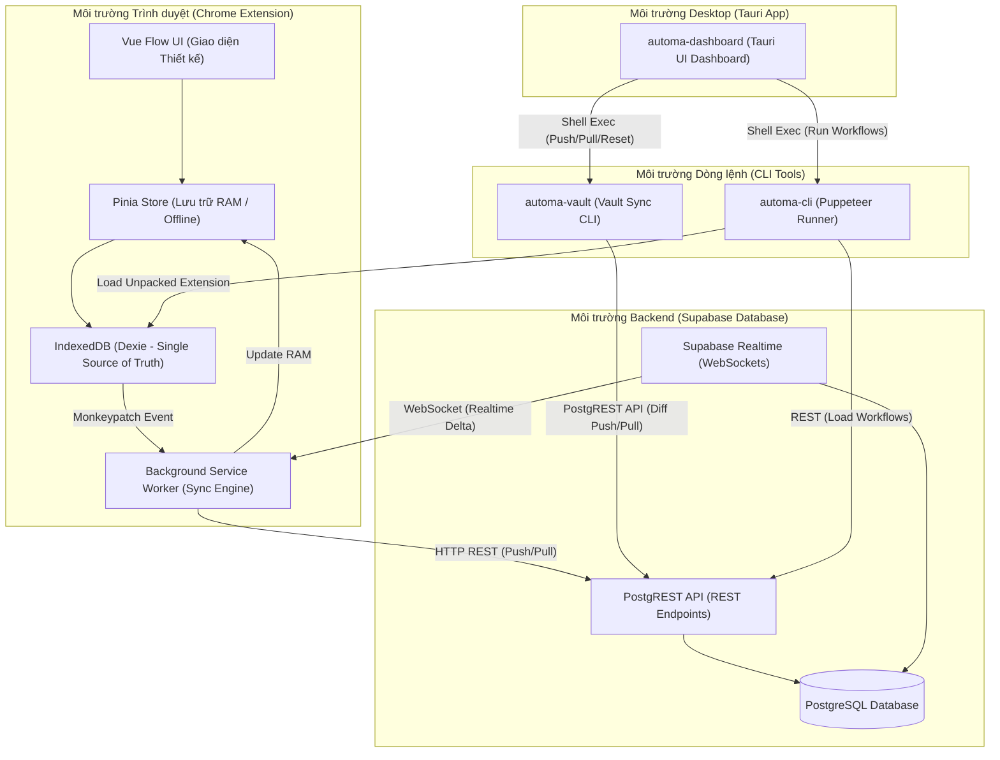

# Automa Ecosystem - Big Picture & Architecture Guide

Chào mừng đến với hệ sinh thái **Automa Ecosystem**. Đây là phiên bản mở rộng toàn diện, hỗ trợ môi trường tự vận hành (Self-contained) ngoại tuyến (Offline-First), đồng bộ đám mây và thực thi tự động hóa nâng cao thông qua kiến trúc đa ứng dụng (Multi-app Ecosystem).

---

## 📥 Hướng Dẫn Cài Đặt (Onboarding) với DevContainers

Hệ thống được tự động hóa 100% môi trường phát triển thông qua **DevContainers** và **Git Submodules**. Bất kể bạn dùng Windows, Mac hay Linux, bạn sẽ **KHÔNG CẦN** phải tự cài đặt Node.js hay cấu hình biến môi trường rườm rà.

### Bước 1: Yêu Cầu Cơ Bản
1. Đã cài đặt **Docker Desktop** (khuyên dùng WSL 2 nếu dùng Windows).
2. Đã cài đặt **Visual Studio Code** và cài Extension **Dev Containers**.
3. Đã cài đặt **Git**.

### Bước 2: Tải Mã Nguồn
Mở Terminal (PowerShell/Bash) và clone repository này về:
```bash
git clone https://github.com/mingxn/automa-ecosystem.git
```

### Bước 3: Phép màu DevContainer (Zero-Config)
1. Mở thư mục `automa-ecosystem` bằng **VS Code**.
2. Góc phải dưới màn hình sẽ hiện popup: *"Folder contains a Dev Container configuration file"*.
3. Bấm **Reopen in Container**.

> [!TIP]
> ⚡ **Magic Happens Here:** Bạn cứ đi uống cafe! VS Code sẽ tự tải Image Linux, cài Node.js, và chạy script `init_workspace.sh` ngầm bên trong. Script này sẽ tự động kéo toàn bộ 5 Submodules con về máy tính của bạn và chạy sẵn `pnpm install` cho tất cả các folder!

> [!CAUTION]
> **Dành cho máy cũ (đã từng clone code kiểu cũ):** Nếu bạn đã từng có các folder `automa-be`, `automa-fe` nằm rải rác bên ngoài, hãy nhớ đổi tên (backup) các folder đó đi. Sau đó gõ `git pull` và chạy thủ công `bash init_workspace.sh` để chuyển sang kiến trúc Submodules xịn xò này.

---
## 1. Bản đồ Kiến trúc Hệ thống (Big Picture)

Dưới đây là sơ đồ Mermaid thể hiện cách các thành phần trong hệ sinh thái tương tác và giao tiếp với nhau:



---

## 2. Trách nhiệm của từng Thành phần (Microservices & Apps)

### 📌 `automa-be` (Supabase Backend)
* **Trách nhiệm:** Cung cấp hạ tầng cơ sở dữ liệu PostgreSQL local (qua Docker) và cloud. Chịu trách nhiệm thực thi các migrations, thiết lập chính sách RLS (Row Level Security) và phân quyền SQL.
* **Giao tiếp:** Tiếp nhận các HTTP REST Request thông qua PostgREST API (cổng `54321` local) từ Extension, Vault CLI và Runner CLI. Phát tín hiệu Realtime qua WebSocket khi có cập nhật bảng.

### 📌 `automa-ex` (Chrome Extension)
* **Trách nhiệm:** Trình thiết kế (Designer) trực quan dạng sơ đồ khối, cho phép người dùng tạo, sửa, cấu hình các tiến trình tự động hoá (workflows) trực tiếp trên Chrome/Edge.
* **Giao tiếp:** Hoạt động theo cơ chế **Offline-First**:
  - Giao diện Vue tương tác với **Pinia Store** $\rightarrow$ Lưu tức thời vào **IndexedDB (Dexie)**.
  - Dexie kích hoạt sự kiện gửi message ngầm báo hiệu cho **Service Worker** (`background/index.js`).
  - Service Worker thực hiện kéo/đẩy (Pull/Push Delta) bất đồng bộ với `automa-be` và lắng nghe kênh Realtime WebSocket để đồng bộ tức thời khi có thay đổi từ máy khác.

### 📌 `automa-vault` (Seeding & Sync CLI)
* **Trách nhiệm:** Kho lưu trữ dữ liệu hạt giống (Seed Data) của các dự án (workflows, packages, variables, credentials). Cung cấp bộ công cụ CLI (`vault.js`) để đẩy dữ liệu lên DB hoặc kéo về máy local một cách độc lập và an toàn.
* **Giao tiếp:** Giao tiếp trực tiếp với PostgREST API của Supabase bằng `fetch` HTTP thuần. Sử dụng thuật toán so khớp khác biệt (Diff LWW) bỏ qua timestamp để đẩy/kéo và bảo toàn cấu trúc đặt tên file nguyên bản của lập trình viên.

### 📌 `automa-cli` (Puppeteer Workflow Executor)
* **Trách nhiệm:** Trình thực thi tự động hóa dạng không đầu (headless) hoặc có đầu qua Puppeteer. Cho phép chạy các workflows của Automa trực tiếp bằng NodeJS thông qua command line mà không cần mở giao diện thiết kế.
* **Giao tiếp:** Gọi REST API tới Supabase để lấy nội dung workflow cần chạy, nạp thư mục build đã đóng gói của `automa-ex/build` vào trình duyệt Puppeteer và kích hoạt chạy tự động.

### 📌 `automa-dashboard` (Tauri Desktop App)
* **Trách nhiệm:** Giao diện điều khiển trung tâm chạy trên Desktop. Giúp người dùng quản lý trạng thái các database, các dự án trong Vault, kích hoạt chạy workflows và xem báo cáo kết quả.
* **Giao tiếp:** Đóng vai trò là lớp bọc UI điều phối (orchestration). Nó gọi trực tiếp các tiến trình hệ thống (Shell Execution) để kích hoạt lệnh của `automa-vault` (push/pull), `automa-cli` (run) và `supabase CLI` (start/stop/reset).

---

## 3. Các Luồng Giao Tiếp Phức Hợp (Core Integration Flows)

### A. Luồng đồng bộ 2 chiều của Extension (Bi-directional Sync)
```text
Vue UI -> Pinia Store -> Dexie IndexedDB (Local Save)
                             │ (Monkeypatch method trigger)
                             ▼
                    browser.runtime.sendMessage
                             │
                             ▼
                    Background Sync Worker
                             │
            ┌────────────────┴────────────────┐
            ▼                                 ▼
   Push Sync Queue                   Subscribe Realtime WS
   (Batched Upsert/Delete)           (Receive Delta updates)
            │                                 │
            ▼                                 ▼
      Supabase Cloud                   Dexie IndexedDB (Write-back)
```

### B. Mối quan hệ giữa Vault CLI và Tauri Dashboard
```text
[Tauri UI Dashboard] --(Nhấn "Đẩy Dữ Liệu")--> [Tauri Rust Core]
                                                       │
                                                       ▼ (Shell Spawn)
                                            [pnpm run push --project=crm]
                                                       │
                                                       ▼
                                            [automa-vault/vault.js]
                                                       │
                                    ┌──────────────────┴──────────────────┐
                                    ▼ (Pre-seed Hooks)                    ▼ (REST API)
                             [lint-workflows.js]                     [Supabase DB]
                             [align-workflows.js]
```

---

## 🛠️ Quản lý Môi trường Phát triển (VS Code Tasks)

Ecosystem đã tích hợp sẵn hệ thống các VS Code Tasks tối giản và đồng bộ tại `.vscode/tasks.json`. Bạn chỉ cần nhấn `Ctrl+Shift+P` -> `Tasks: Run Task` và chọn:

* **`Workspace: Install Dependencies`**: Cài đặt thư viện cho toàn bộ workspace.
* **`Supabase: Start (Local)` / `Supabase: Stop (Local)`**: Quản lý Docker containers DB.
* **`Supabase: Reset (Schema Only)`**: Đưa DB về trạng thái cấu trúc ban đầu sạch sẽ.
* **`Supabase: Deploy to Cloud`**: Đẩy Migrations & Edge Functions lên Production cloud.
* **`Extensions: Start Dev Server` / `Extensions: Build Production`**: Phát triển & đóng gói Extension.
* **`Tauri: Dev` / `Tauri: Build Production`**: Chạy giao diện Desktop Dashboard.
* **`Vault: Push to Database` / `Vault: Pull from Database` / `Vault: Check Sync Status`**: Đồng bộ dữ liệu hạt giống.
* **`CLI: Run Custom Workflow` / `CLI: Scan Workflow Dependencies`**: Chạy thử nghiệm tự động hoá Puppeteer.
