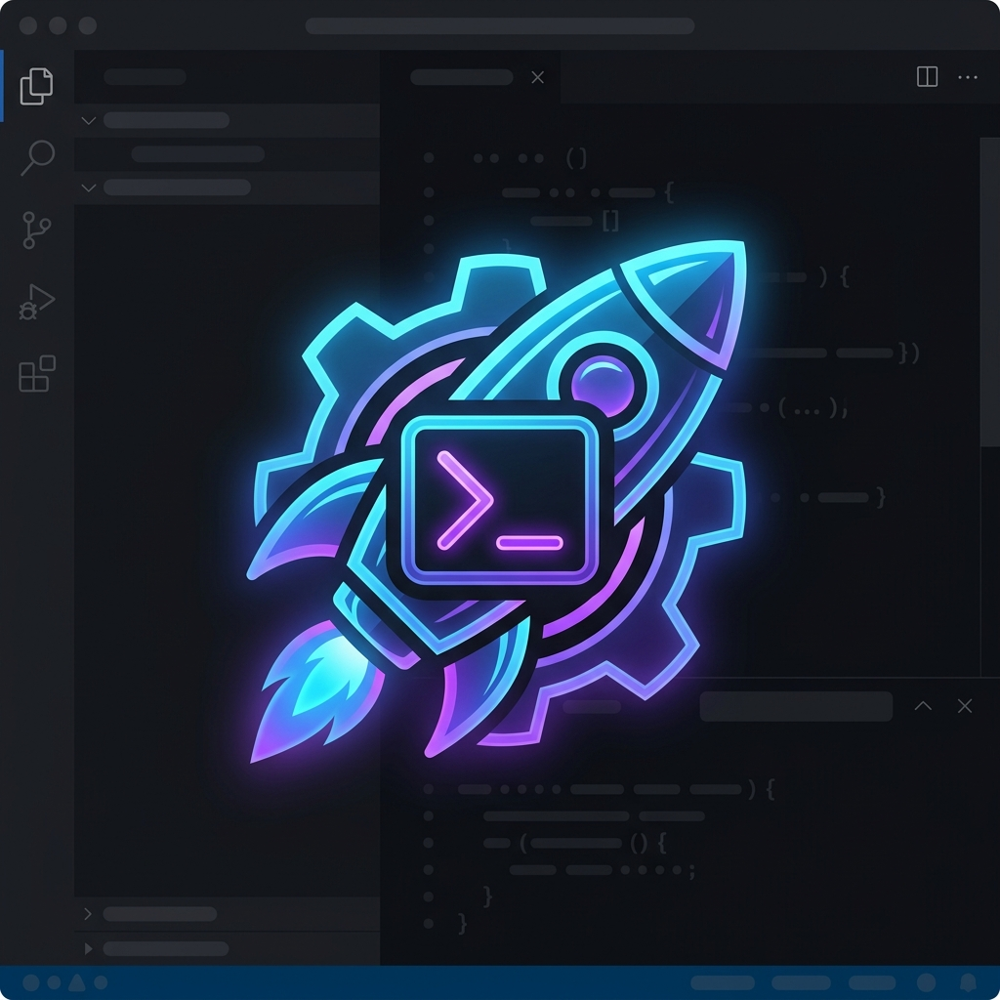

<div align="center">
  
  <h1>Automa Ecosystem</h1>
  <p><strong>Nền tảng Orchestration Đa Trình Duyệt Chuẩn Doanh Nghiệp (Enterprise-Grade)</strong></p>
  
  [](https://nodejs.org/)
  [](https://www.rust-lang.org/)
  [](https://code.visualstudio.com/)
  [](LICENSE)
</div>

<br/>

Chào mừng đến với **Automa Ecosystem**. Phiên bản hiện tại là một hệ sinh thái mạnh mẽ được tái thiết kế với triết lý **Offline-First**, hoạt động hoàn toàn độc lập và không phụ thuộc vào các dịch vụ Cloud bên ngoài, mang lại khả năng quản lý dữ liệu an toàn và tự động hóa đa trình duyệt vượt trội.

Tầm nhìn của chúng tôi là chuyển đổi Automa từ một công cụ tự động hóa cá nhân trở thành một nền tảng điều phối (Orchestrator) toàn diện chạy trên mọi môi trường mà không cần cài đặt runtime phức tạp.

---

## 🧭 Điều Hướng Dự Án (Project Directory & Navigation)

Hệ sinh thái **Automa Ecosystem** được tổ chức theo cấu trúc Monorepo phân tách rõ ràng giữa **Core Engine**, **Extension Targets** và **Client GUI Platforms** theo bộ tứ chuẩn hóa 4 ký tự:

```text
automa-ecosystem/
├── automa-core/        # [Rust Core Engine]      - Daemon xử lý trung tâm (Axum, Tokio, CDP, SQLite)
├── automa-webe/        # [Web Extensions]        - Extension MV3 (Chromium/Firefox, Silent Runner) [Tên cũ: automa-ext]
├── automa-vsce/        # [VS Code Extensions]    - Thin-Client IDE Extension (Webview Canvas, TreeViews) [Tên cũ: automa-vscode]
├── automa-desk/        # [Desktop Native App]    - Ứng dụng Desktop độc lập (Tauri v2 + Vue 3 Frontend)
├── automa-vault/       # [Storage & Security]    - Kho lưu trữ Campaign, Profiles & Workflows
└── packages/           # [Shared Workspaces]     - Shared Types, SDKs & WebExtension Polyfills
```

> [!NOTE]
> **Quy Chuẩn Định Danh 4 Ký Tự (4-Character App Code Standard):**
> - 🦀 **`automa-core`**: Rust Core Engine Daemon
> - 🌐 **`automa-webe`**: Web Extension MV3 *(đổi từ `automa-ext`)*
> - 💻 **`automa-vsce`**: VS Code Extension IDE *(đổi từ `automa-vscode`)*
> - 🖥️ **`automa-desk`**: Desktop Native OS App *(đổi từ `automa-tauri`)*

---

## 🏗️ Kiến Trúc Tổng Thể (System Architecture)

Lõi **Rust Native Daemon** (`automa-core`) đóng vai trò trung tâm xử lý, phục vụ đồng thời cho 3 nền tảng Client (VS Code IDE, Desktop Native App, Web Extension):

```text
┌───────────────────────────────┐     ┌───────────────────────────────┐
│   automa-vsce (VS Code Ext)   │     │   automa-desk (Desktop App)   │
│   - Thin-Client IDE           │     │   - Cross-Platform Native OS  │
│   - Visual Canvas Webview     │     │   - Standalone Studio GUI     │
└───────────────┬───────────────┘     └───────────────┬───────────────┘
                │                                     │
                │        ( HTTP REST / SSE :8765 )    │
                └──────────────────┬──────────────────┘
                                   │
                                   ▼
┌─────────────────────────────────────────────────────────────────────┐
│                     automa-core (Rust Core Daemon)                  │
│                                                                     │
│  1. High-Performance API Server & Realtime Event Emitter (SSE)      │
│  2. Campaign Orchestrator, SQLite Storage & AES Encryption          │
│  3. Browser Process Manager (Stealth Mode & CDP Controller)         │
└──────────────────────────────────┬──────────────────────────────────┘
                                   │
                           ( CDP / Chrome API )
                                   │
                                   ▼
┌─────────────────────────────────────────────────────────────────────┐
│                     automa-webe (Web Extension)                     │
│                                                                     │
│  - Chromium / Chrome / Firefox MV3 Extension Runtime                │
│  - Offscreen Document Workflow Engine & Silent Runner               │
└─────────────────────────────────────────────────────────────────────┘
```

---

## 📦 Chi Tiết Các Thành Phần Cốt Lõi (Core Packages)

### 1. 🦀 `automa-core` — *Rust Core Engine*
Trái tim điều phối của toàn bộ hệ sinh thái. Hoạt động như một Native Daemon (viết bằng Rust Axum/Tokio).
- **Trọng trách:** Xử lý đa luồng (high-concurrency), quản lý cơ sở dữ liệu SQLite cục bộ, mã hóa bảo mật AES, và điều khiển trực tiếp Chrome DevTools Protocol (CDP).
- **Anti-Detection:** Quản lý khởi chạy trình duyệt thông qua cơ chế tàng hình cấp thấp và fingerprinting.

### 2. 🌐 `automa-webe` *(Web Extension Engine)*
Là Extension gốc Manifest V3 (fork độc lập cho Chromium & Firefox), đóng vai trò động cơ thực thi và cung cấp **2 bản build đầu ra (Build Outputs) tái sử dụng cho toàn hệ sinh thái**:

* ⚡ **1. Build Runner (`dist/cli-runner`) — *Headless Silent Engine*:**
  - **Lệnh đóng gói:** `pnpm run build:runner` (hoặc `webpack.runner.config.js`)
  - **Mục đích tái sử dụng:** Bản build siêu gọn nhẹ, loại bỏ toàn bộ giao diện UI/CSS nặng để tối ưu hóa RAM & CPU. Được `automa-core` nạp trực tiếp vào các phiên Chromium Worker để chạy kịch bản ngầm (Headless/Stealth Execution).
* 🎨 **2. Build Studio Standalone (`dist/studio`) — *Visual Canvas Editor GUI*:**
  - **Lệnh đóng gói:** `pnpm run build:studio` (hoặc `webpack.studio.config.js`)
  - **Mục đích tái sử dụng:** Bản build giao diện thiết kế kịch bản hoàn chỉnh (Vue 3, Vue Flow, Host Bridge). Được `automa-core` phục vụ trực tiếp qua Web Server tại `http://127.0.0.1:8765/studio/`, đồng thời có thể nhúng vào `automa-desk` (Tauri App), VS Code Webview (`automa-vsce`) hoặc Iframe độc lập.

### 3. 💻 `automa-vsce` *(automa-vscode)* — *VS Code Extensions*
Extension tích hợp môi trường phát triển (IDE) chuyên nghiệp dành cho lập trình viên.
- **Trọng trách:** Hoạt động dưới dạng **Thin Client**, giao tiếp trực tiếp với `automa-core` qua HTTP REST/SSE. Cung cấp Visual Canvas Editor (Vue Flow), Tree Views quản lý Workflows/Campaigns, và Live Diagnostics Linter.

### 4. 🖥️ `automa-desk` — *Desktop Native OS App*
Ứng dụng Desktop độc lập đa nền tảng (Windows, macOS, Linux) đóng gói qua **Tauri v2**.
- **Trọng trách:** Mang lại trải nghiệm Standalone Studio độc lập và tốc độ native mà không cần cài đặt VS Code hay mở trình duyệt web.

### 5. 🗄️ `automa-vault` — *Storage & Campaign Workspace*
Quản lý cấu trúc thư mục, tệp cấu hình Campaigns và đối chiếu Workflow & Browser.
- Mặc định: `~/.automa/core/` (Production) và `~/.automa/core-dev/` (Dev Sandbox).

### 6. 📁 `packages/` — *Shared Packages*
Chứa các package dùng chung toàn hệ thống (Types, SDKs, Polyfills) được quản lý bởi Turborepo/pnpm workspaces.

---

## 🚀 Hướng Dẫn Khởi Tạo (Getting Started)

Dự án sử dụng **pnpm workspaces**, **Turborepo** và **Cargo** cho quy trình Build.

### Yêu Cầu Tiên Quyết (Prerequisites)

Dự án yêu cầu **Node.js** và **Rust Toolchain**. Để tiết kiệm dung lượng (tránh tải cả bộ Visual Studio cồng kềnh 10–20 GB), hãy cài đặt bản siêu nhẹ (Minimal CLI) bằng lệnh dưới đây:

| Môi trường / Công cụ | Phiên bản | Lệnh cài đặt nhanh trên Windows (PowerShell / winget) |
| :--- | :--- | :--- |
| **Node.js (LTS)** | `>= 20.x` | `winget install OpenJS.NodeJS.LTS` |
| **pnpm** | `>= 11.x` | `npm i -g pnpm@11` *(hoặc `corepack enable`)* |
| **Rust & Cargo** | `>= 1.80+` | `winget install Rustlang.Rustup` *(chọn option `1` Default)* |
| **C++ Build Tools (Siêu nhẹ)** | C++ Minimal | `winget install Microsoft.VisualStudio.2022.BuildTools --override "--passive --add Microsoft.VisualStudio.Workload.VCTools --includeRecommended"` |
| **cargo-watch (Hot-Reload)** | Mới nhất | `cargo install cargo-watch` |
| **VS Code** | `>= 1.85.0` | `winget install Microsoft.VisualStudioCode` |

> [!TIP]
> **🚀 Lệnh One-Liner cài đặt toàn bộ môi trường cho Windows (Chạy trên PowerShell với quyền Admin):**
> ```powershell
> # Cài đặt Node.js, Rust, Minimal C++ Build Tools & VS Code qua winget
> winget install OpenJS.NodeJS.LTS Rustlang.Rustup Microsoft.VisualStudioCode --accept-package-agreements --accept-source-agreements
> winget install Microsoft.VisualStudio.2022.BuildTools --override "--passive --add Microsoft.VisualStudio.Workload.VCTools --includeRecommended"
> 
> # Kích hoạt pnpm và cargo-watch
> npm i -g pnpm@11
> cargo install cargo-watch
> ```

---

### 📦 Hướng Dẫn Cài Đặt & Khởi Chạy (Step-by-Step)

```bash
# 1. Tải mã nguồn cùng toàn bộ submodules
git clone --recursive https://github.com/tuquet/automa-ecosystem.git
cd automa-ecosystem

# 2. Cài đặt các công cụ CLI cần thiết cho Rust (chỉ chạy 1 lần duy nhất)
cargo install cargo-watch

# 3. Cài đặt toàn bộ Node module và liên kết workspaces
pnpm install

# 4. Kiểm tra tính toàn vẹn của các con trỏ Submodule
node scripts/check-submodules.mjs

# 5. Đóng gói toàn bộ hệ sinh thái (Runner, Studio, Core, VSCE)
pnpm run build

# 6. Khởi chạy môi trường phát triển (Dev Mode)
pnpm run dev          # Chạy toàn bộ hệ thống
# hoặc chạy riêng từng thành phần:
pnpm run dev:core     # Chạy Rust Core Daemon (với cargo-watch hot-reload)
pnpm run dev:vsce     # Chạy VS Code Extension Studio
pnpm run dev:source:runner # Chạy Silent Web Extension Runner
pnpm run dev:source:studio # Chạy Standalone Studio Canvas UI
```

### 🧪 Chạy Kiểm Thử Toàn Cục (Test Suites)

```bash
# Chạy Unit Tests cho toàn bộ TypeScript/Node packages (Vitest)
pnpm run test

# Chạy Unit Tests cho Rust Core Engine (20 tests)
pnpm run test:core    # (tương đương cargo test --manifest-path automa-core/Cargo.toml)
```

---

## 🗺️ Định Hướng Phát Triển (Roadmap)

Chiến lược phát triển dài hạn của Automa Ecosystem được chia làm 4 giai đoạn (Horizons):

- **Horizon 1 - Ổn định (Stabilize):** Tối ưu hóa MV3, hoàn thiện tính năng kill/stop Campaign, bổ sung Test Coverage và hạ tầng CI/CD.
- **Horizon 2 - Mở rộng (Grow):** Xây dựng trang tài liệu trực tuyến, ra mắt **Workflow Hub** chia sẻ kịch bản cho cộng đồng.
- **✅ Horizon 3 - Chuyển dịch lõi (Rust Core) [HOÀN THÀNH]:** Thay thế Node.js runtime bằng Native Rust Binary (`automa-core`), đạt được tốc độ xử lý siêu việt, tối ưu bộ nhớ triệt để và kiến trúc Thin Client.
- **Horizon 4 - Nền tảng Doanh nghiệp (SaaS Platform):** Xây dựng Web Dashboard quản trị tập trung với cơ chế Cloud Sync thời gian thực (LWW), hỗ trợ cộng tác nhóm (Team Collaboration) và cung cấp Managed Cloud Runners.

👉 **Xem chi tiết Lộ Trình Giao Diện (Frontend UI Roadmap) tại:** [ROADMAP.md](./ROADMAP.md)

---

## 📚 Hệ Thống Trí Thức (Knowledge Base)

Kiến trúc tài liệu được thiết kế theo dạng **Phân tán (Decentralized Docs)** nhằm tránh tình trạng tài liệu lỗi thời. Mỗi thành phần (microservice/submodule) tự bảo trì tài liệu kỹ thuật và kiến trúc chuyên sâu ngay trong file `README.md` gốc của mình.

👉 **Hãy xem tệp [docs/Home.md](./docs/Home.md) để lấy danh sách liên kết điều hướng đến tài liệu của từng submodule.**

### Giao Tiếp API (Automa Bruno)
Bộ tài liệu đặc tả OpenAPI 3.1.0 và REST/SSE Client (`automa-core-api.json`) tương tác với Rust Core Daemon được sử dụng thông qua phần mềm **Bruno**. Tích hợp qua Git Submodule tại thư mục `automa-bruno` và `bruno/`.

---

## 🤝 Đóng Góp Phát Triển (Contributing)
Mọi chỉnh sửa kiến trúc, quy tắc Code Audit (SOLID, SoC, KISS) đều phải tuân theo hướng dẫn quy chuẩn BẮT BUỘC. Hãy đọc kỹ tệp [AGENTS.md](./.agents/AGENTS.md) trước khi thực hiện quy trình Review Code hay Quality Control (QC).
