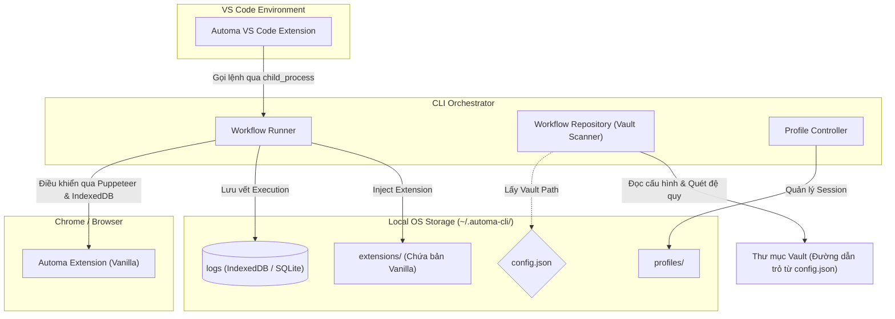

# Automa Ecosystem

Chào mừng đến với **Automa Ecosystem**. Phiên bản hiện tại là một hệ sinh thái gọn nhẹ và mạnh mẽ xoay quanh trung tâm là công cụ dòng lệnh `automa-cli`.

Kiến trúc mới này tập trung vào sự tự động hóa 100%, hoạt động hoàn toàn Offline (Offline-First) và quản lý dữ liệu linh hoạt, tách biệt khỏi sự phụ thuộc vào các dịch vụ Cloud cũ.

---

## 🚀 Hướng Dẫn Cài Đặt & Khởi Chạy (Getting Started)

Dự án được quản lý linh hoạt, các thành phần giao tiếp với nhau trực tiếp qua CLI.

### 1. Yêu Cầu Hệ Thống
- Node.js >= 18.x
- pnpm >= 8.x (`npm install -g pnpm`)

### 2. Cài Đặt & Khởi Chạy
Mở Terminal và chạy tuần tự các lệnh sau:

```bash
# 1. Clone mã nguồn
git clone https://github.com/tuquet/automa-ecosystem.git
cd automa-ecosystem

# 2. Cài đặt extension Automa gốc (Vanilla)
cd automa-cli
pnpm install
pnpm run build
node dist/cli.js install-extension --type github
```

> **Lưu ý:** Giao diện Automa Studio (Web) hay các bản fork cũ như `automa-ex` hiện đang bị **deprecated**. Toàn bộ trải nghiệm người dùng, quản lý Vault và xem Log đã được chuyển hẳn sang **VS Code Extension (`automa-vscode`)** và công cụ CLI gốc. Bản mở rộng Automa (Vanilla) nguyên gốc sẽ được CLI tự động tải về qua lệnh `install-extension`.

---

## 🏗️ Kiến Trúc Hệ Thống: `automa-cli` Là Gốc Rễ

Toàn bộ hệ sinh thái lấy `automa-cli` làm trái tim (Orchestrator). Thay vì giao tiếp phân mảnh qua nhiều app độc lập, mọi luồng dữ liệu đều được thực thi và điều phối bởi CLI.



---

## 🚀 4 Trụ Cột Chức Năng Của CLI

### 1. Phục vụ VS Code Extension (Orchestrator)
CLI cung cấp bộ lệnh hoàn chỉnh (`run`, `history`, `log`) cho **VS Code Extension (`automa-vscode`)** giao tiếp thông qua `child_process`. Điều này mang lại tính năng quản lý kịch bản trực tiếp ngay trong IDE lập trình mà không cần phải bật server nền (daemon).

### 2. Quản lý Thư mục Quét (Vault)
Thông qua `WorkflowRepository`, CLI cho phép người dùng chỉ định một thư mục "Vault" (được khai báo trong `config.json`). Nó sẽ thực hiện quét đệ quy toàn bộ thư mục này để tìm và index các file cấu hình workflow (`.json`). Source code workflows hoàn toàn nằm trên máy cục bộ, dễ dàng đồng bộ qua Git.

### 3. Quản lý Chrome Profiles
Thông qua `ProfileController`, CLI tạo ra và quản lý các thư mục vật lý (Profile) của trình duyệt tại `~/.automa-cli/profiles/`. Khi chạy Puppeteer, CLI map folder bằng cờ `--user-data-dir` để giữ nguyên các phiên đăng nhập (Session, Cookies) của người dùng một cách riêng biệt cho từng ngữ cảnh chạy.

### 4. Tự động hóa & Thực thi Workflow (Runner)
CLI có khả năng tự động bật trình duyệt thông qua Puppeteer, nạp (inject) trực tiếp **Automa Extension nguyên bản (Vanilla)** từ thư mục `extensions/`, và bắt đầu thực thi workflow. Toàn bộ tiến trình sẽ được giám sát chặt chẽ bằng cách poll trực tiếp từ IndexedDB của trình duyệt để xuất báo cáo log theo thời gian thực về màn hình console hoặc VS Code.

---

## ⚙️ Cấu Hình & Dữ Liệu Cục Bộ (Local Storage)

Toàn bộ dữ liệu cấu hình và trạng thái của hệ sinh thái được tập trung duy nhất tại:
**`~/.automa-cli/`**

1. **`config.json`**: File cấu hình trung tâm định nghĩa các đường dẫn (paths) và thiết lập (settings) của CLI.
2. **`extensions/`**: Chứa extension Automa tải từ Github.
3. **`profiles/`**: Nơi chứa dữ liệu phiên duyệt web của từng Profile tách biệt. Đảm bảo chạy tự động hóa nhiều tài khoản mà không bị trùng lặp.
4. **`log.sqlite` / `logs`**: Nơi lưu vết toàn bộ tiến trình lịch sử chạy workflow, giúp người dùng xem lại logs bất cứ lúc nào qua VS Code Extension.

---

## 🛠️ Cấu trúc Hệ Sinh Thái (Submodules)

* **`automa-cli`**: Công cụ dòng lệnh trung tâm. Đảm nhiệm việc tải extension, quét Vault và chạy Workflow thông qua Puppeteer.
* **`automa-vscode`**: VS Code Extension chính thức. Cung cấp giao diện "Click & Run", quản lý lịch sử và xem logs trực quan ngay trong trình soạn thảo mã nguồn.
* **`automa-vault`**: Nơi định nghĩa cấu trúc chuẩn của một Vault cơ bản. Nó bao gồm file cấu hình tĩnh (`settings.json`). Trong tương lai, đóng vai trò là "Khuôn mẫu" (Template) giúp đồng bộ hóa dữ liệu.

---

## ⌨️ Các Lệnh Thường Dùng (Scripts)

Tại thư mục `automa-cli`, bạn có thể sử dụng:

- `pnpm run build`: Đóng gói (Build) CLI.
- `node dist/cli.js install-extension`: Tải tự động extension gốc (Vanilla) từ Github.
- `node dist/cli.js run <file.json>`: Chạy một workflow cục bộ từ file chỉ định.
- `node dist/cli.js history`: Xem lịch sử các workflow đã chạy.
