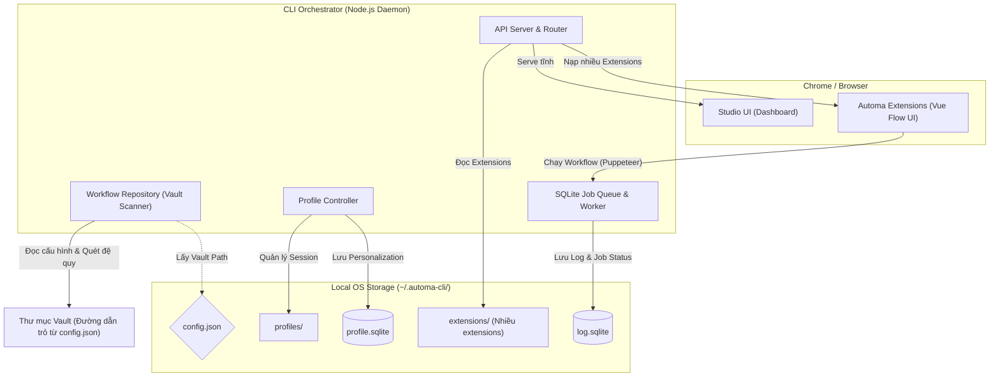

# Automa Ecosystem

Chào mừng đến với **Automa Ecosystem**. Phiên bản hiện tại là một hệ sinh thái mạnh mẽ (Multi-app Monorepo) xoay quanh trung tâm là công cụ dòng lệnh `automa-cli`.

Kiến trúc mới này tập trung vào sự tự động hóa 100%, có thể hoạt động hoàn toàn Offline (Offline-First) và quản lý dữ liệu linh hoạt, tách biệt khỏi sự phụ thuộc vào các dịch vụ Cloud cũ.

---

## 🚀 Hướng Dẫn Cài Đặt & Khởi Chạy (Getting Started)

Dự án được xây dựng dưới dạng **Turborepo** sử dụng **pnpm**.

### 1. Yêu Cầu Hệ Thống
- Node.js >= 18.x
- pnpm >= 8.x (`npm install -g pnpm`)

### 2. Cài Đặt & Khởi Chạy
Mở Terminal và chạy tuần tự các lệnh sau:

```bash
# 1. Clone mã nguồn
git clone https://github.com/tuquet/automa-ecosystem.git
cd automa-ecosystem/automa-cli

# 2. Cài đặt toàn bộ dependencies cho Monorepo
pnpm install

# 3. Khởi động môi trường Dev (Bật API Server & Giao diện Studio)
pnpm run dev
```

Sau khi chạy lệnh `dev`, hãy mở trình duyệt và truy cập vào địa chỉ `http://localhost:3333/ui` để vào trang **Automa Studio**.

---

## 🏗️ Kiến Trúc Hệ Thống: `automa-cli` Là Gốc Rễ

Toàn bộ hệ sinh thái lấy `automa-cli` làm trái tim (Orchestrator). Thay vì giao tiếp phân mảnh qua nhiều app độc lập, mọi luồng dữ liệu đều được quản lý bởi CLI.



---

## 🚀 5 Trụ Cột Chức Năng Của CLI

### 1. Mở & Phục vụ Studio UI
CLI không chỉ là công cụ dòng lệnh mà còn chứa một Daemon Server (chạy ở cổng `3333`). Khi gọi lệnh `automa studio`, CLI sẽ kích hoạt server này, sử dụng `UiController` để serve tĩnh giao diện web điều khiển (được build từ `apps/studio` bằng Vue 3 + Shadcn) lên trình duyệt của người dùng. 

### 2. Quản lý Thư mục Quét (Vault)
Thông qua `WorkflowRepository`, CLI cho phép người dùng chỉ định một thư mục "Vault" (được khai báo trong `config.json`). Nó sẽ thực hiện quét đệ quy toàn bộ thư mục này (bỏ qua các thư mục như `.git` hay `node_modules`) để tìm và index các file cấu hình workflow (`.json`). Nhờ vậy, source code workflows hoàn toàn nằm trên máy cục bộ, quản lý qua Git dễ dàng.

### 3. Quản lý Chrome Profiles
Thông qua `ProfileController`, CLI tạo ra và quản lý các thư mục vật lý (Profile) của trình duyệt tại `~/.automa-cli/profiles/`. Khi chạy Puppeteer để auto web, CLI sẽ map các folder này bằng cờ `--user-data-dir`. Việc này giúp mọi phiên đăng nhập (Session, Cookies) của người dùng đều được lưu lại. Ngoài ra, các cấu hình cá nhân hóa (Personalization) của từng trình duyệt được lưu trữ an toàn trong `profile.sqlite`.

### 4. Thực thi Workflow (Runner)
Thay vì bắt người dùng phải mở Chrome thủ công, CLI có thể tự động bật Puppeteer, bơm (inject) **nhiều extensions cùng lúc** (từ thư mục `extensions/`) vào, và kích hoạt các workflow một cách độc lập thông qua API.

### 5. Lưu vết (Logging) bằng SQLite
Tất cả các lệnh thực thi không bị bay mất vào hư không. CLI tích hợp một hệ thống Hàng đợi (Job Queue) mạnh mẽ (chạy bằng `worker-thread`). Bất cứ khi nào một tiến trình workflow đang chạy hoặc hoàn tất, nó sẽ ghi trực tiếp trạng thái và logs vào file cơ sở dữ liệu `log.sqlite`. Giao diện Studio có thể dùng thông tin này để stream log realtime (SSE) cho người dùng xem.

---

## ⚙️ Cấu Hình & Dữ Liệu Cục Bộ (Local Storage)

Để đảm bảo tính độc lập và dễ quản lý, toàn bộ dữ liệu cấu hình và trạng thái của hệ sinh thái được tập trung duy nhất tại một thư mục gốc trên hệ điều hành (Root OS Folder):
**`~/.automa-cli/`**

Thư mục này bao gồm các thành phần cốt lõi:

1. **`config.json`**
   - File cấu hình trung tâm định nghĩa các đường dẫn (paths) và thiết lập (settings) của CLI.
2. **`extensions/`**
   - Chứa danh sách các đường dẫn mã nguồn của các tiện ích (Extensions). CLI hỗ trợ nạp **nhiều extensions cùng lúc** vào trình duyệt (Puppeteer) thông qua thư mục này.
3. **`profiles/`**
   - Nơi chứa dữ liệu phiên duyệt web (Session, Cookies, Cache) của từng Profile tách biệt (`~/.automa-cli/profiles/<profileId>`). Đảm bảo chạy tự động hóa nhiều tài khoản mà không bị trùng lặp.
4. **`profile.sqlite`**
   - Cơ sở dữ liệu chuyên biệt để lưu trữ các thông tin cá nhân hóa (Personalization), cấu hình riêng lẻ cho từng trình duyệt hoặc profile.
5. **`log.sqlite`** (hoặc `db.sqlite`)
   - Cơ sở dữ liệu cục bộ dùng để lưu vết (Logging) toàn bộ tiến trình Hàng đợi (Job Queue), giúp người dùng xem lại lịch sử chạy workflow bất cứ lúc nào.

> **Lưu ý:** Thư mục Vault có thể nằm ở bất kỳ đâu trên máy tính để tiện cho việc dùng Git, nhưng đường dẫn trỏ tới Vault sẽ được khai báo trong `config.json`.

---

## 🛠️ Cấu trúc Monorepo

Dự án hiện tại là một Monorepo Turborepo, bao gồm các thành phần chính:

* **`automa-cli`**: Bao gồm lõi `apps/cli` (API Server, SQLite Queue, Profile & Vault Manager) và `apps/studio` (Giao diện Web UI điều khiển).
* **`automa-ex`**: Mã nguồn gốc của Automa Extensions (Nơi phát triển các tiện ích nạp vào trình duyệt).
* **`automa-vault`**: Nơi định nghĩa cấu trúc chuẩn của một Vault cơ bản. Nó bao gồm file cấu hình tĩnh (`settings.json`). Trong tương lai, cấu trúc này đóng vai trò là "Khuôn mẫu" (Template) giúp đồng bộ hóa (sync) toàn bộ dữ liệu của Vault lên các hệ thống Backend hoặc Git Remote.
* **`apps/e2e`**: Bộ kiểm thử Playwright.

---

## 🔌 Tích hợp IDE (VS Code Extension)

Hệ sinh thái tích hợp sẵn một Submodule chuyên biệt dành cho VS Code:
* **`automa-vscode`**: Là một VS Code Extension chính thức giúp Lập trình viên tương tác trực tiếp với `automa-cli` ngay trong môi trường viết code.
  - **Nhiệm vụ:** Mang đến trải nghiệm "Click & Run". Cung cấp giao diện để người dùng có thể kích hoạt Studio, chạy Workflow, quản lý Vault và xem logs mà không cần phải gõ lệnh Terminal thủ công. Đây là cầu nối giúp `automa-cli` hòa nhập sâu vào thói quen của Developer.

---

## ⌨️ Các Lệnh Thường Dùng (Scripts)

Tại thư mục `automa-cli`, bạn có thể sử dụng các lệnh Turborepo sau:

- `pnpm run dev`: Khởi chạy toàn bộ hệ thống (API Daemon + Studio UI).
- `pnpm run build`: Đóng gói (Build) CLI và tĩnh hóa Studio UI.
- `pnpm run test`: Chạy Unit Test cho toàn bộ các package.
- `pnpm run test:e2e`: Khởi chạy Playwright để test giao diện End-to-End.
- `npx automa studio`: (Nếu cài CLI global) Khởi chạy giao diện Studio độc lập.
