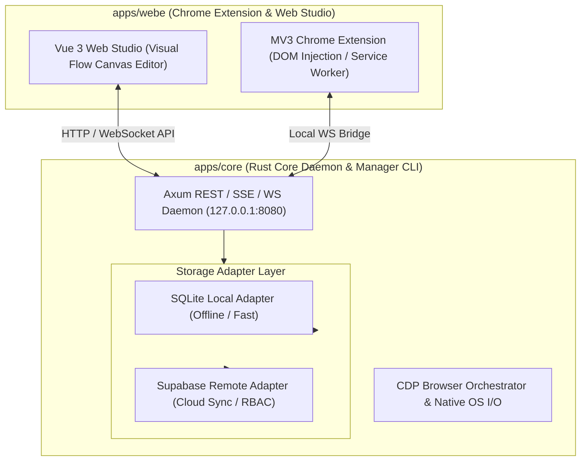

<div align="center">
  <h1>Tuquet Automa Engine</h1>
  <p><strong>High-Performance Browser Automation & OS Orchestration Engine</strong></p>

  [](https://github.com/tuquet/scoop-bucket)
  [](https://github.com/tuquet/tuquet-automa/releases)
  [](https://www.rust-lang.org/)
  [](https://nodejs.org/)
  [](LICENSE)
</div>

<br/>

Welcome to **Tuquet Automa**, an open-source, high-performance browser automation & OS orchestration platform. Built as a streamlined monorepo, Tuquet Automa pairs a lightning-fast **Rust Native Core (`apps/core`)** with a **Manifest V3 Chrome Extension & Visual Canvas Web Studio (`apps/webe`)**.

---

## 🧭 Monorepo Structure

```text
tuquet-automa/
├── apps/
│   ├── core/           # [Rust Core Engine]  - Axum Daemon, CDP Orchestrator, SQLite & Supabase Adapters
│   └── webe/           # [Extension & Studio]- MV3 Chrome Extension Runner & Vue 3 Visual Flow Canvas
├── packages/
│   ├── automa-types/   # OpenAPI Specifications & Shared TypeScript Types
│   ├── automa-ui/      # Enterprise Shadcn Vue UI Primitive Components
│   └── webextension-polyfill/
└── docs/               # Technical Architecture & Deployment Guides
```

---

## 🏗️ System Architecture



---

## 🚀 Quick Start for End Users

There are **two easy ways** to install and run Tuquet Automa on Windows:

### Option 1: Automatic Install via Scoop (Recommended)
If you use [Scoop](https://scoop.sh/):

```powershell
# 1. Add the official Tuquet Scoop bucket
scoop bucket add tuquet https://github.com/tuquet/scoop-bucket

# 2. Install Automa Engine
scoop install automa

# 3. Launch Automa Core Daemon
automa

# 4. Auto-update anytime via Scoop
scoop update automa
```

---

### Option 2: Direct Binary Download (GitHub Releases)
If you prefer downloading pre-built binaries without Scoop:

1. Go to the **[Latest GitHub Releases](https://github.com/tuquet/tuquet-automa/releases)** page.
2. Download the **`automa-v1.0.0-windows-x64.zip`** package under Assets.
3. Extract the `.zip` archive to any folder on your computer.
4. Double-click **`automa.exe`** to start the Automa Core Engine.

> 💡 Once launched, Automa Core runs locally at `http://127.0.0.1:3000`. You can inspect CLI options anytime by running `automa --help`.

---

## 💻 Developer Monorepo Setup

If you want to contribute or build from source:

### Prerequisites
- **Node.js**: `>= 18.0.0`
- **pnpm**: `>= 9.0.0`
- **Rust Toolchain**: `stable` (`cargo`, `rustc`)

```bash
# 1. Clone repository
git clone https://github.com/tuquet/tuquet-automa.git
cd tuquet-automa

# 2. Install dependencies
pnpm install

# 3. Build workspace packages (@automa/webe & apps/core)
pnpm run build

# 4. Launch dev mode
pnpm run dev          # Run full ecosystem
pnpm run dev:core     # Run Rust Core with cargo-watch hot reload
```

---

## 📚 Documentation & Contributing

- 🎨 **[WEB_STUDIO_USER_GUIDE.md](docs/WEB_STUDIO_USER_GUIDE.md)**: End-User manual covering Web Studio screens, tool groups, and step-by-step workflow creation.
- 📖 **[CONTRIBUTING.md](CONTRIBUTING.md)**: Developer guide, coding standards, and PR guidelines.
- 📐 **[WEBE_CHROME_EXTENSION_RUST_ARCHITECTURE.md](docs/WEBE_CHROME_EXTENSION_RUST_ARCHITECTURE.md)**: Deep-dive architecture of Chrome Extension + Rust OS Hybrid Automation.
- 🔒 **[SECURITY.md](SECURITY.md)**: Security policy and vulnerability disclosure process.

---

## 📄 License

Distributed under the [MIT License](LICENSE).
