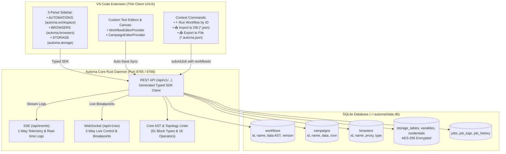

# 🆚 Automa VS Code Extension (Core Client)

**Automa VS Code** là một **Thin Client** giao tiếp trực tiếp với Rust Daemon (`automa-core`) qua cơ chế **SQLite Database-First Central Hub**. Extension đóng vai trò thuần giao diện UI/UX và **TUYỆT ĐỐI KHÔNG** tự mình thực hiện các tác vụ nặng (như chạy trình duyệt, nạp file nháp trực tiếp hay crawl dữ liệu).

---

## 🛑 QUY TẮC KIẾN TRÚC CỐT LÕI (MANDATORY INVARIANTS)



### 1. SQLite Database-First Central Hub & Thực Thi 100% Bằng ID
- **Single Source of Truth**: Toàn bộ trạng thái Workflows, Campaigns, Browsers, Tables, Variables, Credentials và Lịch sử Jobs được quản lý, lưu trữ và truy vấn tập trung tại SQLite Database (`~/.automa/state.db`).
- **Thực thi 100% bằng ID**: Mọi yêu cầu chạy kịch bản (`submitJob`, `executeCampaign`) gửi `workflowId` hoặc `campaignId` để Daemon nạp AST trực tiếp từ SQLite Database. **TUYỆT ĐỐI KHÔNG** phụ thuộc vào đường dẫn file tĩnh trên máy chủ.
- **Tự động đồng bộ AST (Auto-Sync on Save)**: Khi người dùng chỉnh sửa và lưu kịch bản trên Custom Editor (`WorkflowEditorProvider` / `WorkflowSaveService`), extension tự động cập nhật bản ghi AST vào SQLite DB qua API `createStorageWorkflow` / `updateStorageWorkflow`.
- **Cấm Quét Thư Mục Ngầm (Zero Folder Scanning)**: Quét đệ quy thư mục hoặc tìm kiếm glob file scenario trên ổ đĩa bị nghiêm cấm. Mọi thao tác file đều diễn ra tường minh thông qua hành động Import/Export của người dùng.

### 2. Mô Hình Giao Tiếp 3 Kênh Chuẩn Hóa
- **REST API (`/api/v1/...`)**: 100% endpoints CRUD, Storage, Browsers và Jobs tiêu thụ qua Typed SDK Client `@automa/types/api` được sinh tự động từ OpenAPI v3 (`utoipa`).
- **SSE (`/api/events` & `/api/v1/internal/worker/events`)**: Luồng streaming 1 chiều phục vụ nhật ký thực thi thời gian thực, telemetry tiến độ và trạng thái phân bổ Grid Matrix slots.
- **WebSocket (`/api/v1/ws`)**: Kênh điều khiển 2 chiều độ trễ thấp (`PAUSE_JOB`, `RESUME_JOB`, `KILL_JOB`, Live Breakpoints) tiêu thụ types chuẩn từ `@automa/types/ws`.

### 3. Tiếp Nhận Mọi Định Dạng JSON & Dựa Vào Core AST Linter
- **Hỗ Trợ Toàn Diện `*.json`**: Mọi file JSON (`.json`, `.automa.json`, `.workflow.json`, `.package.json`, `.campaign.json`) đều có thể mở qua Custom Editor, Import vào SQLite DB hoặc chạy trực tiếp.
- **Xác Thực Cú Pháp & Cấu Trúc Đồ Thị**: Extension ủy quyền việc kiểm tra tính hợp lệ cho **Core AST & Topology Linter API (`/api/v1/lint/workflow`)** (xác thực 61 block types, 16 toán tử điều kiện, chu trình vòng lặp và kết nối node). Mọi lỗi cấu trúc được backend trả về chi tiết dưới dạng `ApiErrorResponse` và hiển thị trực tiếp lên Editor qua `vscode.Diagnostic`.

### 4. Quản Lý Webview & Bảo Mật Dữ Liệu
- **Tiêm Dữ Liệu Webview An Toàn (Safe JSON Injection)**: Dữ liệu JSON được tiêm an toàn vào thẻ `<script id="data" type="application/json">` và parse bằng `JSON.parse(document.getElementById('data').textContent)` với CSP Nonce 32 ký tự, ngăn chặn triệt để XSS và lỗi escape ký tự đặc biệt.
- **Tự Động Làm Sạch AST (Auto-Sanitize)**: Tự động bổ sung các ID bị thiếu hoặc chuẩn hóa cấu trúc node cũ sang format hiện đại thông qua `WorkflowSanitizer`.

---

## 🧭 CẤU TRÚC GIAO DIỆN & 4-PANEL SIDEBAR

Thanh điều hướng Sidebar chuẩn hóa 4 panel chính (theo chuẩn GitHub Actions):

### 1. ⚡ AUTOMATIONS Panel (`automa.workspace`)
- Quản lý danh sách phẳng (Flat List) toàn bộ Workflows, Campaigns, Packages với huy hiệu phân vùng trực quan `[parent/namespace]`.
- Nút tác vụ tích hợp:
  - ➕ **Create Workflow**: Tạo mới kịch bản.
  - 📥 **Import Workflow to Database**: Nạp file `.automa.json` / `.json` vào SQLite DB.
  - 🚀 **Create Campaign**: Tạo chiến dịch ma trận đa trình duyệt.
  - 🔄 **Refresh Workspace**: Đồng bộ trạng thái mới nhất từ SQLite DB.

### 2. 🌐 BROWSERS Panel (`automa.browsers`)
- Quản lý ảo hóa Browser Anti-Detect profiles lưu trong SQLite DB qua REST API.
- Cung cấp tính năng thêm mới, chỉnh sửa User-Agent, Proxy, Cookie injection và sideload extensions.

### 3. 🔒 STORAGE Panel (`automa.storage`)
- Quản trị cơ sở dữ liệu toàn cục trong SQLite:
  - **Variables**: Biến cấu hình công khai dạng Plaintext.
  - **Credentials**: Bí mật và thông tin xác thực được mã hóa an toàn bằng thuật toán **HMAC-SHA256 + AES-256-CBC (Salted__)**.
  - **Tables**: Bảng dữ liệu quan hệ với giao diện trực quan hỗ trợ thêm cột động và chỉnh sửa dữ liệu dạng lưới.

### 4. 📜 LOGS Panel (`automa.logs`)
- Giám sát và truy vấn toàn bộ lịch sử các phiên chạy kịch bản từ SQLite DB:
  - **Tầng 1 (Root Runs)**: Danh sách phiên chạy từ `/api/v1/history` kèm icon trạng thái `$(pass-filled)`, `$(error)`, `$(sync~spin)`, thời gian và thời lượng.
  - **Tầng 2 (Step Logs)**: Chi tiết từng bước thực thi từ `/api/v1/history/{id}/logs` kèm icon mức độ và thời lượng từng block.
- Nút thao tác: 🔄 **Refresh**, 🧹 **Clear All History**, 🗑️ **Delete Run Item**.

---

## 🏛️ KIẾN TRÚC `automa-vsce:panel` VS `automa-vsce:preview`

| Chiều So Sánh | `automa-vsce:panel` (Panel Architecture) | `automa-vsce:preview` (Preview Architecture) |
| :--- | :--- | :--- |
| **Bản Chất & Khái Niệm** | **Khung nhìn độc lập (Unbound / DB-bound)** | **Trình soạn thảo trực quan (File-bound)** |
| **VS Code API Base** | `vscode.WebviewPanel` / `WebviewViewProvider` / `TreeDataProvider` | `vscode.CustomTextEditorProvider` / `BaseCustomEditorProvider` |
| **Đối Tượng Phục Vụ** | Quản trị tài nguyên toàn cục (Browsers, Tables, Variables, Credentials, Logs) | Chỉnh sửa file kịch bản đồ họa (`*.workflow.json`, `*.automa.json`, `*.campaign.json`, `*.browser.json`) |
| **Cơ Chế Dữ Liệu** | Nạp & Đột biến trực tiếp vào SQLite DB qua Typed REST API SDK | Đồng bộ 2 chiều với `vscode.TextDocument` (hỗ trợ Undo/Redo `Ctrl+Z`, `Ctrl+Y`, Dirty `●`, Lưu `Ctrl+S`) |
| **Cơ Chế Xem / Chuyển Đổi** | Mở trên Sidebar hoặc Tab riêng (`TablePanel`, `WelcomePanel`) | Chuyển đổi qua lại giữa Mã nguồn thô (Raw JSON) $\leftrightarrow$ Visual Canvas Preview (`ViewColumn.Beside`) |
| **Debugging Thời Gian Thực** | Lắng nghe luồng SSE 1 chiều (`/api/events`) | Điều khiển 2 chiều qua WebSocket (`/api/v1/ws`) với Live Breakpoints, Pause, Resume, Highlight node |

---

## 🎨 CUSTOM EDITORS & WEBVIEW PROVIDERS

- **`WorkflowEditorProvider` (`automa.workflowEditor`)**: Trình soạn thảo kịch bản đồ họa / biểu mẫu trực quan, hỗ trợ chạy thử nghiệm và tự động đồng bộ AST vào SQLite DB khi lưu.
- **`CampaignEditorProvider` (`automa.campaignEditor`)**: Trình cấu hình chiến dịch phân bổ ma trận nhiều trình duyệt (Grid Window Slot System).
- **`BrowserEditorProvider` (`automa.browserEditor`)**: Trình cấu hình ảo hóa trình duyệt chống phát hiện độc lập.
- **`LogEditorProvider` (`automa.logEditor`)**: Trình hiển thị nhật ký thực thi lịch sử và streaming live log qua SSE.

---

## 📚 BẢNG THUẬT NGỮ CỐT LÕI (CANONICAL TERMINOLOGY)

| Thuật Ngữ Chuẩn | Thành Phần Code | Mô Tả Kỹ Thuật |
| :--- | :--- | :--- |
| **`automa-vsce:panel`** | `StorageTreeDataProvider`, `LogsTreeDataProvider`, `TablePanel` | Kiến trúc Panel & Webview View quản trị tài nguyên toàn cục nạp từ SQLite DB. |
| **`automa-vsce:preview`** | `WorkflowEditorProvider`, `CampaignEditorProvider` | Kiến trúc Custom Text Editor ràng buộc file, đồng bộ 2 chiều với TextDocument & Live Breakpoints. |
| **Thin Client** | `AutomaClient`, `CommandManager` | Mô hình extension thuần UI/UX, ủy quyền 100% tác vụ logic và thực thi cho Rust Daemon. |
| **SQLite Database-First** | `AutomaDb`, `@automa/types/api` | Nguyên tắc toàn bộ thực thể được quản lý, lưu trữ và thực thi từ SQLite DB trung tâm (`~/.automa/state.db`). |
| **WorkflowId Execution** | `submitJob({ workflowId })` | Cơ chế thực thi kịch bản bằng ID định danh lưu trong SQLite thay vì đọc file tĩnh từ ổ đĩa máy chủ. |
| **Core AST Linter** | `LinterService`, `/api/v1/lint/workflow` | Công cụ phân tích cú pháp và topo đồ họa kịch bản trên Daemon, hỗ trợ 61 loại block và 16 toán tử điều kiện. |
| **Safe JSON Injection** | `<script id="data" type="application/json">` | Tiêm dữ liệu JSON vào DOM Webview an toàn chống tấn công XSS và lỗi escape chuỗi. |
| **Grid Matrix System** | `app_settings.grid`, `executeCampaign` | Cơ chế tự động tính toán tọa độ và kích thước cửa sổ trình duyệt trên màn hình hiển thị. |
| **Vault Cryptography** | `CryptoService`, `AES-256-CBC` | Hệ thống mã hóa bảo mật thông tin xác thực với Master Passphrase trong `SecretStorage`. |

---

## 🧪 PHÁT TRIỂN & KIỂM THỬ (TEST SUITE)

Extension tuân thủ chiến lược kiểm thử đa tầng:

```pwsh
# Chạy Unit Tests của Extension & Webview IPC (122 tests)
pnpm -F vscode-automa test

# Chạy kiểm tra định dạng và chuẩn linter Biome/ESLint
pnpm -F vscode-automa run lint

# Chạy toàn bộ 4 tầng kiểm thử toàn diện Monorepo
pnpm test
```


