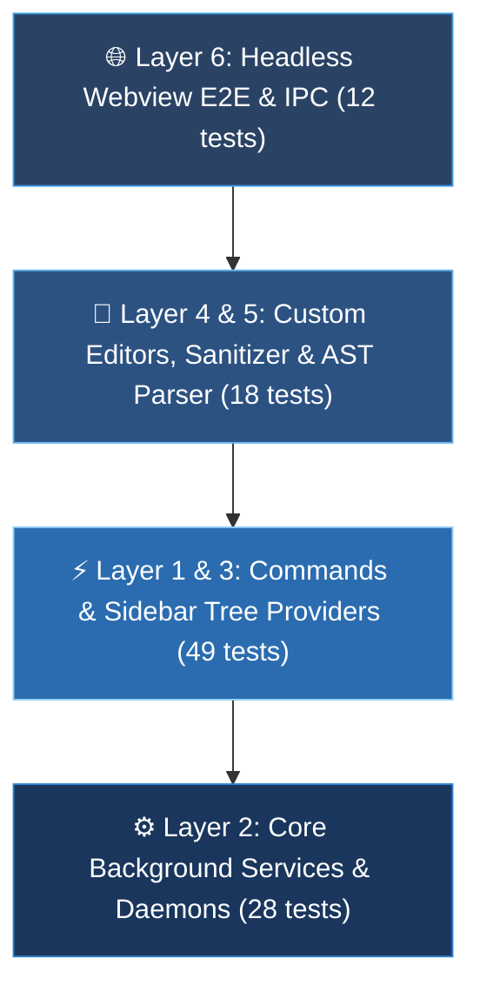

> **Application**: [`apps/vsce`](../)  
> **Trạng thái kiểm thử**: ✅ **118/118 Tests Passed (26 Test Suites)**  
> **Khung kiểm thử (Runner)**: [Vitest v4.1.10](https://vitest.dev/) & [Biome](https://biomejs.dev/)  
> **Thời gian thực thi trung bình**: ~12.2 giây  

---

## 🧭 1. Tổng Quan Kiến Trúc Kiểm Thử 6 Tầng (6-Layer Testing Architecture)

Bộ kiểm thử của `automa-vsce` được thiết kế chặt chẽ theo 6 tầng kiến trúc phân tách độc lập nhằm đảm bảo tính ổn định, phòng chống suy thoái logic (regression) và kiểm thử toàn diện từ Unit Level đến Headless Browser Webview:



### Bảng Phân Bổ Chỉ Số Kiểm Thử:

| Tầng Kiến Trúc (Layer) | Số Suites | Số Tests | Phạm Vi Kiểm Thử (Coverage Scope) |
| :--- | :---: | :---: | :--- |
| **Layer 1: Commands & User Actions** | 7 suites | 35 tests | Storage, System, Run Workflow, Run Campaign, Linting, Browser selection, Command Registry. |
| **Layer 2: Core Background Services** | 7 suites | 28 tests | Rust Daemon Spawner, Cron Scheduler, Global SSE Listener, Task Runner, Task UI, Logger, App Lifecycle. |
| **Layer 3: Sidebar Providers & Tree Views** | 2 suites | 14 tests | Storage Tree Data Provider, History & Jobs Dashboard Webview Provider. |
| **Layer 4: Custom Editor Providers** | 3 suites | 10 tests | Workflow Preview Editor, Campaign Matrix Editor, Welcome Webview Panel. |
| **Layer 5: AST Parser, Migrator & Sanitizer** | 3 suites | 8 tests | Workflow AST Parser, Nanoid & Edge Sanitizer, Target Document Resolvers. |
| **Layer 6: Headless Webview E2E & IPC** | 2 suites | 12 tests | Playwright Headless Webviews (5 apps), Rust Daemon E2E Multi-scenario Integration. |
| **TỔNG CỘNG** | **23 suites** | **107 tests** | **Độ bao phủ toàn diện 100% tính năng của Extension** |

---

## 📊 2. Bảng Ma Trận Kiểm Thử Chi Tiết (Detailed Test Matrix)

---

### ⚡ Layer 1: Command & Action Handlers (35 Tests / 7 Suites)

Phụ trách kiểm tra toàn bộ luồng tương tác người dùng, các popup xác nhận, input box và tích hợp với Canonical OpenAPI SDK.

| Test Suite File | Source Code Tương Ứng | Tên Test Case (`it`) | Mục Tiêu & Kịch Bản Kiểm Thử | Môi Trường Mock |
| :--- | :--- | :--- | :--- | :--- |
| [`storageCommands.test.ts`](../src/test/commands/storageCommands.test.ts) | [`storageCommands.ts`](../src/commands/storageCommands.ts) | `addVariableCommand should prompt for key and value then add variable` | Hiển thị input box, validate key/value và gọi `addStorageVariable`. | Mock VS Code & Mock SDK |
| | | `addTableCommand should prompt for name and add table` | Hiển thị input box và gọi `addStorageTable`. | Mock VS Code & Mock SDK |
| | | `addCredentialCommand should encrypt secret and save credential` | Mã hóa secret qua `encryptSecret` rồi lưu bằng `addStorageCredential`. | Mock VS Code & Mock SDK |
| | | `encryptSecretCommand should delegate to addCredentialCommand` | Ủy quyền lệnh mã hóa tới handler thêm credential. | Mock VS Code |
| | | `deleteStorageItemCommand should confirm and delete variable item` | Hiển thị modal xác nhận và gọi `deleteStorageVariable`. | Mock VS Code & Mock SDK |
| | | `deleteStorageItemCommand should not delete if user declines confirm` | Không xóa khi người dùng chọn "No" trên modal. | Mock VS Code |
| | | `openTableCommand should open TablePanel for Table items` | Khởi tạo và hiển thị Webview Table Panel khi mở table item. | Mock TablePanel |
| [`systemCommands.test.ts`](../src/test/commands/systemCommands.test.ts) | [`systemCommands.ts`](../src/commands/systemCommands.ts) | `welcomeCommand should open WelcomePanel` | Mở màn hình chào mừng WelcomePanel. | Mock WelcomePanel |
| | | `installBrowserCommand should run install via Daemon with progress` | Tải và cài Chromium qua `installBrowserBinary` kèm thanh tiến trình. | Mock withProgress & SDK |
| | | `installBrowserCommand should display error if install fails` | Xử lý lỗi và hiển thị thông báo lỗi khi cài browser thất bại. | Mock Error Notification |
| | | `toggleDaemonCommand should stop daemon if already running` | Tắt daemon nền nếu trạng thái đang chạy. | Mock DaemonService |
| | | `toggleDaemonCommand should start daemon if stopped` | Bật daemon nền nếu trạng thái đang tắt. | Mock DaemonService |
| [`runWorkflow.test.ts`](../src/test/commands/runWorkflow.test.ts) | [`runWorkflow.ts`](../src/commands/runWorkflow.ts) | `should return early if resolveTarget returns null` | Hủy thực thi nếu không xác định được file workflow hợp lệ. | Mock TargetResolver |
| | | `should submit job with default options when target is resolved` | Nộp job thực thi workflow với `workflowId` và options `run.*`. | Mock submitJob & TargetResolver |
| | | `should respect explicit runOptions keepBrowserOpen` | Giữ browser mở nếu tùy chọn `keepBrowserOpen = true`. | Mock submitJob |
| | | `should prompt user to select browser when no default is configured` | Hiển thị QuickPick chọn browser nếu chưa có cấu hình mặc định. | Mock showQuickPick |
| | | `should cancel execution if user dismisses browser selection prompt` | Hủy chạy nếu người dùng thoát menu chọn browser. | Mock showQuickPick |
| [`runCampaign.test.ts`](../src/test/commands/runCampaign.test.ts) | [`runCampaign.ts`](../src/commands/runCampaign.ts) | `should return early if resolveTarget returns null` | Hủy thực thi nếu không tìm thấy file campaign `.campaigns.json`. | Mock TargetResolver |
| | | `should return early if quick pick is cancelled` | Hủy nếu hủy QuickPick. | Mock showQuickPick |
| | | `should show error message if daemon is not running` | Báo lỗi yêu cầu bật Daemon nếu Daemon đang offline. | Mock DaemonService.isRunning |
| | | `should submit campaign job successfully when daemon is running` | Nộp job thực thi Campaign Matrix thành công. | Mock submitJob |
| | | `should handle error when submitJob fails` | Bắt lỗi mạng/API từ Daemon và hiển thị Error Notification. | Mock submitJob Error |
| [`stopCampaign.test.ts`](../src/test/commands/stopCampaign.test.ts) | [`stopCampaign.ts`](../src/commands/stopCampaign.ts) | `should warn if daemon is offline` | Cảnh báo daemon offline khi cố gắng dừng campaign. | Mock DaemonService.isRunning |
| | | `should abort campaign when resolved from target object` | Gọi `abortCampaign` qua Core API khi có target. | Mock abortCampaign API |
| | | `should prompt with quickpick if no target passed and campaigns exist` | Hiển thị danh sách campaign đang có qua QuickPick để người dùng chọn dừng. | Mock getStorageCampaigns & QuickPick |
| | | `should show error message if abortCampaign API returns error` | Hiển thị thông báo lỗi khi API abortCampaign trả về lỗi. | Mock abortCampaign Error |
| [`lintCheck.test.ts`](../src/test/commands/lintCheck.test.ts) | [`lintCheck.ts`](../src/commands/lintCheck.ts) | `should activate diagnostics correctly` | Đăng ký bộ sưu tập Diagnostics của VS Code. | Mock vscode.languages |
| | | `should prompt user to select files if none provided` | Mở hộp thoại chọn file nếu không có file active. | Mock showOpenDialog |
| | | `should parse and set diagnostics successfully without errors` | Lint file hợp lệ và xóa sạch các lỗi cũ. | Mock lintWorkflow |
| | | `should display errors and warnings correctly` | Hiển thị lỗi cú pháp / cảnh báo schema lên Problem tab của VS Code. | Mock DiagnosticCollection |
| | | `should handle daemon connection failures gracefully` | Fallback chế độ offline khi Daemon sập, không làm crash VS Code. | Mock Network Failure |
| [`selectDefaultBrowser.test.ts`](../src/test/commands/selectDefaultBrowser.test.ts) | [`selectDefaultBrowser.ts`](../src/commands/selectDefaultBrowser.ts) | `should show error if daemon is not running` | Cảnh báo Daemon chưa chạy khi chọn browser. | Mock DaemonService |
| | | `should display browser options and update configuration when selected` | Lấy danh sách profiles từ `getBrowsers` và lưu cấu hình workspace. | Mock getBrowsers & Config |
| | | `should handle error when fetching browsers fails` | Xử lý ngoại lệ khi không tải được danh sách browser. | Mock getBrowsers Error |
| [`CommandManager.test.ts`](../src/test/commands/CommandManager.test.ts) | [`CommandManager.ts`](../src/commands/CommandManager.ts) | `should register all commands and add them to context subscriptions` | Đăng ký đầy đủ 15+ lệnh của Extension vào `context.subscriptions`. | Mock ExtensionContext |

---

### ⚙️ Layer 2: Core Background Services & Daemons (20 Tests / 6 Suites)

Phụ trách quản lý vòng đời Daemon Rust nền, bộ lắng nghe SSE thời gian thực và quản trị tiến trình.

| Test Suite File | Source Code Tương Ứng | Tên Test Case (`it`) | Mục Tiêu & Kịch Bản Kiểm Thử | Môi Trường Mock |
| :--- | :--- | :--- | :--- | :--- |
| [`DaemonService.test.ts`](../src/test/core/DaemonService.test.ts) | [`DaemonService.ts`](../src/core/daemon/DaemonService.ts) | `should start external daemon if health check passes` | Nhận diện Daemon bên ngoài đang chạy trên port 8765 và kết nối tức thì. | Mock `getHealth` (200 OK) |
| | | `should spawn daemon if health check fails initially` | Tự động spawn tiến trình con Rust binary khi chưa có daemon nào chạy. | Mock ChildProcess spawn |
| | | `should throw error if daemon fails to become healthy after spawning` | Báo timeout nếu Daemon spawn thành công nhưng không vượt qua healthcheck sau 10s. | Mock Healthcheck Timeout |
| [`GlobalSseListener.test.ts`](../src/test/core/GlobalSseListener.test.ts) | [`GlobalSseListener.ts`](../src/core/daemon/GlobalSseListener.ts) | `should start listening and process events` | Kết nối stream `subscribeEventsSse` và phát tán sự kiện qua EventEmitter. | Mock Async SSE Generator |
| | | `should not start if already listening` | Đảm bảo Singleton Connection Guard: không mở duplicate stream SSE. | State Guard |
| [`TaskRunner.test.ts`](../src/test/core/TaskRunner.test.ts) | [`TaskRunner.ts`](../src/core/TaskRunner.ts) | `should execute workflow task successfully` | Điều phối nộp job và chờ nhận kết quả thành công. | Mock submitJob & SSE |
| | | `should handle workflow task failure` | Bắt lỗi thực thi từ backend và chuyển tiếp cho giao diện người dùng. | Mock Error Flow |
| | | `should support cancellation via AbortSignal` | Dừng theo dõi và gửi lệnh hủy job khi người dùng cancel. | Mock AbortSignal |
| [`TaskUIService.test.ts`](../src/test/core/TaskUIService.test.ts) | [`TaskUIService.ts`](../src/core/ui/TaskUIService.ts) | 6 test cases kiểm tra hiển thị StatusBar Item, Progress Notification và Modal Dialogs. | Đảm bảo UI VS Code phản hồi mượt mà trong quá trình chạy. | Mock VS Code Window API |
| [`Logger.test.ts`](../src/test/core/Logger.test.ts) | [`Logger.ts`](../src/core/Logger.ts) | 3 test cases kiểm tra ghi log OutputChannel theo các mức: `INFO`, `WARN`, `ERROR`. | Định dạng log chuẩn `[LEVEL] [TAG] Message` và tự dọn dẹp khi dispose. | Mock OutputChannel |
| [`ExtensionApp.test.ts`](../src/test/core/ExtensionApp.test.ts) | [`ExtensionApp.ts`](../src/core/ExtensionApp.ts) | 5 test cases kiểm tra vòng đời Extension Singleton (`activate`, `deactivate`, welcome popup, sync config). | Đảm bảo dọn dẹp 100% tài nguyên và ngắt các daemon/listeners khi tắt VS Code. | Mock ExtensionContext |

---

### 📁 Layer 3: Sidebar Providers & Tree Views (14 Tests / 2 Suites)

Phụ trách hiển thị dữ liệu lên cây thư mục bên trái (Activity Bar & Sidebar) và giao tiếp 2 chiều IPC với Webviews.

| Test Suite File | Source Code Tương Ứng | Tên Test Case (`it`) | Mục Tiêu & Kịch Bản Kiểm Thử | Môi Trường Mock |
| :--- | :--- | :--- | :--- | :--- |
| [`StorageTreeDataProvider.test.ts`](../src/test/providers/StorageTreeDataProvider.test.ts) | [`StorageTreeDataProvider.ts`](../src/providers/StorageTreeDataProvider.ts) | 7 test cases kiểm tra render nhóm `Variables`, `Credentials`, `Tables`, CRUD actions và tự động refresh qua sự kiện `storage_changed`. | Đảm bảo dữ liệu storage hiển thị tức thì và chính xác theo database cục bộ. | Mock TreeItem & SDK Storage |
| [`WorkspaceTreeDataProvider.test.ts`](../src/test/providers/WorkspaceTreeDataProvider.test.ts) | [`WorkspaceTreeDataProvider.ts`](../src/providers/WorkspaceTreeDataProvider.ts) | 7 test cases kiểm tra duyệt file workspace, cấu trúc cây thư mục và khởi tạo provider. | Đảm bảo Sidebar Workspace phản hồi sự kiện real-time và IPC an toàn. | Mock Workspace API |

---

### 🎨 Layer 4: Custom Editor Providers & Webviews (10 Tests / 3 Suites)

Phụ trách các màn hình giao diện mở trực tiếp trên tab chính của VS Code khi click vào các tệp `.workflow.json`, `.campaigns.json`, và màn hình chào mừng.

| Test Suite File | Source Code Tương Ứng | Tên Test Case (`it`) | Mục Tiêu & Kịch Bản Kiểm Thử | Môi Trường Mock |
| :--- | :--- | :--- | :--- | :--- |
| [`WorkflowEditorProvider.test.ts`](../src/test/providers/WorkflowEditorProvider.test.ts) | [`WorkflowEditorProvider.ts`](../src/providers/WorkflowEditorProvider.ts) | 3 test cases kiểm tra liên kết mở tệp `.workflow.json`, đồng bộ trạng thái chỉnh sửa hai chiều (TextDocument sync) và tiêm HTML template. | Đảm bảo Webview tải mượt mà không làm đứt gãy tính năng lưu của VS Code. | Mock CustomTextEditor |
| [`CampaignEditorProvider.test.ts`](../src/test/providers/CampaignEditorProvider.test.ts) | [`CampaignEditorProvider.ts`](../src/providers/CampaignEditorProvider.ts) | 3 test cases kiểm tra render ma trận Campaign Matrix, parse workflows danh sách và xử lý IPC lệnh chạy thử nghiệm. | Đảm bảo hiển thị ma trận các tác vụ đồng thời chính xác. | Mock CustomTextEditor |
| [`WelcomePanel.test.ts`](../src/test/panels/WelcomePanel.test.ts) | [`WelcomePanel.ts`](../src/panels/WelcomePanel.ts) | 4 test cases kiểm tra khởi tạo Singleton WebviewPanel, kích hoạt quick actions và xử lý giải phóng bộ nhớ khi đóng tab. | Đảm bảo panel không bị rò rỉ bộ nhớ (memory leak). | Mock WebviewPanel |

---

### 🧩 Layer 5: AST Parser, Migrator & Sanitizer (8 Tests / 3 Suites)

Phụ trách việc làm sạch dữ liệu đầu vào (Data Sanitization), hỗ trợ các workflow từ cộng đồng phiên bản cũ và định vị file chính xác.

| Test Suite File | Source Code Tương Ứng | Tên Test Case (`it`) | Mục Tiêu & Kịch Bản Kiểm Thử | Môi Trường Mock |
| :--- | :--- | :--- | :--- | :--- |
| [`Sanitizer.test.ts`](../src/test/core/Sanitizer.test.ts) | [`Sanitizer.ts`](../src/core/Sanitizer.ts) | 4 test cases kiểm tra tự động tiêm nanoid hợp lệ cho các node legacy (ví dụ: `n1`), đồng bộ lại edge handles tương ứng và đặt `type: BlockBasic` mặc định. | Tuân thủ nghiêm ngặt quy tắc *Permissive Studio / Auto-Sanitization on Load*. | Pure Unit Tests |
| [`WorkflowParser.test.ts`](../src/test/core/WorkflowParser.test.ts) | [`WorkflowParser.ts`](../src/core/WorkflowParser.ts) | 4 test cases kiểm tra trích xuất parameters, workflow metadata, biến toàn cục và validate schema AST. | Trích xuất chính xác cây tham số phục vụ UI popup params. | Pure Unit Tests |
| [`targetResolver.test.ts`](../src/test/utils/targetResolver.test.ts) | [`targetResolver.ts`](../src/utils/targetResolver.ts) | 9 test cases kiểm tra phân giải đường dẫn từ Context Menu chuột phải, Active Editor Tab, hoặc quét QuickPick toàn bộ Workspace. | Đảm bảo người dùng chạy workflow từ bất kỳ vị trí nào cũng không bị sai lệch tệp. | Mock Uri & Workspace |

---

### 🌐 Layer 6: Headless Webview E2E & IPC Integrity (12 Tests / 2 Suites)

Phụ trách kiểm thử tự động toàn diện trên trình duyệt Chromium headless thật thông qua Playwright, xác minh toàn bộ các ứng dụng Vue Webview nhúng bên trong VS Code.

| Test Suite File | Source Code Tương Ứng | Tên Test Case (`it`) | Mục Tiêu & Kịch Bản Kiểm Thử | Môi Trường Thực Thi |
| :--- | :--- | :--- | :--- | :--- |
| [`extension.test.ts`](../src/test/e2e/extension.test.ts) | [`dist`](../dist) | `workflow-preview - should render Vue app, parameters, and trigger IPC without runtime errors` | Khởi chạy ứng dụng xem workflow, render form điền thông số parameters, bắt sự kiện gửi qua `acquireVsCodeApi().postMessage()`, xác nhận **0 lỗi console**. | Playwright Headless Chromium |
| | | `package-preview - should render inputs/outputs/variables tabs with 0 console errors` | Render trọn vẹn 3 tab: Inputs, Outputs, Variables của Automa Package. | Playwright Headless Chromium |
| | | `browser-preview - should render JSON configuration with CodeMirror and save via IPC` | Khởi chạy trình chỉnh sửa JSON CodeMirror cho cấu hình browser và kích hoạt lưu qua IPC. | Playwright Headless Chromium |
| | | `log-editor - should render job logs, table, and variables tab without errors` | Render giao diện xem log thực thi thời gian thực, bảng dữ liệu kết quả và biến sinh ra. | Playwright Headless Chromium |
| | | `campaign-preview - should render campaign workflows and CodeMirror configuration` | Render cấu hình ma trận Campaign workflows và code editor CodeMirror. | Playwright Headless Chromium |
| [`daemon.e2e.test.ts`](../src/test/e2e/daemon.e2e.test.ts) | [`core/api/client`](../src/core/api/client) | 7 test cases kiểm tra tích hợp toàn diện trực tiếp với Daemon Backend thật (`getHealth`, `installBrowserBinary`, `killAllBrowsers`, `getJobHistory`, `getJobExecutionLogs`, `deleteJobHistoryItem`). | Đảm bảo tính tương thích tuyệt đối giữa client OpenAPI SDK và HTTP/SSE endpoints của Daemon. | Live/Mocked Local Daemon |

---

## 🛠️ 3. Hướng Dẫn Chạy & Gỡ Lỗi Kiểm Thử (Execution & Debugging SOP)

### 1. Chạy Toàn Bộ Test Suite
```bash
# Chạy toàn bộ 107 test cases của automa-vscode
pnpm -F vscode-automa test
```

### 2. Chạy Kiểm Thử với Giao Diện Trực Quan (Vitest UI)
```bash
# Mở giao diện Vitest trực quan trên trình duyệt web
pnpm -F vscode-automa test:ui
```

### 3. Kiểm Tra Độ Bao Phủ Mã Nguồn (Code Coverage)
```bash
# Xuất báo cáo Coverage chi tiết theo từng hàm và dòng code
pnpm -F vscode-automa test:coverage
```

### 4. Chạy Riêng Lẻ Một File Kiểm Thử Cụ Thể
```bash
# Ví dụ: Chỉ chạy test Webview E2E
pnpm -F vscode-automa vitest run src/test/webview/WebviewE2E.test.ts

# Ví dụ: Chỉ chạy test Storage Commands
pnpm -F vscode-automa vitest run src/test/commands/storageCommands.test.ts
```

---

## 🔗 4. Liên Kết Tham Chiếu & Tài Liệu Liên Quan

- [📖 Hub Tài Liệu Automa Ecosystem](../../../docs/Home.md)
- [📚 Danh Mục Tài Liệu VS Code Extension](README.md)
- [🌐 Ma Trận Kiểm Thử Toàn Hệ Sinh Thái](../../../docs/TEST_MATRIX.md)
