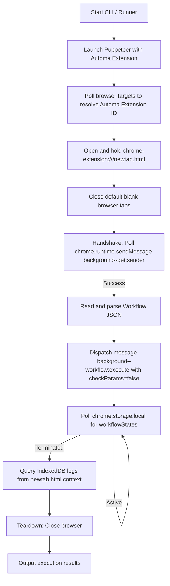

# Automa CLI: Design and Risks Mitigation

This document details the architectural design, Puppeteer startup sequence, message communication flow, and key risk mitigation strategies for running Automa workflows programmatically via the command line interface.

## Puppeteer Startup and Message Sequence

Below is the Mermaid Flowchart detailing the Puppeteer lifecycle, extension ID detection, handshake, and message passing flow.

---

## Risk Mitigation Strategies

### 1. MV3 Service Worker Sleep
* **Risk**: Under Chrome Extension Manifest V3, the background service worker automatically goes to sleep after 30 seconds of inactivity. If a workflow execution takes longer than 30 seconds or performs asynchronous/long-running actions, the background service worker might terminate mid-execution, causing the workflow to freeze.
* **Mitigation**: To prevent the service worker from sleeping, the runner programmatically opens and holds an extension page, specifically `newtab.html` (e.g. `chrome-extension://<extension_id>/newtab.html`), in a dedicated background tab. Since a visible/active extension page is open, Chrome treats the extension as active, keeping the background service worker alive for the entire duration of the browser session.

### 2. Chrome Default Tab Behavior
* **Risk**: When Puppeteer starts a new Chrome instance, Chrome automatically opens a default home page or a blank tab (e.g., `about:blank`). Leaving this default tab open during automated workflows can consume resources, trigger unwanted popups, or pollute target tabs when the workflow expects to operate on specific tab IDs.
* **Mitigation**: After launching Chrome and successfully locating the extension, the runner opens the extension's dashboard (`newtab.html`). It then retrieves all open pages via `browser.pages()` and closes any page that does not match the extension's newtab page. This ensures a clean slate containing only the required extension manager tab.

### 3. Background Listener Startup Latency
* **Risk**: There is a race condition between Puppeteer attempting to execute a workflow and the extension background script completing its initialization. The background service worker may take several hundred milliseconds to register its `chrome.runtime.onMessage` listeners. Dispatching a message immediately after browser startup will result in a "Could not establish connection. Receiving end does not exist." error.
* **Mitigation**: The runner implements a polling-based handshake mechanism. It repeatedly evaluates `chrome.runtime.sendMessage({ name: 'background--get:sender', data: {} })` inside the context of the extension's `newtab.html` tab. It only proceeds to load and execute workflows once the background service worker responds to this handshake message successfully, indicating that the runtime event listeners are ready.

### 4. Bypassing popup.html and params.html UI
* **Risk**: If a workflow contains user input parameters or uses the manual trigger block, Automa's default behavior is to open `popup.html` or `params.html` as a popup window to prompt the user for variables. In a CLI context, this UI prompt is unacceptable as it blocks headless/automated execution and requires manual interaction.
* **Mitigation**: 
  1. The runner dispatches the execution command directly using the `workflow:execute` event on the background message bridge, completely bypassing the popup interface.
  2. The runner injects pre-defined parameters/variables via the `options.data.variables` payload.
  3. The runner explicitly sets `checkParams: false` and `checkParam: false` in the execution options. The workflow engine (`WorkflowEngine.js`) checks `checkParams` to skip displaying the parameters prompt UI (`params.html`) and proceeds immediately with execution using the injected variables.
