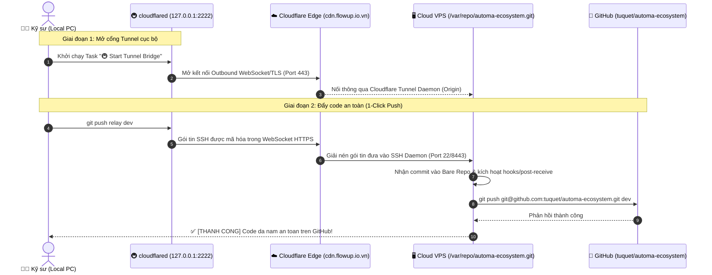

# 🚇 Hướng Dẫn Kỹ Thuật: Cloudflare SSH Tunnel & Git Relay

> **Tài liệu chuẩn hóa hạ tầng mạng & quy trình đẩy mã nguồn an toàn cho Automa Ecosystem**  
> *Áp dụng khi làm việc trong môi trường mạng doanh nghiệp bị hạn chế (chặn port 22, chặn proxy Layer 7, chặn GitHub).*

---

## 1. 📌 Bối Cảnh & Mục Tiêu

Trong quá trình phát triển hệ sinh thái **Automa Ecosystem**, các kỹ sư thường xuyên phải làm việc trong môi trường mạng văn phòng hoặc mạng doanh nghiệp có thiết lập tường lửa khắt khe (Skyhigh Web Gateway, Fortinet, CMC Global firewall):
* **Chặn cổng SSH (Port 22)**: Không thể clone hoặc push qua SSH thông thường.
* **Chặn hoặc kiểm duyệt giao thức Git (DLP/DPI)**: Soi tiêu đề gói tin chứa tên miền `github.com` và chủ động ngắt kết nối (TCP Reset).
* **Đặc thù mạng doanh nghiệp khắt khe**: Cấu hình proxy toàn cục (`--global`) sẽ làm hỏng kết nối của các dự án khác trên máy.

👉 **Giải pháp hoàn hảo**: Thiết lập **Cloudflare SSH Tunnel kết hợp Git Relay qua Bare Repository trên VPS**, được tích hợp sẵn thành **VS Code Task 1-Click** ngay trong bộ công cụ của Automa Ecosystem.

---

## 2. 🏗️ Kiến Trúc Hoạt Động (Data Flow Architecture)



### Ưu điểm vượt trội:
1. **Tuyệt đối ẩn danh với tường lửa nội bộ**: Lưu lượng đi ra ngoài chỉ là lưu lượng HTTPS/WebSocket tiêu chuẩn tới Cloudflare Edge. Tường lửa không thấy DNS `github.com`, không thấy IP GitHub, không thấy lệnh Git.
2. **Không làm ô nhiễm máy tính**: Không cần bật proxy toàn hệ thống. Cấu hình hoàn toàn cục bộ hoặc theo phiên làm việc.
3. **Tự động hóa khép kín (Self-Healing)**: Hệ thống tự động kiểm tra `cloudflared`, tự cài đặt qua Scoop nếu thiếu, tự bật ngầm tunnel và đẩy code trực tiếp.

---

## 3. 🧪 "Nguyên Liệu" Cần Thiết Để Xây Dựng

| Thành phần | Nơi cấu hình | Chi tiết kỹ thuật |
| :--- | :--- | :--- |
| **Domain** | Cloudflare Dashboard | Tên miền riêng (ví dụ `flowup.io.vn`), trỏ Nameserver về Cloudflare. |
| **DNS CNAME** | DNS Records | `cdn.flowup.io.vn` trỏ về `<Tunnel-UUID>.cfargotunnel.com` (bật 🟠 Proxied). |
| **Cloudflare Tunnel** | Zero Trust Dashboard | Route Public Hostname: `cdn.flowup.io.vn` $\rightarrow$ Service `SSH` $\rightarrow$ `localhost:22`. |
| **VPS Origin Server** | Linux VPS | Cài đặt `cloudflared` làm service ngầm; Cấu hình Bare Repo tại `/var/repo/automa-ecosystem.git`. |
| **Deploy Key / SSH** | GitHub & VPS | Public Key của VPS được cấp quyền ghi (*Write access*) trên GitHub. |
| **Local Client** | Máy tính cá nhân | Cài `cloudflared` qua Scoop; Mở cổng `127.0.0.1:2222`. |

---

## 4. 🚀 Hướng Dẫn Sử Dụng Trong Automa Ecosystem

Toàn bộ cơ chế đã được lập trình sẵn thành công cụ dòng lệnh và tác vụ VS Code. Kỹ sư không cần nhớ các câu lệnh SSH phức tạp.

### Cách 1: Sử dụng VS Code Tasks (Khuyên dùng)
1. Nhấn `Ctrl + Shift + P` (hoặc `F1`) $\rightarrow$ chọn **Tasks: Run Task**.
2. Chọn: **`🚇 8. Cloudflare Tunnel & Git Relay (Wizard)`**.
3. Chọn một trong các tác vụ:

| Tùy chọn | Chức năng |
| :--- | :--- |
| 🚀 **1-Click Push via Relay** | **Tự động từ A-Z**: Kiểm tra `cloudflared` (tự cài nếu thiếu) $\rightarrow$ Tự mở cổng 2222 $\rightarrow$ Đẩy code lên GitHub qua Relay. |
| 🚇 **Start Tunnel Bridge** | Mở tiến trình `cloudflared access tcp` ngầm lắng nghe tại `127.0.0.1:2222`. |
| 🛑 **Stop Tunnel Bridge** | Dừng tiến trình và giải phóng cổng `2222`. |
| 🩺 **Doctor & Healthcheck** | Chẩn đoán toàn diện 4 tầng (Binary CLI $\rightarrow$ Port 2222 $\rightarrow$ SSH VPS $\rightarrow$ Quyền GitHub). |
| ⚙️ **Setup Cloudflared** | Kiểm tra và tự động cài đặt `cloudflared` qua Scoop. |

---

### Cách 2: Sử dụng dòng lệnh NPM Scripts
Mở terminal tại thư mục gốc của dự án:

```powershell
# 1-Click Push lên GitHub qua đường hầm an toàn:
pnpm run push:relay

# Chẩn đoán trạng thái kết nối 4 tầng:
pnpm run tunnel:status

# Quản lý bật/tắt thủ công:
pnpm run tunnel:start
pnpm run tunnel:stop

# Mở giao diện tương tác TUI:
pnpm run tunnel
```

---

## 5. 🛡️ Quy Tắc An Toàn Mã Nguồn (Safety Guidelines)

Tuân thủ nghiêm ngặt quy định tại [`.agents/AGENTS.md`](../.agents/AGENTS.md):

1. **Quy tắc An Toàn Nhánh (Branch Safety)**:
   - Tất cả các tác vụ Relay Push theo mặc định được đẩy vào nhánh `dev` (hoặc nhánh chỉ định).
   - Nhánh `main` được bảo vệ nghiêm ngặt, chỉ dành cho bản release chính thức.
2. **Atomic Monorepo Push**:
   - Toàn bộ thay đổi mã nguồn trên các ứng dụng (`apps/*`) và thư viện (`packages/*`) được đẩy nguyên khối (atomic) lên GitHub chỉ qua 1 lần push duy nhất.
3. **Bảo mật Repository Visibility**:
   - Đảm bảo repo `tuquet/automa-ecosystem` được đặt ở trạng thái **Private** trên GitHub để bảo vệ logic nghiệp vụ nội bộ.

---

## 6. 🩺 Bảng Xử Lý Sự Cố Thường Gặp (Troubleshooting)

### Sự cố 1: Lỗi `cloudflared not found`
* **Nguyên nhân**: Máy tính chưa có binary `cloudflared`.
* **Khắc phục**: Chạy lệnh `pnpm run tunnel:setup`. Script sẽ tự động dùng Scoop để cài đặt mà không cần tải thủ công.

### Sự cố 2: Lỗi `Connection refused on port 2222`
* **Nguyên nhân**: Cổng tunnel chưa được mở trên máy local.
* **Khắc phục**: Chạy `pnpm run tunnel:start` hoặc dùng lệnh `pnpm run push:relay` (script sẽ tự động phát hiện và mở cổng giúp bạn).

### Sự cố 3: Lỗi `Permission denied (publickey)` khi kết nối VPS
* **Nguyên nhân**: VPS chưa nhận SSH Key cá nhân của bạn.
* **Khắc phục**: Sao chép public key của bạn (`~/.ssh/id_rsa.pub` hoặc `~/.ssh/id_ed25519.pub`) và thêm vào file `~/.ssh/authorized_keys` trên VPS.

### Sự cố 4: Hook báo `Không thể đẩy code sang GitHub`
* **Nguyên nhân**: VPS chưa được cấp quyền ghi trên GitHub repository.
* **Khắc phục**: Đăng nhập VPS, chạy `ssh -T git@github.com` để kiểm tra xác thực. Đảm bảo public key của VPS đã được thêm vào mục **Deploy Keys** (tích chọn *Allow write access*) trên GitHub.
