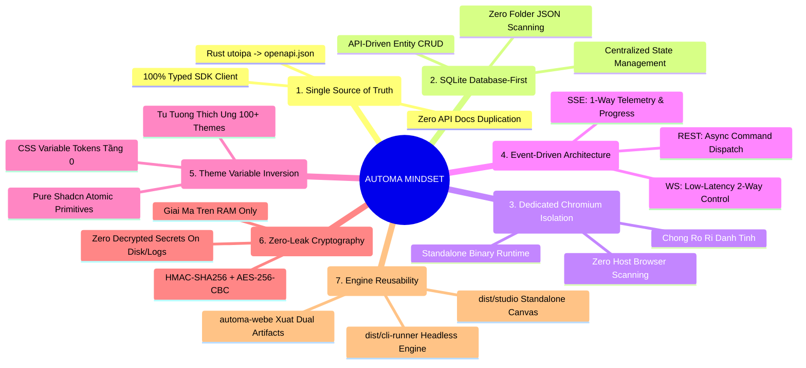

# 📚 Automa Ecosystem Knowledge Base (Hub)

Chào mừng bạn đến với trung tâm tri thức và tài liệu (Knowledge Base) của **Automa Ecosystem**.

Hệ thống tài liệu được quản trị theo mô hình **Tài liệu sống (Living Documentation & Single Source of Truth)** kết nối trực tiếp giữa **Ma Trận Đặc Tả 2 Chiều (2D Matrix SRS)**, **Cẩm Nang Kỹ Thuật (Engineering Guides)**, và **Hệ Thống API Tương Tác Hiện Đại (Scalar API Reference)**.

> 🗂️ **Tra cứu nhanh toàn bộ mục lục tài liệu**: Xem tại [`docs/README.md`](./README.md)

---

## 🧠 BẢN ĐỒ TƯ DUY KIẾN TRÚC & 7 NGUYÊN TẮC BẤT BIẾN (CORE ARCHITECTURAL INVARIANTS)

Mã nguồn (code) có thể thay đổi liên tục qua từng bản commit, nhưng **Tư Duy Thiết Kế (Mindset)** và **Các Quy Tắc Bất Biến (Invariants)** là những chân lý định hình sự ổn định lâu dài của Automa Ecosystem:



### 💎 7 Nguyên Tắc Bất Biến (The 7 Golden Invariants):

1. **Single Source of Truth & Zero Redundancy (Nguồn Chân Lý Duy Nhất)**:
   - Toàn bộ đặc tả API được định nghĩa tại `automa-core` (Rust + `utoipa`) và xuất ra [`openapi.json`](../packages/types/openapi.json).
   - Client tiêu thụ duy nhất qua SDK [`@automa/types/api`](../packages/types/README.md).
   - **Tư duy**: Tuyệt đối không viết tài liệu sao chép lại schema của API dạng Markdown tĩnh (tránh Documentation Drift). Khám phá tương tác trực tiếp qua **Scalar API Server** (`:8767`).
2. **Database-First State & Zero Folder Scanning (Dữ Liệu Tập Trung SQLite)**:
   - **Tư duy**: Quét thư mục tìm file JSON (`*.workflow.json`, `*.browser.json`) là phương pháp phản mô hình (anti-pattern) gây nghẽn I/O và xung đột trạng thái.
   - Mọi thực thể (Workflows, Browsers, Campaigns, Tables, Variables, Credentials) được quản lý tập trung và bền vững trong SQLite Database thông qua Automa Core REST API (`/api/v1/...`).
3. **Dedicated Downloaded Chromium & Zero Host Browser Scanning (Cách Ly Danh Tính)**:
   - **Tư duy**: Quét và chiếm quyền điều khiển trình duyệt của máy người dùng (`chrome.exe`, `msedge.exe`) tiềm ẩn nguy cơ rò rỉ dữ liệu cá nhân và không thể đảm bảo môi trường thực thi đồng nhất.
   - Automa Core sử dụng binary Chromium độc lập được tải và duy trì riêng biệt (theo kiến trúc Playwright), loại trừ 100% version drift và cô lập phiên làm việc hoàn toàn.
4. **Event-Driven UI Reactions (Kiến Trúc Phản Xạ Hướng Sự Kiện)**:
   - **Tư duy**: Chia tách ranh giới rõ ràng giữa **Điều khiển (Command)** và **Quan sát (Observation)**:
     - **HTTP REST**: Gửi lệnh bất đồng bộ, trả về ngay lập tức `200 OK (job_id)` (Non-blocking).
     - **SSE (`/api/v1/events`)**: Truyền phát luồng dữ liệu 1 chiều (Logs, Telemetry, Matrix Progress) để cập nhật phản xạ Pinia Store.
     - **WebSocket (`/api/v1/ws`)**: Kênh 2 chiều độ trễ cực thấp để can thiệp trực tiếp (`PAUSE_JOB`, `RESUME_JOB`, `KILL_JOB`, live breakpoints).
   - Nghiêm cấm sử dụng cơ chế Polling (thăm dò định kỳ) làm quá tải server.
5. **Theme Variable Inversion & Pure Atomic UI (Đảo Ngược Biến Giao Diện)**:
   - **Tư duy**: Linh kiện giao diện nguyên tử không được chứa logic nhận biết theme (Dark/Light/VS Code).
   - Mọi linh kiện Shadcn-Vue giữ nguyên 100% class chuẩn hóa (`bg-primary`, `border-border`). Toàn bộ khả năng thích ứng với hơn 100 theme của VS Code, Desktop, hay Web Extension được giải quyết triệt để tại tầng CSS Variables Tokens (`tokens.css`).
6. **Zero-Leak RAM-Only Cryptography (Mật Mã An Toàn Tuyệt Đối)**:
   - **Tư duy**: Dữ liệu nhạy cảm chỉ tồn tại dưới dạng mã hóa `HMAC-SHA256 + AES-256-CBC` khi lưu trữ.
   - Quá trình giải mã `{{secrets.key}}` chỉ diễn ra trên bộ nhớ RAM tại microsecond block thực thi, và bộ nhớ được xóa sạch ngay sau đó. Nghiêm cấm ghi log hoặc lưu trữ secret đã giải mã xuống đĩa.
7. **Single Core Engine & Dual Reusable Artifacts (Một Động Cơ, Đa Nền Tảng)**:
   - `automa-webe` đóng vai trò là Engine cốt lõi, đóng gói thành 2 artifacts tái sử dụng:
     - `dist/cli-runner`: Headless Execution Engine tiêu thụ bởi Daemon Rust.
     - `dist/studio`: Standalone Web Canvas nhúng vào VS Code Webview và Desktop Tauri.
   - Không một dòng code thực thi hay canvas layout nào được phép sao chép thủ công (Zero Code Duplication).

---

## 🏛️ TRỤ CỘT 1: HỆ THỐNG ĐẶC TẢ SRS MA TRẬN 2 CHIỀU (2D MATRIX SPECIFICATION)

> 📍 **Trung tâm điều hướng chi tiết**: [**`docs/srs/README.md`**](./srs/README.md)

### 🌐 1. Tiêu Chuẩn Kỹ Thuật Ngang (Horizontal Standards)
- ⚡ [**SRS Horizontal Buttons & FSM Engine (`SRS_HORIZONTAL_BUTTONS.md`)**](./srs/SRS_HORIZONTAL_BUTTONS.md): Master catalog 37 Button IDs (`btn.*`), máy trạng thái FSM 7 bước (`IDLE` $\rightarrow$ `TERMINATING`), Thác cứu hộ Browser Waterfall 3 cấp độ, và WebSocket live breakpoint controls (`PAUSE_JOB`, `RESUME_JOB`, `KILL_JOB`).
- 📜 [**SRS Horizontal Selects & Virtualization (`SRS_HORIZONTAL_SELECTS.md`)**](./srs/SRS_HORIZONTAL_SELECTS.md): Master catalog 11 Remote Select IDs (`select.*`), thuật toán cắt lát ảo hóa (Virtualization Slices), Debounce fuzzy search, và tự động làm mới qua SSE Cache Invalidation.
- 🏛️ [**SRS Horizontal Feature Stores & Reactive Hub (`SRS_HORIZONTAL_FEATURE_STORES.md`)**](./srs/SRS_HORIZONTAL_FEATURE_STORES.md): Master architecture 6 Pinia Domain Stores theo mô hình 4 lớp (Primitive State, Entity Graph, Actions, SSE Mutations) và Ma trận Phản xạ Tức thì (Reactive Reflection Matrix).
- 🎨 [**SRS Horizontal UI Components & Shadcn (`SRS_HORIZONTAL_UI_COMPONENTS.md`)**](./srs/SRS_HORIZONTAL_UI_COMPONENTS.md): Kiến trúc Design System 3 tầng phân lớp, Theme Variable Inversion đa nền tảng, 19 linh kiện atomic Shadcn-Vue, và quy chuẩn tự động hóa CLI (`sync:ui`, `add:ui`, `audit:ui`).

### 📱 2. Đặc Tả Nghiệp Vụ Dọc Từng Màn Hình (Vertical Menu SRS)
1. 🎨 [**Menu 1: Studio Canvas & Workflow Editor (`SRS_MENU_STUDIO.md`)**](./srs/SRS_MENU_STUDIO.md) - Soạn thảo đồ thị VueFlow, Smart Connect, Action Header, Run Modal, Dynamic Parameters, Lint diagnostics, và Live Debugger Console.
2. 🌐 [**Menu 2: Browsers Fleet Management (`SRS_MENU_BROWSERS.md`)**](./srs/SRS_MENU_BROWSERS.md) - Quản lý Profile Anti-detect, Auto-detect Chrome/Brave/Edge, Quản lý phiên Chromium `startBrowser()`, Dừng khẩn cấp Kill-all.
3. 🚀 [**Menu 3: Campaign Matrix Scheduler (`SRS_MENU_CAMPAIGN.md`)**](./srs/SRS_MENU_CAMPAIGN.md) - Ma trận Campaign Matrix Grid, điều phối chạy song song nhiều profile, phân bổ slots, theo dõi tiến độ thời gian thực `campaign_slot_progress`.
4. 🗄️ [**Menu 4: Storage & Vault Cryptography (`SRS_MENU_STORAGE.md`)**](./srs/SRS_MENU_STORAGE.md) - Bảng dữ liệu SQLite động, Biến công khai `{{variables.*}}`, Mật mã Vault mã hóa `HMAC-SHA256 + AES-256-CBC` `{{secrets.*}}`, Workspace File Explorer.
5. 📜 [**Menu 5: History & Telemetry Explorer (`SRS_MENU_HISTORY.md`)**](./srs/SRS_MENU_HISTORY.md) - Lịch sử thực thi Job, bộ lọc trạng thái, xem chi tiết trace log từng block, thống kê thời gian và hiệu suất.
6. ⚙️ [**Menu 6: Settings & Core Daemon Configuration (`SRS_MENU_SETTINGS.md`)**](./srs/SRS_MENU_SETTINGS.md) - Cấu hình Daemon Host/Port `:8765`, Giám sát Heartbeat Health, Master Passphrase, Giao diện Dark/Light/System, Đường dẫn lưu trữ Workspace.

---

## 📘 TRỤ CỘT 2: CẨM NANG KỸ THUẬT & QUY CHUẨN KỸ SƯ (ENGINEERING GUIDES)

- 📘 [**OpenAPI Integration & Developer Guide (`OPENAPI_INTEGRATION_GUIDE.md`)**](./OPENAPI_INTEGRATION_GUIDE.md): Cẩm nang lập trình kết nối Backend Axum Daemon bằng Typed SDK `@automa/types/api`, xử lý lỗi `ApiErrorResponse`, và 4 bộ Recipes luồng nghiệp vụ thực tế.
- 🛡️ [**Minimalist UI/UX Audit Log (`MINIMALIST_UX_AUDIT_LOG.md`)**](./MINIMALIST_UX_AUDIT_LOG.md): Báo cáo kiểm toán giao diện 5 vòng định kỳ, quy tắc Rule of 1–3 Words, tối giản hóa Visual Noise và loại bỏ trùng lặp CTA.
- 🧪 [**Ma Trận Kiểm Thử Toàn Hệ Sinh Thái (`TEST_MATRIX.md`)**](./TEST_MATRIX.md): Báo cáo kim tự tháp kiểm thử 4 tầng toàn diện (Unit, E2E Vitest, Schema Linter, Unified Runner).

---

## ⚡ TRỤ CỘT 3: HỆ THỐNG API TẬP TRUNG (THE UNIFIED API TRINITY)

Dự án áp dụng triết lý **Single Source of Truth (SSOT)**: Toàn bộ API contracts được định nghĩa tại `apps/core` (Rust + `utoipa`) và xuất ra [`openapi.json`](../packages/types/openapi.json). Thay vì lưu trữ hàng trăm file Markdown tĩnh dễ bị lỗi thời, hệ thống cung cấp 3 tầng phục vụ chuyên biệt:

1. **Tier 1 (Code-to-Code / Type-Safe SDK)**: 
   - Tiêu thụ trực tiếp từ package [`@automa/types/api`](../packages/types/README.md).
   - Cung cấp 100% type safety, auto-completion, và zero-fetch syntax.
2. **Tier 2 (Interactive Live Explorer & Testing)**:
   - **Scalar API Reference**: Khởi chạy tài liệu tương tác với hot reload trên trình duyệt:
     ```bash
     pnpm run docs:api
     # Truy cập: http://localhost:8767
     ```
   - **Bruno API Collection**: Chạy và kiểm thử trực tiếp các request tại thư mục `bruno/`.
3. **Tier 3 (Architecture & Blueprints)**:
   - Đọc cẩm nang [`docs/OPENAPI_INTEGRATION_GUIDE.md`](./OPENAPI_INTEGRATION_GUIDE.md) để nắm rõ luồng SSE (`/api/v1/events`), WebSocket (`/api/v1/ws`) và mã hóa Vault.

---

## 📦 APPLICATIONS & PACKAGES REFERENCE

1. 🦀 [**Automa Core (Rust Daemon)**](../apps/core/README.md) - Core engine xử lý logic, Axum REST/SSE/WS server, Browser management, SQLite DB.
2. 🖥️ [**Automa Desktop App (Tauri v2)**](../apps/desk/README.md) - Ứng dụng Desktop độc lập Native OS tích hợp Pinia Domain Stores và Browser Waterfall.
3. 🧩 [**Automa VS Code Extension**](../apps/vsce/README.md) - 3-Panel Sidebar (`automa.workspace`, `automa.browsers`, `automa.storage`), Custom Editors, và Live Debugger.
4. 🌐 [**Automa Web Extension & Studio**](../apps/webe/README.md) - Standalone Web Studio (`dist/studio`) và Headless Runner (`dist/cli-runner`).
5. 📂 [**Automa Vault**](../apps/vault/README.md) - Cấu trúc lưu trữ Local Vault, Campaigns, và Browsers.
6. 🎨 [**Automa UI SDK (`@automa/ui`)**](../packages/ui/README.md) - Gói thư viện giao diện & trạng thái dùng chung (Shadcn-Vue Primitives, Theme Tokens).
7. 📦 [**Automa Types & API SDK (`@automa/types`)**](../packages/types/README.md) - Định nghĩa kiểu dữ liệu dùng chung và TypeScript SDK client sinh tự động từ OpenAPI.
