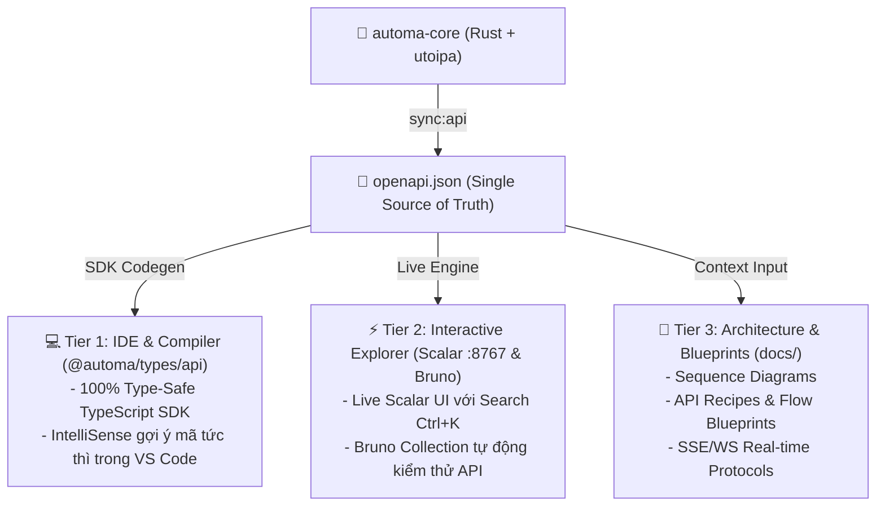

# 📚 Automa Ecosystem Documentation & Knowledge Base (Hub)

Chào mừng bạn đến với trung tâm tài liệu toàn diện của **Automa Ecosystem**.

Hệ thống tài liệu được quản trị theo mô hình **Tài liệu sống (Living Documentation & Single Source of Truth)** kết nối trực tiếp giữa **Ma Trận Đặc Tả 2 Chiều (2D Matrix SRS)**, **Cẩm Nang Kỹ Thuật (Engineering Guides)**, và **Hệ Thống API Tương Tác Hiện Đại (Scalar API Reference)**.

---

## 🏛️ TRỤ CỘT 1: HỆ THỐNG ĐẶC TẢ SRS MA TRẬN 2 CHIỀU (2D MATRIX SPECIFICATION)

> 📍 **Trung tâm điều hướng chi tiết**: [**`docs/srs/README.md`**](./srs/README.md)

```
                       ┌───────────────────────────────────────────────────────────┐
                       │   AUTOMA ECOSYSTEM: 2D MATRIX SPECIFICATION ARCHITECTURE  │
                       └─────────────────────────────┬─────────────────────────────┘
                                                     │
               ┌─────────────────────────────────────┴─────────────────────────────────────┐
               ▼                                                                           ▼
   [ TIÊU CHUẨN KỸ THUẬT NGANG ]                                               [ ĐẶC TẢ NGHIỆP VỤ DỌC TỪNG MENU ]
   - SRS_HORIZONTAL_BUTTONS.md                                                 - Menu 1: SRS_MENU_STUDIO.md
   - SRS_HORIZONTAL_SELECTS.md                 ◄══ 1-to-1 Matrix Link ══►      - Menu 2: SRS_MENU_BROWSERS.md
   - SRS_HORIZONTAL_FEATURE_STORES.md                                          - Menu 3: SRS_MENU_CAMPAIGN.md
   - SRS_HORIZONTAL_UI_COMPONENTS.md                                           - Menu 4: SRS_MENU_STORAGE.md
                                                                               - Menu 5: SRS_MENU_HISTORY.md
                                                                               - Menu 6: SRS_MENU_SETTINGS.md
```

### 🌐 1. Tiêu Chuẩn Kỹ Thuật Ngang (Horizontal Standards)
- ⚡ [**SRS Horizontal Buttons & FSM Engine (`docs/srs/SRS_HORIZONTAL_BUTTONS.md`)**](./srs/SRS_HORIZONTAL_BUTTONS.md): Master catalog 37 Button IDs (`btn.*`), máy trạng thái FSM 7 bước (`IDLE` $\rightarrow$ `TERMINATING`), Thác cứu hộ Browser Waterfall 3 cấp độ, và WebSocket live breakpoint controls (`PAUSE_JOB`, `RESUME_JOB`, `KILL_JOB`).
- 📜 [**SRS Horizontal Selects & Virtualization (`docs/srs/SRS_HORIZONTAL_SELECTS.md`)**](./srs/SRS_HORIZONTAL_SELECTS.md): Master catalog 11 Remote Select IDs (`select.*`), thuật toán cắt lát ảo hóa (Virtualization Slices), Debounce fuzzy search, và tự động làm mới qua SSE Cache Invalidation.
- 🏛️ [**SRS Horizontal Feature Stores & Reactive Hub (`docs/srs/SRS_HORIZONTAL_FEATURE_STORES.md`)**](./srs/SRS_HORIZONTAL_FEATURE_STORES.md): Master architecture 6 Pinia Domain Stores theo mô hình 4 lớp (Primitive State, Entity Graph, Actions, SSE Mutations) và Ma trận Phản xạ Tức thì (Reactive Reflection Matrix).
- 🎨 [**SRS Horizontal UI Components & Shadcn (`docs/srs/SRS_HORIZONTAL_UI_COMPONENTS.md`)**](./srs/SRS_HORIZONTAL_UI_COMPONENTS.md): Kiến trúc Design System 3 tầng phân lớp, Theme Variable Inversion đa nền tảng, 19 linh kiện atomic Shadcn-Vue, và quy chuẩn tự động hóa CLI (`sync:ui`, `add:ui`, `audit:ui`).

### 📱 2. Đặc Tả Nghiệp Vụ Dọc Từng Màn Hình (Vertical Menu SRS)
1. 🎨 [**Menu 1: Studio Canvas & Workflow Editor (`docs/srs/SRS_MENU_STUDIO.md`)**](./srs/SRS_MENU_STUDIO.md) - Soạn thảo đồ thị VueFlow, Smart Connect, Action Header, Run Modal, Dynamic Parameters, Lint diagnostics, và Live Debugger Console.
2. 🌐 [**Menu 2: Browsers Fleet Management (`docs/srs/SRS_MENU_BROWSERS.md`)**](./srs/SRS_MENU_BROWSERS.md) - Quản lý Profile Anti-detect, Auto-detect Chrome/Brave/Edge, Quản lý phiên Chromium `startBrowser()`, Dừng khẩn cấp Kill-all.
3. 🚀 [**Menu 3: Campaign Matrix Scheduler (`docs/srs/SRS_MENU_CAMPAIGN.md`)**](./srs/SRS_MENU_CAMPAIGN.md) - Ma trận Campaign Matrix Grid, điều phối chạy song song nhiều profile, phân bổ slots, theo dõi tiến độ thời gian thực `campaign_slot_progress`.
4. 🗄️ [**Menu 4: Storage & Vault Cryptography (`docs/srs/SRS_MENU_STORAGE.md`)**](./srs/SRS_MENU_STORAGE.md) - Bảng dữ liệu SQLite động, Biến công khai `{{variables.*}}`, Mật mã Vault mã hóa `HMAC-SHA256 + AES-256-CBC` `{{secrets.*}}`, Workspace File Explorer.
5. 📜 [**Menu 5: History & Telemetry Explorer (`docs/srs/SRS_MENU_HISTORY.md`)**](./srs/SRS_MENU_HISTORY.md) - Lịch sử thực thi Job, bộ lọc trạng thái, xem chi tiết trace log từng block, thống kê thời gian và hiệu suất.
6. ⚙️ [**Menu 6: Settings & Core Daemon Configuration (`docs/srs/SRS_MENU_SETTINGS.md`)**](./srs/SRS_MENU_SETTINGS.md) - Cấu hình Daemon Host/Port `:8765`, Giám sát Heartbeat Health, Master Passphrase, Giao diện Dark/Light/System, Đường dẫn lưu trữ Workspace.

---

## 📘 TRỤ CỘT 2: CẨM NANG KỸ THUẬT & QUY CHUẨN KỸ SƯ (ENGINEERING GUIDES)

- 📘 [**OpenAPI Integration & Developer Guide (`docs/OPENAPI_INTEGRATION_GUIDE.md`)**](./OPENAPI_INTEGRATION_GUIDE.md): Cẩm nang lập trình kết nối Backend Axum Daemon bằng Typed SDK `@automa/types/api`, xử lý lỗi `ApiErrorResponse`, và 4 bộ Recipes luồng nghiệp vụ thực tế.
- 🚇 [**Cloudflare SSH Tunnel & Git Relay Guide (`docs/CLOUDFLARE_TUNNEL_GIT_RELAY.md`)**](./CLOUDFLARE_TUNNEL_GIT_RELAY.md): Cẩm nang thiết lập hạ tầng mạng ngầm, tự động kết nối Cloudflare SSH Tunnel (`127.0.0.1:2222`) và quy trình Git Relay 1-Click an toàn vượt tường lửa.
- 🛡️ [**Minimalist UI/UX Audit Log (`docs/MINIMALIST_UX_AUDIT_LOG.md`)**](./MINIMALIST_UX_AUDIT_LOG.md): Báo cáo kiểm toán giao diện 5 vòng định kỳ, quy tắc Rule of 1–3 Words, tối giản hóa Visual Noise và loại bỏ trùng lặp CTA.
- 🧪 [**Ma Trận Kiểm Thử Toàn Hệ Sinh Thái (`docs/TEST_MATRIX.md`)**](./TEST_MATRIX.md): Báo cáo kim tự tháp kiểm thử 4 tầng toàn diện (Unit, E2E Vitest, Schema Linter, Unified Runner).

---

## ⚡ TRỤ CỘT 3: HỆ THỐNG API TẬP TRUNG (THE UNIFIED API TRINITY)

Dự án áp dụng triết lý **Single Source of Truth (SSOT)**: Toàn bộ API contracts được định nghĩa tại `automa-core` (Rust + `utoipa`) và xuất ra [`openapi.json`](../openapi.json). Thay vì lưu trữ hàng trăm file Markdown tĩnh dễ bị lỗi thời, hệ thống cung cấp 3 tầng phục vụ chuyên biệt:



1. **Tier 1 (Code-to-Code / Type-Safe SDK)**: 
   - Tiêu thụ trực tiếp từ package [`@automa/types/api`](../packages/automa-types/README.md).
   - Cung cấp 100% type safety, auto-completion, và zero-fetch syntax.
2. **Tier 2 (Interactive Live Explorer & Testing)**:
   - **Scalar API Reference**: Khởi chạy tài liệu tương tác với hot reload trên trình duyệt:
     ```bash
     pnpm run docs:api
     # Truy cập: http://localhost:8767
     ```
   - **Bruno API Collection**: Chạy và kiểm thử trực tiếp các request tại thư mục `automa-bruno/`.
3. **Tier 3 (Architecture & Blueprints)**:
   - Đọc cẩm nang [`docs/OPENAPI_INTEGRATION_GUIDE.md`](./OPENAPI_INTEGRATION_GUIDE.md) để nắm rõ luồng SSE (`/api/v1/events`), WebSocket (`/api/v1/ws`) và mã hóa Vault.

---

## 📦 SUBMODULES & PACKAGES REFERENCE

1. 🦀 [**Automa Core (Rust Daemon)**](../automa-core/README.md) - Core engine xử lý logic, Axum REST/SSE/WS server, Browser management, SQLite DB.
2. 🖥️ [**Automa Desktop App (Tauri v2)**](../automa-desk/README.md) - Ứng dụng Desktop độc lập Native OS tích hợp Pinia Domain Stores và Browser Waterfall.
3. 🧩 [**Automa VS Code Extension**](../automa-vsce/README.md) - 3-Panel Sidebar (`automa.workspace`, `automa.browsers`, `automa.storage`), Custom Editors, và Live Debugger.
4. 🌐 [**Automa Web Extension & Studio**](../automa-webe/README.md) - Standalone Web Studio (`dist/studio`) và Headless Runner (`dist/cli-runner`).
5. 📂 [**Automa Vault**](../automa-vault/README.md) - Cấu trúc lưu trữ Local Vault, Campaigns, và Browsers.
6. 🎨 [**Automa UI SDK (`@automa/ui`)**](../packages/automa-ui/README.md) - Gói thư viện giao diện & trạng thái dùng chung (Shadcn-Vue Primitives, Theme Tokens).
7. 📦 [**Automa Types & API SDK (`@automa/types`)**](../packages/automa-types/README.md) - Định nghĩa kiểu dữ liệu dùng chung và TypeScript SDK client sinh tự động từ OpenAPI.
