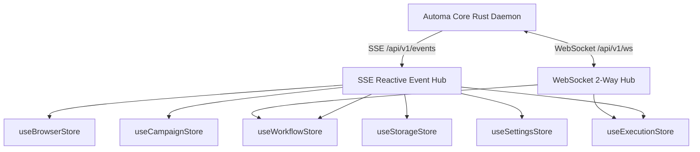
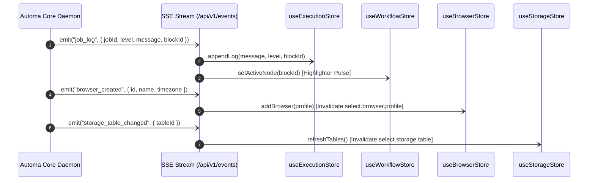

# 🏛️ SRS Feature Store & Reactive State Topology Specification

---

## 🎯 1. TỔNG QUAN VÀ NGUYÊN TẮC KIẾN TRÚC STORE

Tài liệu này là **Đặc tả Kỹ thuật Master (SRS)** chuẩn hóa toàn bộ kiến trúc quản lý trạng thái (State Management) thông qua **Feature-Scoped Stores** trên toàn bộ hệ sinh thái Automa (**`automa-desk`**, **`automa-vsce`**, **`automa-webe`**).

Mục tiêu là thiết lập **Single Source of Truth** cho từng phân hệ nghiệp vụ, cho phép các nút bấm (`btn.*`), dropdowns (`select.*`) và views tự động phản xạ reactive tức thì theo luồng sự kiện thời gian thực từ Rust Daemon (`/api/v1/events` & `/api/v1/ws`).



---

### 🛡️ CẤU TRÚC 4 TẦNG CHUẨN CỦA MỖI FEATURE STORE

Mọi Feature Store trong hệ sinh thái **BẮT BUỘC** tuân thủ cấu trúc 4 tầng đồng nhất:

```
┌─────────────────────────────────────────────────────────────┐
│ 1. State Slice (Strict Typing từ @automa/types)             │
├─────────────────────────────────────────────────────────────┤
│ 2. Computed / Getters (Dữ liệu phái sinh Reactive)          │
├─────────────────────────────────────────────────────────────┤
│ 3. Actions & FSM Mutators (Thực thi nút bấm & mutations)    │
├─────────────────────────────────────────────────────────────┤
│ 4. SSE / WS Event Listeners (Tự động nạp lại & Invalidation)│
└─────────────────────────────────────────────────────────────┘
```

---

## 📊 2. CHI TIẾT 6 DOMAIN FEATURE STORES CHUẨN HOÁ

---

### 1. `useWorkflowStore` — Quản Lý Canvas & Đồ Thị AST Kịch Bản
* **Vị trí**: Quản lý đồ thị nodes/edges trên VueFlow Canvas, trạng thái chỉnh sửa (`isDirty`), breakpoints và linter issues.
* **State Slice**:
  ```typescript
  interface WorkflowStoreState {
    workflow: Partial<Workflow>;
    workflowId: string;
    isDirty: boolean;
    activeNodeId: string | null;
    breakpoints: string[];
    fsmState: ButtonExecutionState;
    lintIssues: Array<{ id: string; nodeId?: string; message: string; severity: 'error' | 'warning' | 'info' }>;
  }
  ```
* **Getters Phái Sinh**:
  - `validNodesCount`: Đếm số lượng node hợp lệ trên canvas.
  - `hasUnsavedChanges`: Kiểm tra xem canvas có thay đổi chưa lưu hay không.
  - `isExecuting`: Trả về `true` khi `fsmState === 'EXECUTING'`.
* **Phản Xạ Reactive (Side-Effects)**:
  - Khi `setWorkflow()`: Tự động kích hoạt `lint_workflow` để phân tích AST.
  - Khi `btn.workflow.save` hoàn tất: Đặt `isDirty = false`, phát tín hiệu `workflow_saved` đến `select.storage.workflow`.

---

### 2. `useBrowserStore` — Quản Lý Đội Trình Duyệt & Anti-Detect Profiles
* **Vị trí**: Quản lý danh sách browser profiles từ SQLite DB, trạng thái online/offline và ưu tiên khởi chạy (Waterfall Resolution).
* **State Slice**:
  ```typescript
  interface BrowserStoreState {
    browsers: BrowserResponse[];
    selectedBrowserId: string;
    onlineBrowserIds: string[];
    waterfallResolution: { activeType: string; executablePath: string | null; isDetected: boolean };
    isLoading: boolean;
    searchQuery: string;
  }
  ```
* **SSE Event Invalidation Bindings**:
  - `browser_created`: Tự động thêm profile mới vào mảng `browsers`, cập nhật `select.browser.profile`.
  - `browser_deleted`: Xóa profile khỏi `browsers`, fallback `selectedBrowserId` về `default`.
  - `browser_online` / `browser_offline`: Cập nhật `onlineBrowserIds` để đổi màu status badge.

---

### 3. `useCampaignStore` — Quản Lý Chiến Dịch Ma Trận (Matrix Fleet)
* **Vị trí**: Quản lý kịch bản campaign matrix, phân bổ slots hiển thị và tiến trình chạy đồng thời.
* **State Slice**:
  ```typescript
  interface CampaignStoreState {
    campaignId: string | null;
    campaignName: string;
    activeSlots: Array<{
      slotIndex: number;
      browserId: string;
      workflowId: string;
      status: 'idle' | 'running' | 'completed' | 'failed';
      progressPercent: number;
    }>;
    status: 'idle' | 'running' | 'aborted' | 'completed';
    totalSlots: number;
  }
  ```
* **SSE Event Bindings**:
  - `campaign_slot_progress`: Cập nhật tiến độ `progressPercent` của slot tương ứng trên CSS Grid.
  - `campaign_aborted`: Chuyển trạng thái toàn bộ active slots về `aborted` và giải phóng tài nguyên.

---

### 4. `useStorageStore` — Quản Lý Cơ Sở Dữ Liệu Business (Tables, Variables, Credentials)
* **Vị trí**: Lưu trữ danh sách bảng dữ liệu, biến toàn cục, secret keys và file tree workspace.
* **State Slice**:
  ```typescript
  interface StorageStoreState {
    tables: Array<{ id: string; name: string; rowCount?: number }>;
    activeTableId: string | null;
    activeTableRows: Array<{ id: string; [key: string]: unknown }>;
    variables: Array<{ id: string; key: string; name: string; value: unknown }>;
    credentials: Array<{ id: string; key: string; name: string }>;
    isLoading: boolean;
  }
  ```
* **Phản Xạ Reactive**:
  - Khi `storage_table_changed`: Tự động gọi lại `get_storage_tables` và refresh `select.storage.table`.
  - Khi `storage_variable_changed`: Cập nhật danh sách autocomplete `{{variables.KEY}}` trên mọi input field.

---

### 5. `useExecutionStore` — Giám Sát Thực Thi Real-time & Telemetry Logs
* **Vị trí**: Quản lý telemetry buffer, nhật ký thực thi từng bước và điều khiển FSM (Pause/Resume/Kill).
* **State Slice**:
  ```typescript
  interface ExecutionStoreState {
    activeJobId: string | null;
    fsmState: ButtonExecutionState;
    logs: Array<{ id: string; timestamp: string; level: 'info' | 'warn' | 'error' | 'debug'; message: string; blockId?: string }>;
    lastError: string | null;
    isConsoleOpen: boolean;
  }
  ```
* **SSE Event Bindings**:
  - `job_log`: Nhận log mới từ Rust Core, chèn vào `logs` và tự động cuộn xuống cuối màn hình console.
  - `job_status`: Chuyển `fsmState` tương ứng (`EXECUTING`, `COMPLETED`, `FAILED`, `TERMINATING`).

---

### 6. `useSettingsStore` — Cấu Hình Hệ Thống & Tọa Độ Grid
* **Vị trí**: Lưu trữ cấu hình kích thước màn hình, tỷ lệ chia ô ma trận, giới hạn tải và giao diện Dark/Light.
* **State Slice**:
  ```typescript
  interface SettingsStoreState {
    settings: AppSettings | null;
    isDaemonHealthy: boolean;
    theme: 'dark' | 'light' | 'system';
  }
  ```

---

## ⚡ 3. MA TRẬN KẾT NỐI SỰ KIỆN REAL-TIME (SSE / WS TO STORE DISPATCH MATRIX)



---

## 💻 4. MẪU TRIỂN KHAI PHẢN XẠ REACTIVE (CODE RECIPES)

### 📦 Ví Dụ 1: Gắn Kết SSE Event Hub Vào Pinia Store Trong Vue 3.5

```typescript
// composables/useBindStoreSse.ts
import { onMounted, onUnmounted } from 'vue';
import { useExecutionStore } from '../stores/useExecutionStore';
import { useWorkflowStore } from '../stores/useWorkflowStore';
import { useBrowserStore } from '../stores/useBrowserStore';
import { useStorageStore } from '../stores/useStorageStore';

export function useBindStoreSse() {
  const executionStore = useExecutionStore();
  const workflowStore = useWorkflowStore();
  const browserStore = useBrowserStore();
  const storageStore = useStorageStore();

  let eventSource: EventSource | null = null;

  onMounted(() => {
    eventSource = new EventSource('http://127.0.0.1:8765/api/v1/events');

    eventSource.addEventListener('job_log', (e) => {
      const data = JSON.parse(e.data);
      executionStore.appendLog(data.message, data.level, data.blockId);
      if (data.blockId) {
        workflowStore.setActiveNode(data.blockId);
      }
    });

    eventSource.addEventListener('browser_created', (e) => {
      const profile = JSON.parse(e.data);
      browserStore.addBrowser(profile);
    });

    eventSource.addEventListener('storage_table_changed', () => {
      storageStore.setTables([]); // Triggers auto-refetch via store
    });
  });

  onUnmounted(() => {
    eventSource?.close();
  });
}
```

---

## 🔍 5. GIAO THỨC KIỂM TRA CHÉO DÀNH CHO SUBAGENT (AGENT STORE AUDIT PROTOCOL)

Khi rà soát một tính năng trên UI, Agent **BẮT BUỘC** kiểm tra 4 tiêu chí:
1. **Store Binding**: Thành phần UI có đọc trạng thái trực tiếp từ Feature Store hay không (tránh lưu state cục bộ rời rạc).
2. **Action Trigger**: Khi người dùng tương tác, UI có gọi Action tương ứng trong Store (Action sau đó dispatch `btn.*` hoặc `select.*`).
3. **SSE Reflection**: Khi Daemon bắn sự kiện thay đổi dữ liệu, Store có hook listener cập nhật state slice ngay lập tức không.
4. **Zero Flakiness**: Không gây ra tình trạng bất đồng bộ dữ liệu giữa các tabs / webviews.
