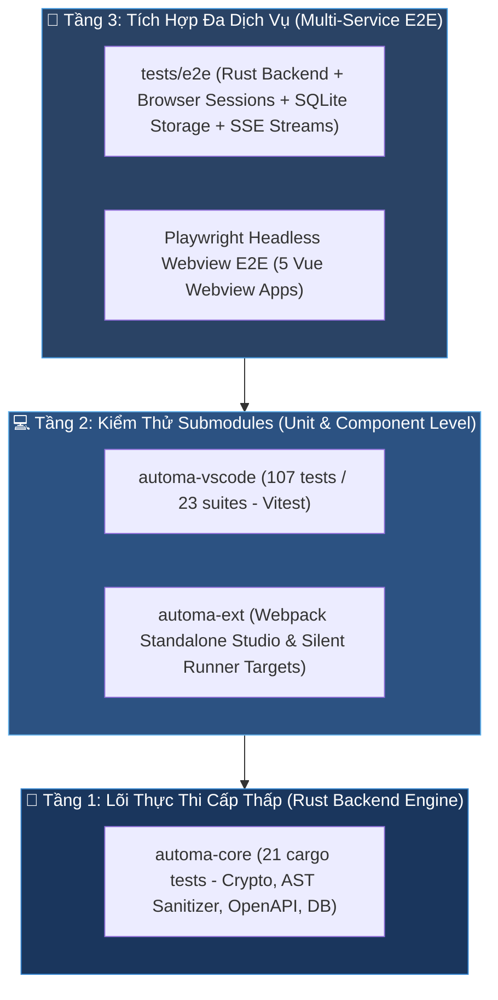

# 🌐 Ma Trận Kiểm Thử Hệ Sinh Thái Automa (Ecosystem Test Matrix)

Chào mừng bạn đến với trung tâm giám sát chất lượng và ma trận kiểm thử tổng thể của **Automa Ecosystem**. Hệ thống áp dụng chiến lược kiểm thử đa tầng (Multi-tier Testing Strategy) đảm bảo tính toàn vẹn từ lõi Rust Engine tới giao diện VS Code Extension và Chrome Web Extension.

---

## 🧭 1. Kim Tự Tháp Kiểm Thử Hệ Sinh Thái (Ecosystem Testing Pyramid)



---

## 📊 2. Bảng Tổng Hợp Chỉ Số Kiểm Thử Từng Phân Hệ

| Phân Hệ (Submodule) | Công Nghệ Kiểm Thử | Số Tests / Suites | Trạng Thái | Tài Liệu Chi Tiết | Lệnh Thực Thi |
| :--- | :--- | :---: | :---: | :--- | :--- |
| **`automa-vsce`** | Vitest v4 + Biome | **120 tests / 27 suites** | ✅ **Passed** | [📄 automa-vsce Test Matrix](../automa-vsce/docs/TEST_MATRIX.md) | `pnpm -F vscode-automa test` |
| **`automa-core`** | Cargo Test (In-Memory SQLite) | **55 tests** | ✅ **Passed** | [📄 automa-core README](../automa-core/README.md) | `cargo test --manifest-path automa-core/Cargo.toml --lib` |
| **`automa-desk`** | Vitest v4 + Istanbul | **122 tests / 19 suites** | ✅ **Passed** | [📄 automa-desk README](../automa-desk/README.md) | `pnpm -F @automa/desk test:unit` |
| **`automa-webe`** | Webpack 5 + ESLint | **Studio & Silent Runner** | ✅ **Passed** | [📄 automa-webe README](../automa-webe/README.md) | `pnpm -F automa build:studio` |
| **`automa-types`** | TypeScript Compiler (`tsc`) | **OpenAPI Typed SDK** | ✅ **Passed** | [📄 automa-types README](../packages/automa-types/README.md) | `pnpm -F @automa/types build` |
| **Root E2E Suite** | Vitest E2E + Typed SDK (Port 8766) | **96 tests / 19 suites** | ✅ **Passed** | [📄 tests/e2e Directory](../tests/e2e) | `pnpm test` / `node scripts/test-all.mjs` |

---

## 🛠️ 3. Sổ Tay Chạy Kiểm Thử Toàn Diện (All-in-One Testing SOP)

### 1. Kiểm tra toàn bộ hệ sinh thái (All Packages)
```bash
# Chạy script điều phối kiểm thử 4 tầng của toàn bộ monorepo
pnpm test
# hoặc
node scripts/test-all.mjs
```

### 2. Kiểm thử riêng lẻ từng phân hệ
- **VS Code Extension (118 tests / 26 suites)**:
  ```bash
  pnpm -F vscode-automa test
  ```
- **Rust Daemon Core (55 tests)**:
  ```bash
  cargo test --manifest-path automa-core/Cargo.toml --lib
  ```
- **Kiểm tra tự động sinh mã OpenAPI SDK (Zero-conflict)**:
  ```bash
  pnpm run sync:api
  ```
- **Đóng gói toàn bộ Monorepo**:
  ```bash
  pnpm run build
  ```

---

## 🔗 4. Liên Kết Điều Hướng

- [🏠 Documentation Hub](Home.md)
- [💻 Chi Tiết Ma Trận Kiểm Thử automa-vsce (119 tests)](../automa-vsce/docs/TEST_MATRIX.md)
- [📚 Danh Mục Hướng Dẫn Kỹ Thuật automa-vsce](../automa-vsce/docs/README.md)
