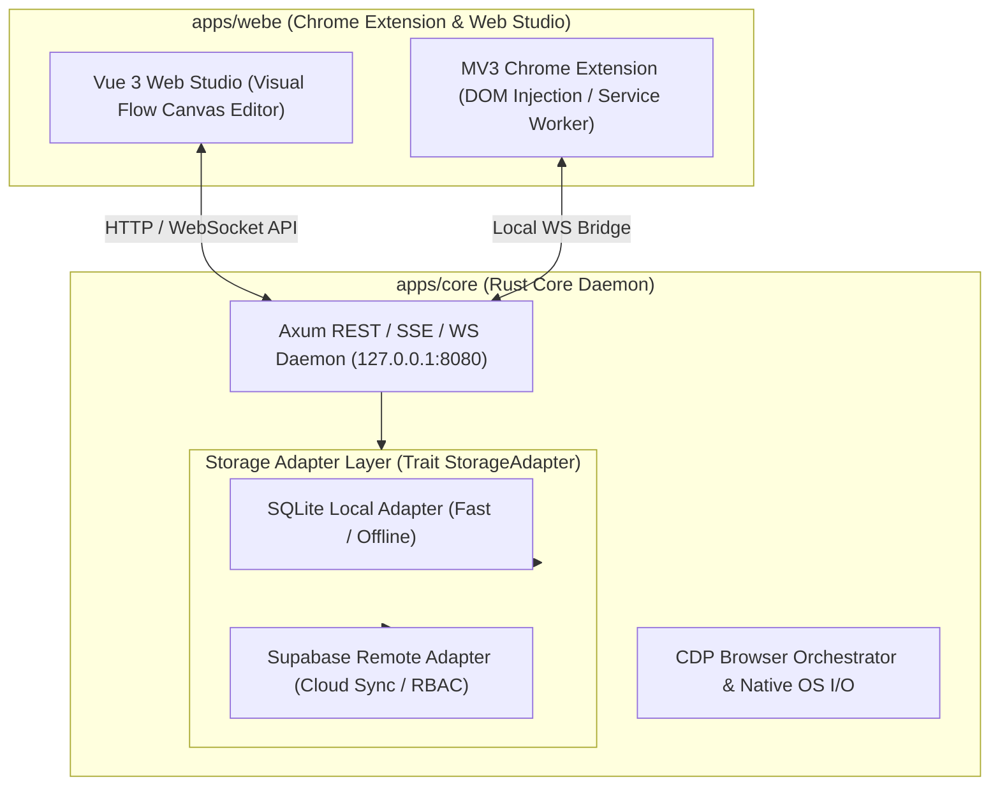

# Technical Architecture: `apps/webe` & `apps/core` Hybrid System

## 1. System Overview

The **Tuquet Automa Ecosystem** is a streamlined monorepo composed of two core applications:

1. **`apps/core` (Rust Core Backend Engine & Daemon)**: High-performance Native OS engine providing REST, SSE, and WebSocket services alongside Dual Storage Adapters (SQLite Local & Supabase Remote).
2. **`apps/webe` (Chrome Extension & Web Studio SPA)**: Visual flow canvas editor (Vue 3 + Vue Flow) and Manifest V3 Chrome Extension.



---

## 2. `apps/webe`: Chrome Extension & Web Studio SPA

`@automa/webe` functions under a **Dual-Build Architecture**:

### A. Manifest V3 Chrome Extension
- **Background Service Worker**: Handles event listeners, alarms, context menus, and keeps communication channels open with `apps/core`.
- **Content Scripts**: Injected into web pages to execute DOM manipulation, click/input simulation, data scraping, and element selector recording.
- **Offscreen Documents**: Handles complex DOM parsing, clipboard access, or audio/video recording unavailable in Manifest V3 background workers.

### B. Web Studio SPA (Visual Flow Canvas Editor)
- Built with Vue 3, Pinia, Tailwind CSS, and Vue Flow.
- Deployed as a web application or loaded directly from local extension.
- Enables visual drag-and-drop workflow building, block connection, schema validation, and execution monitoring.

---

## 3. `apps/core`: Dual Storage Adapter Pattern (SQLite vs Supabase)

`apps/core` separates storage concerns through a polymorphic `StorageAdapter` interface:

```rust
#[async_trait]
pub trait StorageAdapter: Send + Sync {
    async fn get_workflow(&self, id: &str) -> Result<Workflow, StorageError>;
    async fn save_workflow(&self, workflow: &Workflow) -> Result<(), StorageError>;
    async fn list_workflows(&self) -> Result<Vec<Workflow>, StorageError>;
    async fn delete_workflow(&self, id: &str) -> Result<(), StorageError>;
}
```

### 💾 1. SQLite Local Adapter (`SqliteAdapter`)
- **Use Case**: Offline mode, local privacy, zero network latency.
- **Implementation**: Uses embedded SQLite database (`~/.automa/automa.db`). Ideal for single-device offline automation.

### ☁️ 2. Supabase Remote Adapter (`SupabaseAdapter`)
- **Use Case**: Multi-device sync, cloud collaboration, team RBAC, centralized logging.
- **Implementation**: Communicates with Supabase via PostgREST / REST endpoints using `reqwest`. Supports JWT authentication and Supabase Row Level Security (RLS).

---

## 4. Hybrid Execution Model: Browser Context + OS Native Execution

Chrome Extensions are sandboxed inside Google Chrome and cannot execute OS-level operations (such as running native system binaries, accessing the OS file system outside downloads, or launching raw CDP browser instances).

When `apps/webe` executes a workflow containing OS-level blocks:

1. **Browser Blocks** (e.g., Click Element, Extract Text, Scroll) are executed natively by `apps/webe` inside the active Chrome tab.
2. **OS / System Blocks** (e.g., Execute Shell Command, Launch Multi-Profile CDP Chrome, Save to Local File System, Trigger Webhook Listener) are delegated via WebSocket / REST to `apps/core` (`127.0.0.1:8080`).
3. `apps/core` executes the OS task with native Rust efficiency and streams status updates back via Server-Sent Events (SSE).
