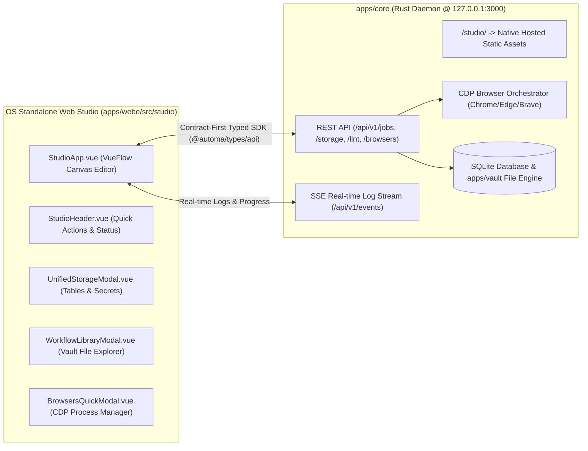

# 📖 Hướng Dẫn Sử Dụng Tuquet Automa Web Studio Standalone (`apps/webe/src/studio`)

Tài liệu hướng dẫn chi tiết dành cho người dùng về kiến trúc giao diện OS Standalone Studio, danh sách các màn hình chức năng, nhóm công cụ sơ đồ khối và quy trình thiết kế kịch bản tự động hóa trên môi trường Desktop OS.

---

## 🔌 1. Kiến Trúc Liên Kết Rust Core Daemon (`apps/core`) & OS Web Studio (`apps/webe/src/studio`)

Automa Web Studio Standalone được thiết kế để chạy trực tiếp trên hệ điều hành (Native OS Mode), được nhúng và phục vụ trực tiếp bởi Daemon Rust (`apps/core`) tại địa chỉ:

$$\text{URL}: \mathtt{http://127.0.0.1:3000/studio/}$$

* **Contract-First Type Safety**: Toàn bộ giao tiếp giữa Studio UI và Rust Core được định kiểu an toàn 100% qua SDK Client `@automa/types/api`.
* **Zero Extension Dependency**: Chạy hoàn toàn độc lập mà không cần môi trường Chrome Extension.

---

## 🖥️ 2. Danh Sách Màn Hình & Thành Phần Giao Diện Trong OS Studio (`apps/webe/src/studio/`)

Tất cả các thành phần màn hình bên dưới thuộc về phiên bản **OS Standalone Web Studio (`apps/webe/src/studio`)**:

### 2.1 Main Studio Workspace Canvas (`apps/webe/src/studio/StudioApp.vue`)
* **Chức năng**: Màn hình làm việc chính thiết kế sơ đồ khối tự động hóa (Visual Flowchart Editor).
* **Các vùng thành phần**:
  * **Top Header Bar ([`StudioHeader.vue`](components/StudioHeader.vue))**:
    * Hiển thị tên file/kịch bản đang mở, đường dẫn tệp vault (`.workflow.json`).
    * Trạng thái kết nối Rust Daemon ([`StudioCoreStatus.vue`](../components/newtab/workflow/StudioCoreStatus.vue)).
    * Các nút hành động: **Run** (`Ctrl+Enter`), **Save** (`Ctrl+S`), **Pause/Resume/Stop Job**, **New Workflow**, **Export JSON**.
    * Đếm số lượng cảnh báo Linter thời gian thực (Live AST Lint).
  * **Resizable Sidebar (Bên trái)**:
    * **Block Palette**: Danh sách hơn 50+ khối công cụ sơ đồ khối.
    * **Block Form Editor**: Bảng tùy chỉnh thuộc tính chi tiết của khối đang chọn.
  * **VueFlow Canvas Area (Ở giữa)**:
    * Khung trực quan hóa sơ đồ khối kéo-thả.
    * Thanh công cụ Canvas: **Undo** (`Ctrl+Z`), **Redo** (`Ctrl+Y`), **Auto-Align** (Tự động căn chỉnh nút sơ đồ).

### 2.2 Modal Thư Viện Kịch Bản Vault Explorer ([`WorkflowLibraryModal.vue`](components/WorkflowLibraryModal.vue))
* **Chức năng**: Trình duyệt và quản lý danh sách file kịch bản lưu trên đĩa cá nhân (`apps/vault/*.workflow.json`).
* **Tính năng**:
  * Tìm kiếm tệp kịch bản theo tên hoặc từ khóa.
  * Tải trực tiếp kịch bản từ đĩa cứng lên Canvas để chỉnh sửa.
  * Tạo mới hoặc xóa file kịch bản khỏi Vault.

### 2.3 Modal Quản Lý Storage & Dữ Liệu Tập Trung ([`UnifiedStorageModal.vue`](components/UnifiedStorageModal.vue))
* **Chức năng**: Trung tâm quản lý dữ liệu lưu trữ offline/cloud.
* **Các Tab màn hình con**:
  * **Storage Tables Tab ([`StorageTablesTab.vue`](components/StorageTablesTab.vue))**: Tạo bảng dữ liệu mẫu, xem và phân trang các dòng dữ liệu bóc tách được.
  * **Storage Secrets Tab ([`StorageSecretsTab.vue`](components/StorageSecretsTab.vue))**: Quản lý Biến toàn cục (Variables) và Khóa mật mã AES-256 (Credentials/API Keys).

### 2.4 Modal Quản Lý Trình Duyệt CDP ([`BrowsersQuickModal.vue`](components/BrowsersQuickModal.vue))
* **Chức năng**: Quản lý và theo dõi các tiến trình trình duyệt CDP do Rust Core điều khiển.
* **Tính năng**:
  * Hiển thị danh sách các cửa sổ trình duyệt Chrome/Edge/Brave đang mở.
  * Nút khẩn cấp **Kill All Browsers**: Giải phóng tức thì toàn bộ tiến trình trình duyệt ngầm trên OS.

### 2.5 Modal Cấu Hình Khởi Chạy Kịch Bản ([`RunWorkflowModal.vue`](components/RunWorkflowModal.vue))
* **Chức năng**: Thiết lập tham số trước khi bấm chạy kịch bản thực tế trên OS.
* **Tùy chọn**:
  * Chọn chế độ hiển thị: **Headed** (Mở trình duyệt thực) hoặc **Headless** (Chạy ẩn).
  * Chọn loại trình duyệt target: Chrome, Edge, Brave.
  * Truyền danh sách biến đầu vào (Input Parameters).

### 2.6 Modal Cài Đặt Nhanh Kịch Bản ([`WorkflowQuickSettings.vue`](components/WorkflowQuickSettings.vue))
* **Chức năng**: Tùy chỉnh cài đặt riêng cho kịch bản đang mở.
* **Tùy chọn**: Đổi biểu tượng (Icon), Tên, Mô tả, Cấu hình hành vi khi gặp lỗi (OnError fallback / Notification).

---

## 🧩 3. Chi Tiết Các Nhóm Công Cụ (Block Palette Tool Groups)

Trong màn hình Canvas Studio (`StudioApp.vue`), danh sách khối công cụ kéo-thả được chia làm **6 Nhóm chính**:

| Nhóm Công Cụ | Tên Tiếng Anh | Khối Công Cụ Tiêu Biểu | Chức Năng |
| :--- | :--- | :--- | :--- |
| **1. Khởi chạy & Điều khiển** | `General` | `Trigger`, `Execute Workflow`, `Delay`, `Repeat Task`, `Note` | Khởi tạo mốc bắt đầu kịch bản, hẹn giờ chờ, gọi kịch bản con, lặp lại công việc. |
| **2. Trình duyệt** | `Browser` | `Active Tab`, `New Tab`, `Close Tab`, `Switch Tab`, `Take Screenshot`, `Save Assets`, `Set Cookies` | Mở/Đóng tab, chuyển tab, chụp ảnh màn hình, lưu file tải về, quản lý Cookie/Proxy. |
| **3. Tương tác Web (DOM)** | `Interaction` | `Click Element`, `Type Text`, `Select Dropdown`, `Get Text`, `Scroll Page`, `Hover Element`, `Upload File` | Bấm nút, điền văn bản vào input, chọn ô dropdown, cuộn trang, upload file, bóc tách text/attribute. |
| **4. Điều kiện & Vòng lặp** | `Conditions` | `Conditions (If/Else)`, `Element Exists`, `Loop Data`, `Loop Elements`, `Switch Case` | Kiểm tra điều kiện đúng/sai, lặp qua danh sách phần tử web hoặc dòng dữ liệu bảng. |
| **5. Dữ liệu & Lưu trữ** | `Data & Storage` | `Insert Data`, `Get Variable`, `Set Variable`, `Export Data (CSV/JSON)`, `Crypto/Hash` | Đọc/Ghi biến, chèn dòng vào Bảng dữ liệu (Table), xuất dữ liệu ra file CSV/JSON. |
| **6. Dịch vụ Trực tuyến** | `Online Services` | `Google Sheets`, `HTTP Request (API)`, `Webhook` | Gửi HTTP GET/POST API đến server bên ngoài, đồng bộ dữ liệu trực tiếp với Google Sheets. |

---

## 🛠️ 4. Quy Trình 4 Bước Thiết Kế Kịch Bản Trên OS Studio

1. **Khởi động Daemon & Mở Studio**:
   * Khởi chạy Rust Core: `automa` (Daemon mở tại `http://127.0.0.1:3000`).
   * Mở trình duyệt truy cập: `http://127.0.0.1:3000/studio/`. Trạng thái kết nối hiển thị **Core Daemon Connected (Xanh)**.
2. **Tạo kịch bản mới**: Nhấp nút **New Workflow** trên Header (`StudioHeader.vue`) -> Nhập tên file kịch bản.
3. **Thiết kế sơ đồ khối trên Canvas (`StudioApp.vue`)**:
   * Kéo khối **New Tab** từ Sidebar bên trái vào Canvas -> Nhập URL mục tiêu (VD: `https://example.com`).
   * Kéo khối **Click Element** -> Nhập Selector CSS của nút bấm.
   * Kéo khối **Get Text** -> Nhập Selector nội dung cần lấy -> Chọn cột lưu vào Storage Table.
   * Nối đường liên kết từ Output khối này sang Input khối kế tiếp.
4. **Thực thi & Xuất Dữ Liệu**:
   * Nhấp nút **Run** (`Ctrl+Enter`) -> Cửa sổ trình duyệt thực tế mở ra tự động thao tác.
   * Mở **Storage Explorer** (`UnifiedStorageModal.vue`) -> Xem dữ liệu trong Table và tải về file CSV.
