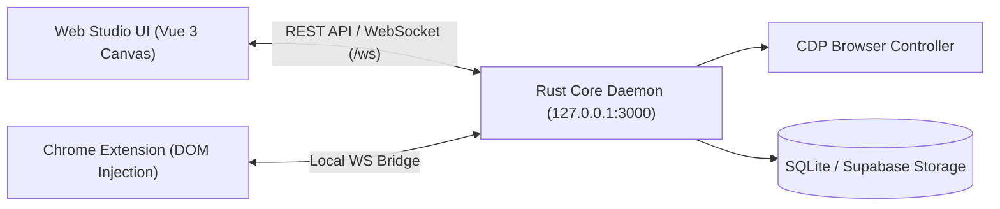

# 📖 Hướng Dẫn Sử Dụng Tuquet Automa Web Studio & Engine

Tài liệu hướng dẫn chi tiết dành cho người dùng về kiến trúc giao diện, các màn hình chức năng, nhóm công cụ sơ đồ khối và quy trình tạo kịch bản tự động hóa từ cơ bản đến nâng cao.

---

## 🔌 1. Cơ Chế Liên Kết Backend - Frontend (Rust Core <-> Web Studio)

Tuquet Automa hoạt động theo mô hình **Hybrid Architecture**:
* **Backend Engine (`apps/core`)**: Rust Engine chạy ngầm dưới dạng Daemon tại `http://127.0.0.1:3000`. Nhiệm vụ:
  * Quản lý tiến trình trình duyệt (Chrome/Edge/Brave) qua CDP (Chrome DevTools Protocol).
  * Lưu trữ dữ liệu SQLite local / Supabase Cloud.
  * Xử lý I/O hệ thống, bóc tách dữ liệu và chạy kịch bản tốc độ cao.
* **Frontend (`apps/webe`)**: Web Studio UI & Chrome Extension (Manifest V3). Nhiệm vụ:
  * Giao diện thiết kế kịch bản trực quan (Visual Canvas Editor).
  * Kết nối 2 chiều với Rust Core qua **WebSocket (`/ws`)** và **REST API (`/api/v1`)**.
  * Bắt sự kiện DOM trên trình duyệt và tự động tạo khối (Smart Recording).

---

## 🖥️ 2. Danh Sách Màn Hình Chức Năng (Screen Inventory)

### 2.1 Màn hình Dashboard Kịch bản (`Workflows Overview`)
* **Chức năng**: Nơi quản lý toàn bộ các kịch bản tự động hóa đã tạo.
* **Thao tác chính**:
  * Tạo kịch bản mới (New Workflow).
  * Import / Export kịch bản dạng file `.json`.
  * Tìm kiếm, phân loại kịch bản theo Thẻ (Tags).
  * Bật/Tắt công tắc kích hoạt tự động (Active / Inactive).

### 2.2 Màn hình Visual Workflow Studio (Visual Canvas Editor)
* **Chức năng**: Màn hình trung tâm để kéo-thả và thiết kế sơ đồ khối tự động hóa.
* **Bố cục giao diện**:
  * **Thanh Công cụ bên trái (Block Palette)**: Danh sách 50+ khối công cụ chia theo 6 nhóm chức năng.
  * **Khung vẽ Sơ đồ (Canvas Editor)**: Nơi kéo các khối vào, nối đường liên kết (Connections) từ điểm Đuôi (Output) của khối này sang Đầu (Input) của khối khác.
  * **Bảng Thuộc tính bên phải (Block Inspector)**: Chỉnh sửa thông số chi tiết của khối đang chọn (VD: URL, Selector CSS, Nội dung text, Thời gian delay).
  * **Thanh Trạng thái Engine (Status Bar)**: Hiển thị kết nối `ONLINE / OFFLINE` với Rust Core Daemon (`127.0.0.1:3000`).
  * **Nút Điều khiển (Toolbar Controls)**: Chạy thử kịch bản (Run), Tạm dừng (Pause), Đặt điểm dừng (Breakpoint), Debug từng bước.

### 2.3 Màn hình Trình ghi Tự động (Smart Web Recorder)
* **Chức năng**: Giúp người dùng không cần gõ code hay kéo khối thủ công.
* **Cách dùng**: Nhấp "Start Recording" -> Mở trang web mong muốn -> Thao tác tự nhiên (Click, gõ chữ, cuộn trang) -> Hệ thống tự động phân tích DOM và sinh ra sơ đồ khối tương ứng trên Studio Canvas.

### 2.4 Màn hình Nhật ký Lịch sử & Bóc tách Dữ liệu (Execution Logs & Data Viewer)
* **Chức năng**: Xem lại chi tiết từng lần chạy kịch bản.
* **Chi tiết thông tin**:
  * **Step Timeline**: Thời gian chạy chính xác của từng khối.
  * **Extracted Data Table**: Bảng dữ liệu cào/bóc tách được (có thể xuất ra CSV / Excel / JSON).
  * **Variable State**: Giá trị các biến toàn cục tại thời điểm chạy.
  * **Error Stacktrace**: Báo lỗi chi tiết nếu có khối bị hỏng (VD: không tìm thấy Selector).

### 2.5 Màn hình Quản lý Lưu trữ (Storage, Tables & Credentials)
* **Chức năng**: Quản lý kho dữ liệu phụ trợ cho kịch bản.
* **Bao gồm**:
  * **Tables (Bảng dữ liệu)**: Tạo các cột dữ liệu mẫu để điền form tự động hoặc chứa dữ liệu thu thập được.
  * **Variables (Biến toàn cục)**: Khởi tạo các biến dùng chung giữa nhiều workflow.
  * **Credentials (Mật khẩu & Token)**: Lưu trữ mã hóa khóa API Key, mật khẩu tài khoản an toàn.

### 2.6 Màn hình Lịch trình Chạy Tự động (Schedules & Cronjob)
* **Chức năng**: Đặt lịch cho kịch bản tự động chạy ngầm.
* **Chế độ hẹn giờ**: Hẹn giờ theo định kỳ (mỗi N phút/giờ), Theo mốc thời gian cố định trong ngày, hoặc dạng biểu thức Cron.

---

## 🧩 3. Chi Tiết Các Nhóm Công Cụ (Block Palette Tool Groups)

Trong màn hình **Visual Workflow Studio Canvas**, các khối được chia làm **6 Nhóm công cụ chính**:

| Nhóm Công Cụ | Tên Tiếng Anh | Khối Công Cụ Tiêu Biểu | Chức Năng |
| :--- | :--- | :--- | :--- |
| **1. Khởi chạy & Điều khiển** | `General` | `Trigger`, `Execute Workflow`, `Delay`, `Repeat Task`, `Note` | Khởi tạo mốc bắt đầu kịch bản, hẹn giờ chờ, gọi kịch bản con, lặp lại công việc. |
| **2. Trình duyệt** | `Browser` | `Active Tab`, `New Tab`, `Close Tab`, `Switch Tab`, `Take Screenshot`, `Save Assets`, `Set Cookies` | Mở/Đóng tab, chuyển tab, chụp ảnh màn hình, lưu file tải về, quản lý Cookie/Proxy. |
| **3. Tương tác Web (DOM)** | `Interaction` | `Click Element`, `Type Text`, `Select Dropdown`, `Get Text`, `Scroll Page`, `Hover Element`, `Upload File` | Bấm nút, điền văn bản vào input, chọn ô dropdown, cuộn trang, upload file, bóc tách text/attribute. |
| **4. Điều kiện & Vòng lặp** | `Conditions` | `Conditions (If/Else)`, `Element Exists`, `Loop Data`, `Loop Elements`, `Switch Case` | Kiểm tra điều kiện đúng/sai, lặp qua danh sách phần tử web hoặc dòng dữ liệu bảng. |
| **5. Dữ liệu & Lưu trữ** | `Data & Storage` | `Insert Data`, `Get Variable`, `Set Variable`, `Export Data (CSV/JSON)`, `Crypto/Hash` | Đọc/Ghi biến, chèn dòng vào Bảng dữ liệu (Table), xuất dữ liệu ra file CSV/JSON. |
| **6. Dịch vụ Trực tuyến** | `Online Services` | `Google Sheets`, `HTTP Request (API)`, `Webhook` | Gửi HTTP GET/POST API đến server bên ngoài, đồng bộ dữ liệu trực tiếp với Google Sheets. |

---

## 🛠️ 4. Quy Trình 4 Bước Tạo Workflow Đầu Tiên (Step-by-Step Guide)

1. **Khởi động Engine**: Chạy lệnh `automa` trên Terminal (hoặc chạy file `automa.exe`). Biểu tượng trạng thái kết nối trên Web Studio đổi sang màu **Xanh (Online)**.
2. **Tạo kịch bản mới**: Vào màn Dashboard -> Nhấp **New Workflow** -> Đặt tên cho kịch bản.
3. **Thiết kế sơ đồ khối**:
   * Kéo khối **New Tab** vào Canvas -> Nhập URL mục tiêu (VD: `https://example.com`).
   * Kéo khối **Click Element** -> Dùng công cụ chọn phần tử (CSS Selector Picker) trỏ vào nút bấm trên trang.
   * Kéo khối **Get Text** -> Trỏ vào vùng thông tin cần cào -> Gán cột lưu vào Table.
   * Nối các dây nối (Connections) giữa các khối theo đúng thứ tự thực thi.
4. **Chạy & Kiểm tra kết quả**: Nhấp nút **Run Workflow** -> Theo dõi tiến trình chạy thực tế trên trình duyệt và mở màn **Execution Logs** để tải file CSV kết quả.
