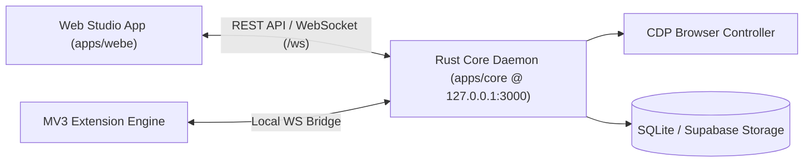

# 📖 Hướng Dẫn Sử Dụng Tuquet Automa Web Studio (`apps/webe`)

Tài liệu hướng dẫn chi tiết dành cho người dùng về kiến trúc giao diện, danh sách các màn hình chức năng trong **Web Studio (`apps/webe`)**, nhóm công cụ sơ đồ khối và quy trình thiết kế kịch bản tự động hóa.

---

## 🔌 1. Cơ Chế Liên Kết Backend Engine (`apps/core`) & Web Studio (`apps/webe`)

Tuquet Automa hoạt động theo mô hình **Hybrid Architecture**:
* **Rust Core Daemon (`apps/core`)**: Rust Engine chạy ngầm dưới dạng Daemon dịch vụ tại `http://127.0.0.1:3000`. Nhiệm vụ:
  * Quản lý tiến trình trình duyệt (Chrome/Edge/Brave) qua CDP (Chrome DevTools Protocol).
  * Xử lý lưu trữ SQLite local / Supabase Cloud.
  * Thực thi kịch bản tốc độ cao và I/O hệ thống.
* **Web Studio App (`apps/webe`)**: Web App & MV3 Chrome Extension đóng vai trò Giao diện trực quan. Nhiệm vụ:
  * Cung cấp giao diện thiết kế kịch bản sơ đồ khối (Visual Flowchart Editor).
  * Kết nối 2 chiều với `apps/core` qua **WebSocket (`/ws`)** và **REST API (`/api/v1`)**.
  * Bắt sự kiện DOM trên trình duyệt và tự động tạo khối (Smart Recording).

---

## 🖥️ 2. Danh Sách Màn Hình Chức Năng Chi Tiết Trong Web Studio (`apps/webe/src/newtab/pages`)

Tất cả các màn hình dưới đây nằm hoàn toàn trong ứng dụng **Web Studio (`apps/webe`)**:

### 2.1 Màn hình Dashboard Kịch bản (`apps/webe/src/newtab/pages/Workflows.vue`)
* **Chức năng**: Màn hình trang chủ quản lý danh sách toàn bộ kịch bản tự động hóa (Workflows).
* **Thao tác chính**:
  * Tạo kịch bản mới (New Workflow).
  * Import / Export kịch bản dưới dạng file `.json`.
  * Lọc và tìm kiếm kịch bản theo Thẻ (Tags).
  * Bật/tắt công tắc kích hoạt tự động chạy (Active / Inactive).

### 2.2 Màn hình Visual Canvas Editor (`apps/webe/src/newtab/pages/workflows/[id].vue`)
* **Chức năng**: Màn hình trung tâm thiết kế sơ đồ khối tự động hóa bằng thao tác kéo-thả.
* **Các thành phần giao diện chính**:
  * **Block Palette (Sidebar bên trái)**: Danh sách 50+ khối công cụ được phân theo 6 nhóm chức năng.
  * **Drawflow Canvas (Khung vẽ ở giữa)**: Nơi kéo khối vào, nối đường liên kết (Connections) từ điểm Đuôi (Output) của khối này sang Đầu (Input) của khối khác.
  * **Block Inspector (Panel bên phải)**: Chỉnh sửa thông số chi tiết của khối đang chọn (VD: URL, Selector CSS, Nội dung text, Thời gian delay).
  * **Studio Status Bar (Thanh trạng thái kết nối)**: Hiển thị kết nối `ONLINE / OFFLINE` với Rust Core Daemon (`apps/core` tại `127.0.0.1:3000`).
  * **Toolbar Controls**: Nút Run (Chạy thử), Pause (Tạm dừng), Debug từng bước, Đặt mốc Breakpoint.

### 2.3 Màn hình Trình ghi Tự động (`apps/webe/src/newtab/pages/Recording.vue`)
* **Chức năng**: Tự động tạo kịch bản dựa trên thao tác thực tế của người dùng.
* **Cách sử dụng**: Nhấp "Start Recording" -> Mở trang web -> Thao tác tự nhiên (Click, điền chữ, cuộn trang) -> Web Studio tự động phân tích DOM và tạo ra sơ đồ khối tương ứng trên Canvas.

### 2.4 Màn hình Nhật ký Execution Logs & Data Viewer (`apps/webe/src/newtab/pages/logs/[id].vue`)
* **Chức năng**: Kiểm tra kết quả chi tiết của từng lần thực thi kịch bản.
* **Bao gồm**:
  * **Step Timings**: Thời gian thực thi chính xác tính theo mili-giây của từng khối.
  * **Data Viewer Table**: Bảng dữ liệu đã bóc tách/cào được (Hỗ trợ xuất file CSV, Excel, JSON).
  * **Variable State**: Trạng thái và giá trị các biến toàn cục tại thời điểm chạy.
  * **Error Stacktrace**: Báo lỗi chi tiết vị trí khối bị hỏng nếu kịch bản gặp sự cố.

### 2.5 Màn hình Quản lý Lưu trữ Data (`apps/webe/src/newtab/pages/Storage.vue` & `pages/storage/Tables.vue`)
* **Chức năng**: Quản lý cơ sở dữ liệu phụ trợ cho các kịch bản trong Studio.
* **Bao gồm**:
  * **Tables (Bảng dữ liệu)**: Tạo các bảng dữ liệu mẫu để điền form tự động hoặc chứa dữ liệu thu thập được.
  * **Variables (Biến toàn cục)**: Khởi tạo các biến dùng chung giữa nhiều kịch bản.
  * **Credentials (Mật khẩu & Token)**: Quản lý mã hóa an toàn các API Key, mật khẩu tài khoản.

### 2.6 Màn hình Lập lịch Chạy Tự động (`apps/webe/src/newtab/pages/ScheduledWorkflow.vue`)
* **Chức năng**: Cấu hình hẹn giờ và lịch trình chạy tự động ngầm cho các kịch bản.
* **Chế độ**: Lặp lại định kỳ (mỗi N phút/giờ), Hẹn giờ mốc cố định trong ngày, hoặc dạng biểu thức Cron.

### 2.7 Màn hình Cài đặt Hệ thống Studio (`apps/webe/src/newtab/pages/Settings.vue`)
* **Chức năng**: Quản lý cấu hình chung cho ứng dụng Web Studio.
* **Bao gồm**:
  * Cấu hình URL địa chỉ kết nối `apps/core` Rust Daemon (Mặc định `http://127.0.0.1:3000`).
  * Tùy chỉnh phím tắt thao tác nhanh (Shortcuts).
  * Sao lưu & Khôi phục dữ liệu Web Studio (Backup / Restore).

---

## 🧩 3. Chi Tiết Các Nhóm Công Cụ (Block Palette Tool Groups)

Trong màn hình **Visual Canvas Editor (`workflows/[id].vue`)**, các khối công cụ được chia làm **6 Nhóm chính**:

| Nhóm Công Cụ | Tên Tiếng Anh | Khối Công Cụ Tiêu Biểu | Chức Năng |
| :--- | :--- | :--- | :--- |
| **1. Khởi chạy & Điều khiển** | `General` | `Trigger`, `Execute Workflow`, `Delay`, `Repeat Task`, `Note` | Khởi tạo mốc bắt đầu kịch bản, hẹn giờ chờ, gọi kịch bản con, lặp lại công việc. |
| **2. Trình duyệt** | `Browser` | `Active Tab`, `New Tab`, `Close Tab`, `Switch Tab`, `Take Screenshot`, `Save Assets`, `Set Cookies` | Mở/Đóng tab, chuyển tab, chụp ảnh màn hình, lưu file tải về, quản lý Cookie/Proxy. |
| **3. Tương tác Web (DOM)** | `Interaction` | `Click Element`, `Type Text`, `Select Dropdown`, `Get Text`, `Scroll Page`, `Hover Element`, `Upload File` | Bấm nút, điền văn bản vào input, chọn ô dropdown, cuộn trang, upload file, bóc tách text/attribute. |
| **4. Điều kiện & Vòng lặp** | `Conditions` | `Conditions (If/Else)`, `Element Exists`, `Loop Data`, `Loop Elements`, `Switch Case` | Kiểm tra điều kiện đúng/sai, lặp qua danh sách phần tử web hoặc dòng dữ liệu bảng. |
| **5. Dữ liệu & Lưu trữ** | `Data & Storage` | `Insert Data`, `Get Variable`, `Set Variable`, `Export Data (CSV/JSON)`, `Crypto/Hash` | Đọc/Ghi biến, chèn dòng vào Bảng dữ liệu (Table), xuất dữ liệu ra file CSV/JSON. |
| **6. Dịch vụ Trực tuyến** | `Online Services` | `Google Sheets`, `HTTP Request (API)`, `Webhook` | Gửi HTTP GET/POST API đến server bên ngoài, đồng bộ dữ liệu trực tiếp với Google Sheets. |

---

## 🛠️ 4. Quy Trình 4 Bước Tạo Workflow Đầu Tiên Trên Web Studio

1. **Kết nối Engine**: Khởi động Daemon `apps/core` (lệnh `automa`). Trạng thái kết nối trên Web Studio báo màu **Xanh (Online)**.
2. **Tạo kịch bản mới**: Tại màn Dashboard (`Workflows.vue`) -> Nhấp **New Workflow** -> Nhập tên kịch bản.
3. **Thiết kế trên Canvas (`workflows/[id].vue`)**:
   * Kéo khối **New Tab** vào Canvas -> Nhập URL mục tiêu (VD: `https://example.com`).
   * Kéo khối **Click Element** -> Dùng công cụ Selector Picker trỏ vào nút bấm trên trang.
   * Kéo khối **Get Text** -> Trỏ vào vùng thông tin cần bóc tách -> Gán cột lưu vào Table.
   * Nối đường liên kết (Connections) giữa các khối theo thứ tự thực thi.
4. **Thực thi & Tải dữ liệu**: Nhấp nút **Run Workflow** -> Kiểm tra trình duyệt chạy và mở màn **Execution Logs (`logs/[id].vue`)** để tải file CSV kết quả.
