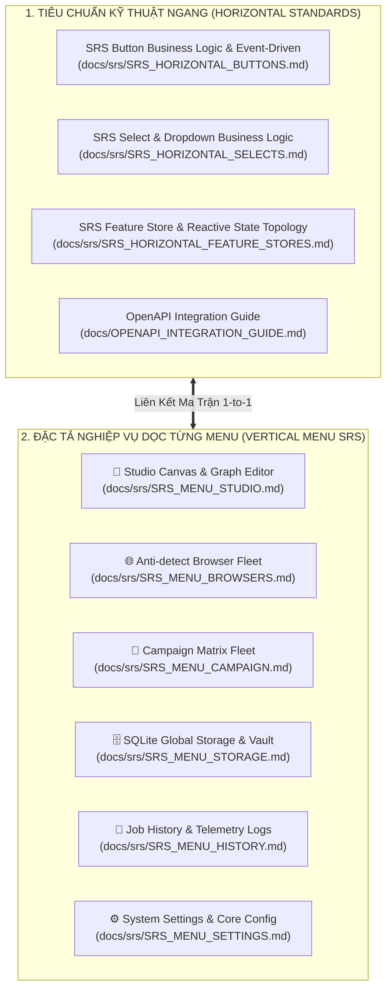

# 📚 AUTOMA ECOSYSTEM: HỆ THỐNG ĐẶC TẢ SRS MA TRẬN 2 CHIỀU (2D MATRIX SPECIFICATION HUB)

---

## 🏛️ 1. TỔNG QUAN KIẾN TRÚC MA TRẬN 2 CHIỀU

Hệ thống tài liệu đặc tả của Automa Ecosystem được tổ chức theo mô hình **Ma Trận 2 Chiều (2D Matrix Specification Hub)** kết hợp giữa **Tiêu Chuẩn Kỹ Thuật Ngang (Horizontal Standards)** và **Đặc Tả Nghiệp Vụ Dọc Từng Màn Hình (Vertical Menu Specs)**:

---

## 📑 2. MỤC LỤC TRUY CẬP ĐẶC TẢ CHI TIẾT

### 🌐 A. Nhóm Tiêu Chuẩn Kỹ Thuật Dùng Chung (Horizontal Standards)
1. [**SRS Button Business Logic & Event-Driven Schema (`SRS_HORIZONTAL_BUTTONS.md`)**](./SRS_HORIZONTAL_BUTTONS.md): Master catalog 37 Button actions (`btn.*`), máy trạng thái FSM 7 bước, và ma trận phản xạ reactive liên thành phần.
2. [**SRS Select & Dropdown Business Logic Schema (`SRS_HORIZONTAL_SELECTS.md`)**](./SRS_HORIZONTAL_SELECTS.md): Master catalog 11 Remote Virtualized Selects (`select.*`), thuật toán cắt lát ảo hóa (Virtualization Slices), và Debounce tìm kiếm.
3. [**SRS Feature Store & Reactive State Topology (`SRS_HORIZONTAL_FEATURE_STORES.md`)**](./SRS_HORIZONTAL_FEATURE_STORES.md): Master architecture 6 Pinia Domain Stores và SSE Event Dispatch Hub.
4. [**OpenAPI Integration Guide (`OPENAPI_INTEGRATION_GUIDE.md`)**](../OPENAPI_INTEGRATION_GUIDE.md): Cẩm nang lập trình kết nối Backend Axum Daemon bằng Typed SDK `@automa/types/api`.

---

### 📱 B. Nhóm Đặc Tả Nghiệp Vụ Từng Màn Hình (Vertical Menu SRS)
1. [**SRS Menu 1: Studio Canvas & Workflow Editor (`SRS_MENU_STUDIO.md`)**](./SRS_MENU_STUDIO.md):
   - Soạn thảo đồ thị VueFlow, Blocks palette drawer, Smart Connect, Action Header, Run Modal, Dynamic Parameters, Lint diagnostics, và Live Debugger Console.
2. [**SRS Menu 2: Browsers Fleet Management (`SRS_MENU_BROWSERS.md`)**](./SRS_MENU_BROWSERS.md):
   - Quản lý Profile Anti-detect, Thác giải quyết Browser 3 cấp (Cascading Waterfall), Auto-detect Chrome/Brave/Edge, Quản lý phiên Chromium `startBrowser()`, Dừng khẩn cấp Kill-all.
3. [**SRS Menu 3: Campaign Matrix Scheduler (`SRS_MENU_CAMPAIGN.md`)**](./SRS_MENU_CAMPAIGN.md):
   - Ma trận Campaign Matrix Grid, điều phối chạy song song nhiều profile, phân bổ slots, theo dõi tiến độ thời gian thực `campaign_slot_progress`.
4. [**SRS Menu 4: Storage & Vault Cryptography (`SRS_MENU_STORAGE.md`)**](./SRS_MENU_STORAGE.md):
   - Bảng dữ liệu SQLite động, Biến công khai `{{variables.*}}`, Mật mã Vault mã hóa `HMAC-SHA256 + AES-256-CBC` `{{secrets.*}}`, Workspace File Explorer.
5. [**SRS Menu 5: History & Telemetry Explorer (`SRS_MENU_HISTORY.md`)**](./SRS_MENU_HISTORY.md):
   - Lịch sử thực thi Job, bộ lọc trạng thái, xem chi tiết trace log từng block, thống kê thời gian và hiệu suất.
6. [**SRS Menu 6: Settings & Core Daemon Configuration (`SRS_MENU_SETTINGS.md`)**](./SRS_MENU_SETTINGS.md):
   - Cấu hình Daemon Host/Port `:8765`, Giám sát Heartbeat Health, Master Passphrase, Giao diện Dark/Light/System, Đường dẫn lưu trữ Workspace.
