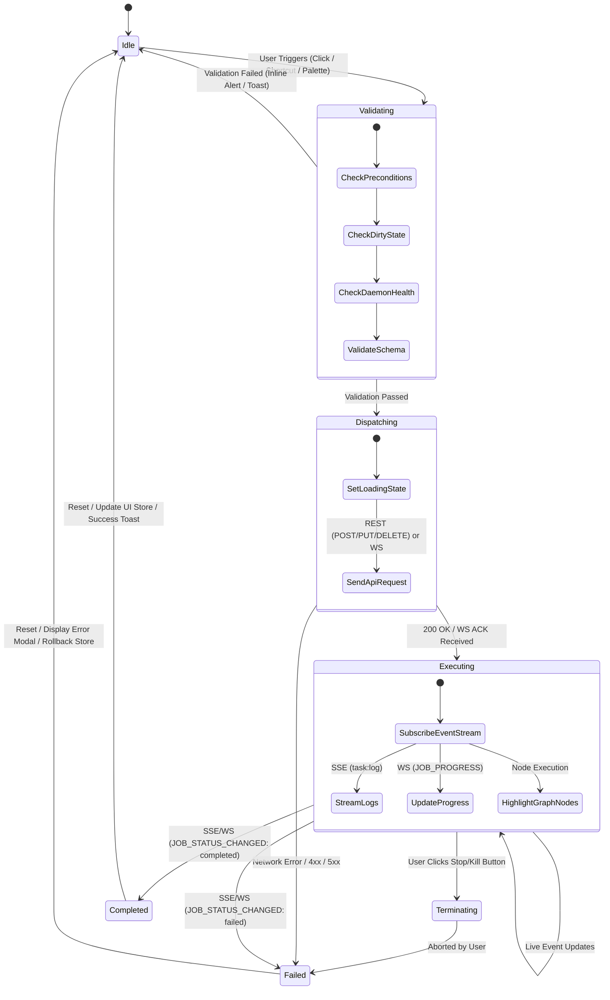
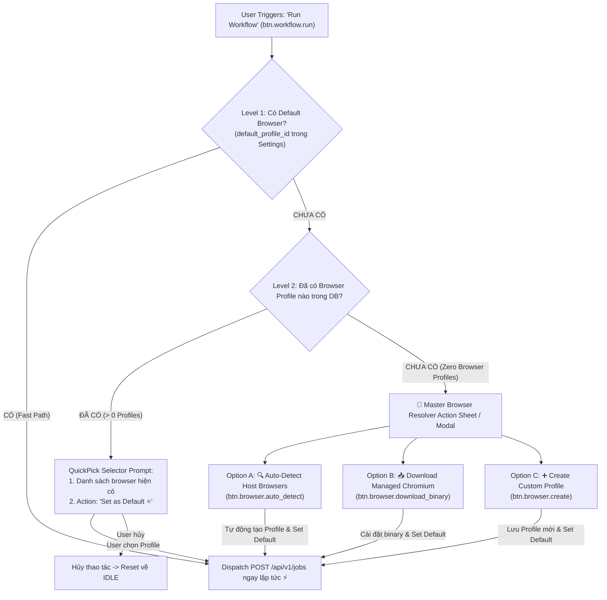
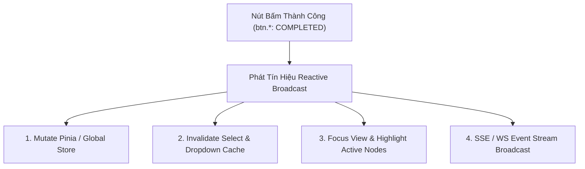

# Software Requirements Specification (SRS)
## Event-Driven Button Business Logic & OpenAPI Prototype Schema

**Document Version:** 1.0.0  
**Target Platforms:** `apps/core`, `apps/desk`, `apps/vsce`, `apps/webe`, `packages/types`  
**Architecture Paradigm:** Contract-First, Zero-Dummy UI, Event-Driven Architecture (EDA) via REST, WebSocket (`/api/v1/ws`), and SSE (`/api/v1/events`).

---

## 1. 🎯 Executive Summary & Purpose

Tài liệu này đặc tả toàn bộ **Business Logic Prototype Schema** cho hệ thống nút bấm (Buttons / Action Triggers) trên toàn bộ hệ sinh thái Automa Ecosystem (`apps/desk`, `apps/vsce`, `apps/webe` Studio).

### Mục tiêu chuẩn hóa:
1. **Zero-Dummy UI**: 100% các nút bấm trên giao diện người dùng phải có handler thực thi hoàn chỉnh kết nối trực tiếp với backend `apps/core` thông qua OpenAPI v3 contracts (`@automa/types/api`).
2. **Event-Driven Architecture (EDA)**: Nút bấm chỉ đóng vai trò **kích hoạt sự kiện (Event Dispatcher)**. Toàn bộ tiến trình thực thi, cập nhật trạng thái, hiển thị loading/spinner, tô màu tiến trình node trên canvas và cập nhật log đều phản ứng theo luồng sự kiện thời gian thực (SSE `/api/v1/events` hoặc WebSocket `/api/v1/ws`).
3. **Deterministic State Machine**: Mỗi nút bấm tuân thủ một máy trạng thái hữu hạn (FSM) gồm các pha: `Idle` $\rightarrow$ `Validating` $\rightarrow$ `Dispatching` $\rightarrow$ `Executing/Streaming` $\rightarrow$ `Completed`/`Failed` $\rightarrow$ `Idle`.
4. **Strict Type Safety**: Mọi payload gửi lên và phản hồi sự kiện đều ánh xạ 1:1 với OpenAPI Operation IDs và WebSocket message schemas.

---

## 2. 🏛️ Event-Driven Button Architecture & State Machine



---

### 2.1. 🌊 Pre-flight Cascading & Browser Resolution Waterfall

Khi người dùng kích hoạt lệnh thực thi (ví dụ `btn.workflow.run`), máy trạng thái bước vào pha `VALIDATING`. Để đảm bảo tính toàn vẹn và ngăn chặn lỗi thiếu môi trường runtime, hệ thống kích hoạt **Chu trình giải quyết Trình duyệt xếp tầng (Browser Resolution Waterfall)**:



#### Quy tắc xử lý 3 cấp độ (Cascading Levels):
1. **Level 1 (Fast Path - Happy Flow)**: Nếu `browser.default_profile_id` đã được cấu hình trong Settings và còn khả dụng trong SQLite $\rightarrow$ Lập tức chuyển sang `DISPATCHING` gửi `POST /api/v1/jobs`.
2. **Level 2 (Selection Prompt - Missing Default)**: Nếu trong DB đã tồn tại các Browser Profiles nhưng chưa đặt Default $\rightarrow$ Hiển thị QuickPick/Popup liệt kê danh sách Profile để người dùng chọn, đồng thời cung cấp tùy chọn lưu làm mặc định (`⭐ Set as Default`).
3. **Level 3 (Master Browser Resolver - Zero Profiles / Missing Binary)**: Nếu cơ sở dữ liệu hoàn toàn trống hoặc máy chủ chưa có bất kỳ Chromium binary nào $\rightarrow$ Hiển thị Master Browser Resolver Sheet với 3 hành động tự phục hồi (Self-healing).

---

## 3. 📐 Canonical TypeScript Schema Definition

Schema chuẩn hóa để cấu hình và phát triển toàn bộ các nút bấm trong hệ thống:

```typescript
import type { AutomaWsCommand, AutomaWsEvent } from '@automa/types/ws';
import type { ApiErrorResponse } from '@automa/types/api';

/**
 * Các phân vùng hiển thị nút bấm trong UI
 */
export type ButtonContextScope =
  | 'WorkflowCanvas'
  | 'CampaignMatrix'
  | 'BrowserManager'
  | 'StorageExplorer'
  | 'HistoryLogs'
  | 'SystemTitlebar'
  | 'CommandPalette';

/**
 * Trạng thái của máy trạng thái nút bấm
 */
export type ButtonExecutionState =
  | 'IDLE'
  | 'VALIDATING'
  | 'DISPATCHING'
  | 'EXECUTING'
  | 'TERMINATING'
  | 'COMPLETED'
  | 'FAILED';

/**
 * Cấu hình Modal xác nhận cho các thao tác quan trọng/nguy hiểm
 */
export interface ConfirmationModalConfig {
  title: string;
  message: string;
  confirmText: string;
  cancelText?: string;
  variant: 'default' | 'destructive' | 'warning';
}

/**
 * Khai báo ánh xạ Endpoint OpenAPI
 */
export interface RestDispatchContract {
  type: 'REST';
  operationId: string;
  method: 'GET' | 'POST' | 'PUT' | 'DELETE' | 'PATCH';
  pathTemplate: string;
  buildPayload?: (context: unknown) => Record<string, unknown> | undefined;
}

/**
 * Khai báo ánh xạ Lệnh WebSocket
 */
export interface WebSocketDispatchContract {
  type: 'WEBSOCKET';
  commandType: AutomaWsCommand['type'];
  buildCommand: (context: unknown) => AutomaWsCommand;
}

/**
 * Khai báo ánh xạ IPC (Tauri / VS Code)
 */
export interface IpcDispatchContract {
  type: 'IPC';
  channel: string;
  buildPayload?: (context: unknown) => unknown;
}

export type ButtonDispatchContract =
  | RestDispatchContract
  | WebSocketDispatchContract
  | IpcDispatchContract;

/**
 * Bộ lắng nghe sự kiện phản ứng (Event Driven Reaction)
 */
export interface EventReactionRule {
  source: 'SSE' | 'WEBSOCKET' | 'IPC';
  eventType: string;
  handler: (eventData: unknown, buttonContext: unknown) => void;
}

/**
 * Định nghĩa Prototype Schema hoàn chỉnh cho một nút bấm
 */
export interface ButtonBusinessLogicSchema<TContext = unknown, TResponse = unknown> {
  /** Định danh duy nhất theo chuẩn chấm: domain.subdomain.action */
  id: string;
  
  /** Vùng ngữ cảnh xuất hiện */
  context: ButtonContextScope;

  /** Khai báo Presentation & Accessibility */
  presentation: {
    label: string;
    icon: string;
    dataTestId: string;
    tooltip?: string;
    keyboardShortcut?: string;
    badgeCountKey?: string;
  };

  /** Tiền điều kiện để nút bấm được phép kích hoạt */
  preConditions: {
    requiresDaemonHealthy?: boolean;
    requiresSelection?: boolean;
    requiresDirtyState?: boolean;
    customValidator?: (context: TContext) => boolean | Promise<boolean>;
    confirmationModal?: ConfirmationModalConfig;
  };

  /** Giao thức và thông tin phát sự kiện (Dispatching) */
  dispatch: ButtonDispatchContract;

  /** Các kênh sự kiện phản ứng trong quá trình Executing */
  eventReactions?: EventReactionRule[];

  /** Hậu điều kiện và đột biến trạng thái sau khi hoàn tất */
  postConditions: {
    onSuccess: (response: TResponse, context: TContext) => void;
    onError: (error: ApiErrorResponse | Error, context: TContext) => void;
    mutateStoreKeys?: string[];
    refreshQueries?: string[];
  };
}
```

---

## 4. 📋 Chi Tiết Specification Toàn Bộ Nút Bấm (Button Catalog)

### 4.1. Phân Hệ Workflow & Canvas Execution (`Jobs`, `Lint`)

| Button ID | Label & Icon | `data-testid` | OpenAPI `operation_id` | Giao Thức & Payload | Event-Driven Reactions |
| :--- | :--- | :--- | :--- | :--- | :--- |
| **`btn.workflow.run`** | **Run Workflow** <br>`▶` Play | `btn-run-workflow` | `submit_job` | `POST /api/v1/jobs`<br>`SubmitJobRequest` | • Precondition: Tự động phân giải `defaultBrowser` (hoặc mở QuickPick chọn browser nếu chưa có default)<br>• SSE `task:log` $\rightarrow$ Live output console<br>• WS `JOB_PROGRESS` $\rightarrow$ Highlight active node<br>• WS `JOB_STATUS_CHANGED` (running $\rightarrow$ completed) |
| **`btn.workflow.pause`** | **Pause Execution** <br>`⏸` Pause | `btn-pause-workflow` | *WebSocket* | WS Command:<br>`{ type: 'PAUSE_JOB', jobId }` | • WS `JOB_STATUS_CHANGED` (`status: 'paused'`) $\rightarrow$ Switch icon to Resume |
| **`btn.workflow.resume`** | **Resume Execution** <br>`▶` Play | `btn-resume-workflow` | *WebSocket* | WS Command:<br>`{ type: 'RESUME_JOB', jobId }` | • WS `JOB_STATUS_CHANGED` (`status: 'running'`) $\rightarrow$ Switch icon to Pause |
| **`btn.workflow.stop`** | **Stop / Kill** <br>`⏹` Square | `btn-stop-workflow` | `kill_job` | `DELETE /api/v1/jobs/{job_id}`<br>or WS `KILL_JOB` | • WS `JOB_STATUS_CHANGED` (`status: 'stopped'`) $\rightarrow$ Reset button state to Idle |
| **`btn.workflow.create`** | **New Workflow** <br>`➕` Plus | `btn-create-workflow` | *Client Action* | IPC `workflow:create` | • Create a new blank workflow canvas |
| **`btn.workflow.save`** | **Save Workflow** <br>`💾` Save | `btn-save-workflow` | `save_workflow` / `update_storage_workflow` | `PUT /api/v1/storage/workflow`<br>`SaveWorkflowPayload` | • Store: clear `isDirty = false`<br>• VSCE: Remove dirty dot indicator on editor tab |
| **`btn.workflow.import`** | **Import Workflow** <br>`📥` Upload | `btn-import-workflow` | *Client Action* | IPC `workflow:import` | • Reads `.workflow.json` from disk to load into Canvas |
| **`btn.workflow.export`** | **Export JSON** <br>`💾` Download | `btn-export-workflow` | *Client Action* | IPC `workflow:export` | • Exports active workflow as `.workflow.json` to disk |
| **`btn.workflow.delete`** | **Delete Workflow** <br>`🗑️` Trash2 | `btn-delete-workflow` | `delete_storage_workflow` | `DELETE /api/v1/storage/workflows/{id}` | • Precondition: `isJobRunning == false`<br>• Destructive Confirmation Modal<br>• Invalidate `select.storage.workflow` and reload list<br>• Auto fallback to remaining workflow or blank canvas<br>• IPC `automa:workflow-deleted` |
| **`btn.workflow.lint`** | **Lint & Check** <br>`🔍` Sparkles | `btn-lint-workflow` | `lint_workflow` | `POST /api/v1/lint`<br>`LintWorkflowRequest` | • Update canvas node markers with lint errors/warnings<br>• Focus Problems panel |
| **`btn.workflow.open_studio`** | **Open in Studio** <br>`🖥️` ExternalLink | `btn-open-studio` | `open_web_studio` | `POST /api/v1/system/studio/session` | • Spawns / attaches standalone VueFlow canvas view |

---

### 4.2. Phân Hệ Campaign & Matrix Fleet Scheduling (`Campaigns`)

| Button ID | Label & Icon | `data-testid` | OpenAPI `operation_id` | Giao Thức & Payload | Event-Driven Reactions |
| :--- | :--- | :--- | :--- | :--- | :--- |
| **`btn.campaign.run_matrix`** | **Execute Matrix** <br>`🚀` Rocket | `btn-run-campaign` | `execute_campaign` | `POST /api/v1/campaigns/execute`<br>`ExecuteCampaignRequest` | • SSE `/api/v1/events` (`CAMPAIGN_PROGRESS`)<br>• Live matrix slots progress bar update |
| **`btn.campaign.abort`** | **Abort Matrix** <br>`🛑` OctagonAlert | `btn-abort-campaign` | `abort_campaign` | `DELETE /api/v1/campaigns/{id}` | • Stop all active parallel jobs in matrix<br>• Show matrix cancellation summary |
| **`btn.campaign.refresh`** | **Refresh Matrix** <br>`🔄` RefreshCw | `btn-refresh-matrix` | `get_campaign_matrix_status` | `GET /api/v1/campaigns/{id}/matrix-status` | • Re-render matrix slot cards & pass/fail metrics |
| **`btn.campaign.create`** | **New Campaign** <br>`➕` Plus | `btn-create-campaign` | `create_storage_campaign` | `POST /api/v1/storage/campaigns`<br>`CreateCampaignStorageRequest` | • Insert into SQLite store<br>• Open campaign designer view |
| **`btn.campaign.delete`** | **Delete Campaign** <br>`🗑️` Trash2 | `btn-delete-campaign` | `delete_storage_campaign` | `DELETE /api/v1/storage/campaigns/{id}` | • Modal confirm $\rightarrow$ Remove item from list $\rightarrow$ Toast success |

---

### 4.3. Phân Hệ Anti-Detect Browser Profiles (`Browsers`)

| Button ID | Label & Icon | `data-testid` | OpenAPI `operation_id` | Giao Thức & Payload | Event-Driven Reactions |
| :--- | :--- | :--- | :--- | :--- | :--- |
| **`btn.browser.launch`** | **Launch Browser** <br>`🌐` Chrome/Globe | `btn-launch-browser` | `start_browser_session` | `POST /api/v1/browsers/{id}/session` | • Update browser badge state: `Offline` $\rightarrow$ `Online`<br>• Display active debug CDP port |
| **`btn.browser.stop`** | **Stop Session** <br>`⏻` Power | `btn-stop-browser` | `stop_browser_session` | `DELETE /api/v1/browsers/{id}/session` | • Close Chromium window $\rightarrow$ Badge `Offline` |
| **`btn.browser.kill_all`** | **Kill All Sessions** <br>`⚡` ZapOff | `btn-kill-all-browsers` | `kill_all_browsers` | `DELETE /api/v1/browsers/sessions` | • Emergency process termination across all instances |
| **`btn.browser.create`** | **Create Profile** <br>`➕` Plus | `btn-create-browser` | `create_browser` | `POST /api/v1/browsers`<br>`CreateBrowserRequest` | • Save SQLite $\rightarrow$ Append to Browsers tree/grid |
| **`btn.browser.import_csv`** | **Import CSV** <br>`📥` Upload | `btn-import-browsers-csv` | `import_browsers_csv` | `POST /api/v1/browsers/import-csv`<br>`ImportCsvPayload` | • Batch insert $\rightarrow$ Refresh list $\rightarrow$ Report count |
| **`btn.browser.import_cookies`** | **Import Cookies** <br>`🍪` Cookie | `btn-import-cookies` | `import_browser_cookies` | `POST /api/v1/browsers/{id}/cookies`<br>`ImportCookiesPayload` | • Injects JSON Netscape cookies into browser profile |
| **`btn.browser.sideload_ext`** | **Add Extension** <br>`🧩` Puzzle | `btn-sideload-ext` | `sideload_browser_extension` | `POST /api/v1/browsers/{id}/extensions`<br>`SideloadExtensionPayload` | • Attach unpacked CRX/folder to runtime profile |
| **`btn.browser.set_default`** | **Set as Default** <br>`⭐` Star | `btn-set-default-browser` | `patch_app_settings` | `PATCH /api/v1/system/settings`<br>`{ "browser": { "default_profile_id": "{id}" } }` | • Lưu browser mặc định vào Settings Store SQLite<br>• Gắn huy hiệu `⭐ [Default]` trên browser được chọn và gỡ sao ở browser cũ<br>• Tự động chọn browser này khi nhấn `Run Workflow` mà không cần hỏi lại |
| **`btn.browser.auto_detect`** | **Auto-Detect Host Browsers** <br>`🔍` Scan | `btn-autodetect-browsers` | `auto_detect_browsers` | `POST /api/v1/browsers/auto-detect` | • Quét toàn bộ Chrome/Edge/Brave/Chromium trên máy host<br>• Tự động tạo profiles và gán default browser đầu tiên tìm thấy |
| **`btn.browser.download_binary`** | **Download Managed Chromium** <br>`📥` DownloadCloud | `btn-download-chromium` | `install_browser_binary` | `POST /api/v1/system/browser-binaries`<br>`{ "browser": "chromium" }` | • Tải bản Chromium portable từ Google Storage<br>• Hiển thị thanh tiến trình download SSE $\rightarrow$ Tự động tạo profile mặc định khi tải xong |

---

### 4.4. Phân Hệ Global Storage (`Storage`, `Secrets`)

| Button ID | Label & Icon | `data-testid` | OpenAPI `operation_id` | Giao Thức & Payload | Event-Driven Reactions |
| :--- | :--- | :--- | :--- | :--- | :--- |
| **`btn.storage.table.add`** | **Create Table** <br>`➕` Plus | `btn-add-table` | `add_storage_table` | `POST /api/v1/storage/tables`<br>`AddTableRequest` | • Visual column editor $\rightarrow$ Save SQLite $\rightarrow$ Refresh |
| **`btn.storage.table.add_row`** | **Add Row** <br>`➕` PlusCircle | `btn-add-table-row` | `add_storage_table_row` | `POST /api/v1/storage/tables/{id}/rows`<br>`AddTableRowRequest` | • In-place grid edit $\rightarrow$ Sync SQLite |
| **`btn.storage.table.delete`** | **Delete Table** <br>`🗑️` Trash | `btn-delete-table` | `delete_storage_table` | `DELETE /api/v1/storage/tables/{id}` | • Modal confirm $\rightarrow$ Remove table |
| **`btn.storage.var.add`** | **New Variable** <br>`➕` Plus | `btn-add-variable` | `add_storage_variable` | `POST /api/v1/storage/variables`<br>`StorageVariablePayload` | • Plaintext public variable persisted |
| **`btn.storage.var.delete`** | **Delete Variable** <br>`🗑️` Trash | `btn-delete-variable` | `delete_storage_variable` | `DELETE /api/v1/storage/variables/{id}` | • Remove from global variables store |
| **`btn.storage.cred.add`** | **New Credential** <br>`🔒` Lock | `btn-add-credential` | `add_storage_credential` | `POST /api/v1/storage/credentials`<br>`AddCredentialRequest` | • AES-256 encrypted in RAM with master passphrase |
| **`btn.storage.cred.delete`** | **Delete Credential** <br>`🗑️` Trash | `btn-delete-credential` | `delete_storage_credential` | `DELETE /api/v1/storage/credentials/{id}` | • Remove encrypted secret from SQLite |

---

### 4.5. Phân Hệ Telemetry & Execution History (`History`, `Events`)

| Button ID | Label & Icon | `data-testid` | OpenAPI `operation_id` | Giao Thức & Payload | Event-Driven Reactions |
| :--- | :--- | :--- | :--- | :--- | :--- |
| **`btn.history.clear_all`** | **Clear History** <br>`🧹` Trash2 | `btn-clear-history` | `clear_all_job_history` | `DELETE /api/v1/history` | • Modal confirm $\rightarrow$ Purge all execution records |
| **`btn.history.delete_item`** | **Delete Log Item** <br>`✕` X | `btn-delete-history-item` | `delete_job_history_item` | `DELETE /api/v1/history/{job_id}` | • Remove specific job trace and logs |
| **`btn.history.view_logs`** | **Inspect Logs** <br>`📋` FileText | `btn-view-job-logs` | `get_job_execution_logs` | `GET /api/v1/history/{job_id}/logs` | • Fetch log records $\rightarrow$ Render in virtualized log list |
| **`btn.history.export_logs`** | **Export JSON/Text** <br>`💾` Download | `btn-export-logs` | *Client Action* | Local serialization | • Triggers OS save dialog for log dump |

---

### 4.6. Phân Hệ System, Window Ergonomics & Command Palette (`System`, `Settings`)

| Button ID | Label & Icon | `data-testid` | OpenAPI `operation_id` / IPC | Giao Thức & Payload | Event-Driven Reactions |
| :--- | :--- | :--- | :--- | :--- | :--- |
| **`btn.system.health_check`** | **Daemon Status** <br>`🟢` Activity | `btn-health-check` | `get_health` | `GET /api/v1/health` | • Heartbeat ping status badge (Online/Offline) |
| **`btn.system.command_palette`** | **Command Palette** <br>`⌨️` `Ctrl+K` | `btn-command-palette` | *Client Action* | Shortcut / Click event | • Opens fuzzy search modal for quick actions |
| **`btn.system.toggle_theme`** | **Theme Mode** <br>`🌓` Sun/Moon | `btn-toggle-theme` | `patch_app_settings` | `PATCH /api/v1/system/settings`<br>`UpdateAppSettingsRequest` | • Toggles Dark / Light mode across Webview and Titlebar |
| **`btn.window.minimize`** | **Minimize** <br>`🗕` Minus | `btn-window-minimize` | Tauri IPC / Window | `appWindow.minimize()` | • Minimizes window to Taskbar or Tray |
| **`btn.window.maximize`** | **Maximize/Restore** <br>`🗖` Square | `btn-window-maximize` | Tauri IPC / Window | `appWindow.toggleMaximize()` | • Toggles full-screen maximize/restore state |
| **`btn.window.close`** | **Close Window** <br>`✕` Close | `btn-window-close` | Tauri IPC / Window | `appWindow.close()` | • Checks minimize-to-tray setting or terminates app |

---

## 5. ⚡ Event-Driven Reaction Pipeline (SSE & WebSocket)

Khi bất kỳ nút bấm nào kích hoạt một tác vụ bất đồng bộ (Asynchronous Job / Session), hệ thống phản ứng theo các kênh sự kiện sau:

```text
[Button Click Trigger] 
       │
       ▼
[OpenAPI REST / WS Command] ──(200 OK + JobId)──► [Button FSM State: EXECUTING]
                                                             │
      ┌──────────────────────────────────────────────────────┴──────────────────────────────────────────────────────┐
      │                                                                                                             │
      ▼                                                                                                             ▼
[SSE: /api/v1/events]                                                                                   [WebSocket: /api/v1/ws]
  • event: "task:started"   ──► Update button spinner                                                     • type: "JOB_PROGRESS" ──► Step increment
  • event: "task:log"       ──► Stream log text to Output Console                                         • type: "SYSTEM_METRICS" ──► CPU/Memory meter
  • event: "task:completed" ──► Button FSM: COMPLETED -> IDLE (Green Toast)                               • type: "JOB_STATUS_CHANGED" (stopped) ──► Reset to IDLE
  • event: "task:error"     ──► Button FSM: FAILED -> IDLE (Error Modal)
```

---

## 6. 🛡️ Guardrails, Linter & Zero-Dummy Compliance

Để đảm bảo tuân thủ tiêu chuẩn chất lượng:
1. **Mọi nút bấm phải có `data-testid`**:
   - Format: `btn-<kebab-case-action>` (ví dụ: `btn-run-workflow`, `btn-launch-browser`).
2. **Không cho phép Silent Execution**:
   - Khi bấm nút thực thi (`Run Workflow`, `Execute Matrix`), hệ thống phải focus cửa sổ log và hiển thị thông báo trạng thái.
3. **Chống Duplicate Click (Debounce & State Guard)**:
   - Trong pha `VALIDATING` hoặc `DISPATCHING`, thuộc tính `disabled` hoặc `aria-busy="true"` phải được gán để ngăn chặn spam request.
4. **Xác thực phá hủy (Destructive Operations)**:
   - Các nút xóa (`delete_browser`, `clear_all_job_history`, `delete_storage_table`) bắt buộc hiển thị `ConfirmationModal` trước khi gọi backend API.

---

## 7. 💻 Production Implementation Example (Vue 3 Composable)

```typescript
import { ref, computed } from 'vue';
import { submitJob, killJob } from '@automa/types/api';
import type { ButtonBusinessLogicSchema, ButtonExecutionState } from './button-schema';

export function useWorkflowRunButton(workflowId: string, workflowPath: string) {
  const state = ref<ButtonExecutionState>('IDLE');
  const activeJobId = ref<string | null>(null);
  const errorMessage = ref<string | null>(null);

  const isLoading = computed(() => state.value === 'VALIDATING' || state.value === 'DISPATCHING');
  const isRunning = computed(() => state.value === 'EXECUTING');

  async function handleButtonClick() {
    if (isRunning.value && activeJobId.value) {
      // Logic khi đang chạy: Nút chuyển thành STOP
      state.value = 'TERMINATING';
      try {
        await killJob({ path: { job_id: activeJobId.value } });
      } catch (err) {
        console.error('Failed to stop job:', err);
      }
      return;
    }

    if (state.value !== 'IDLE') return;

    // Pha 1: Validation
    state.value = 'VALIDATING';
    if (!workflowPath) {
      errorMessage.value = 'Workflow path is required';
      state.value = 'IDLE';
      return;
    }

    // Pha 2: Dispatching API
    state.value = 'DISPATCHING';
    try {
      const response = await submitJob({
        body: {
          workflow_path: workflowPath,
          options: { headless: true },
        },
      });

      if (response.data && response.data.job_id) {
        activeJobId.value = response.data.job_id;
        state.value = 'EXECUTING';
      }
    } catch (err: any) {
      state.value = 'FAILED';
      errorMessage.value = err?.message || 'Failed to submit workflow execution job';
      setTimeout(() => { state.value = 'IDLE'; }, 3000);
    }
  }

  // Pha 3: Event-Driven Reaction (Được gọi từ SSE hoặc WS listener)
  function handleJobStatusEvent(event: { jobId: string; status: string; error?: string }) {
    if (event.jobId !== activeJobId.value) return;

    if (event.status === 'completed') {
      state.value = 'COMPLETED';
      setTimeout(() => { state.value = 'IDLE'; activeJobId.value = null; }, 1500);
    } else if (event.status === 'failed' || event.status === 'stopped') {
      state.value = 'FAILED';
      errorMessage.value = event.error || 'Execution failed';
      setTimeout(() => { state.value = 'IDLE'; activeJobId.value = null; }, 2000);
    }
  }

  return {
    state,
    isLoading,
    isRunning,
    errorMessage,
    handleButtonClick,
    handleJobStatusEvent,
  };
}
```

---

## 8. 📌 Tích Hợp Vào Monorepo & Quy Trình Phát Triển

1. **Vị trí tài liệu**: `docs/SRS_BUTTON_BUSINESS_LOGIC_EVENT_DRIVEN.md`.
2. **Cập nhật Types**: File `packages/types/src/button.ts` kế thừa toàn bộ types từ tài liệu này.
3. **Kiểm thử tự động**: Thêm các test case trong Vitest (`apps/vsce`, `apps/desk`) kiểm tra xem 100% `data-testid` của nút bấm có tồn tại và phản hồi chính xác theo event-driven FSM.

---

## ⚡ 9. MA TRẬN SIDE EFFECT THÀNH CÔNG & PHẢN XẠ REACTIVE LIÊN THÀNH PHẦN (CROSS-COMPONENT REFLECTION GRAPH)

Khi một nút bấm (`btn.*`) thực thi thành công, hành động này **bắt buộc tạo ra các Reactive Side Effects** phản xạ trạng thái tức thì đến các thành phần UI, Pinia Stores và Select Dropdowns đang phụ thuộc:



### 📋 Ma Trận Phản Xạ Chéo (Cross-Component Reactive Matrix)

| Nút Bấm (`btn.*`) | Sự Kiện Broadcast (SSE / WS / IPC) | Thành Phần / Select Phụ Thuộc | Phản Xạ Reactive Bắt Buộc |
|---|---|---|---|
| `btn.workflow.run` | SSE: `job_status: running` | `ExecutionConsole.vue`, Canvas Nodes, `btn.workflow.pause`, `btn.workflow.stop` | Focus màn hình log console, bật viền sáng pulse trên Node đang chạy, enable nút Pause/Stop. |
| `btn.workflow.pause` | WS: `PAUSE_JOB` | `btn.workflow.resume`, Canvas debugger bar | Đổi trạng thái nút sang Resume, dừng bước thực thi tại breakpoint hiện tại. |
| `btn.workflow.resume` | WS: `RESUME_JOB` | `btn.workflow.pause`, Canvas execution highlighter | Đổi trạng thái nút sang Pause, tiếp tục chạy bước kế tiếp. |
| `btn.workflow.stop` | REST: `kill_job` $\rightarrow$ SSE: `job_status: stopped` | `btn.workflow.run`, `ExecutionConsole.vue`, Matrix grid slots | Enable lại nút Run, in log cảnh báo Terminated, giải phóng slot grid. |
| `btn.workflow.save` | REST / IPC: `workflow_saved` | `select.storage.workflow`, `AutomaFilesProvider`, Store `isDirty` | Reset `isDirty = false`, nạp lại ngầm `select.storage.workflow`, cập nhật tree view. |
| `btn.browser.create` | REST: `create_browser` $\rightarrow$ SSE: `browser_created` | `select.browser.profile`, `BrowsersPanel`, Badge `browsers` | Nạp lại ngầm `select.browser.profile`, tăng badge đếm browser, thêm card mới vào UI. |
| `btn.browser.delete` | REST: `delete_browser` $\rightarrow$ SSE: `browser_deleted` | `select.browser.profile`, `BrowsersPanel`, `useBrowserWaterfall` | Xóa option khỏi `select.browser.profile`, xóa card khỏi UI, giảm badge đếm. |
| `btn.browser.launch` | REST: `launch_browser` $\rightarrow$ SSE: `browser_online` | `select.browser.profile`, Browser Card Status Badge | Đổi badge trạng thái của profile sang `Online / Green`, kích hoạt nút CDP Inspect. |
| `btn.browser.kill` | REST: `kill_browser` $\rightarrow$ SSE: `browser_offline` | `select.browser.profile`, Browser Card Status Badge | Đổi badge trạng thái về `Offline / Gray`, disable nút CDP. |
| `btn.campaign.matrix.run` | REST: `execute_campaign` $\rightarrow$ SSE: `campaign_started` | `MatrixGrid.vue`, `select.history.job_filter`, `HistoryView.vue` | Khởi động allocation matrix grid, tự động filter history sang `running`, stream logs các slots. |
| `btn.campaign.abort` | REST: `abort_campaign` $\rightarrow$ SSE: `campaign_aborted` | `MatrixGrid.vue`, Slot badges | Chuyển tất cả active slots sang màu đỏ/hủy, giải phóng tài nguyên. |
| `btn.storage.table.create` | REST: `create_storage_table` $\rightarrow$ SSE: `storage_table_changed` | `select.storage.table`, `StorageTreeDataProvider`, `TableView.vue` | Invalidate cache `select.storage.table`, thêm table vào cây storage sidebar. |
| `btn.storage.variable.create` | REST: `add_storage_variable` $\rightarrow$ SSE: `storage_variable_changed` | `select.storage.variable`, Variable Autocomplete Helper | Invalidate `select.storage.variable`, cập nhật danh sách gợi ý `{{variables.KEY}}`. |
| `btn.storage.credential.create` | REST: `add_storage_credential` $\rightarrow$ SSE: `storage_credential_changed` | `select.storage.credential`, Secret Autocomplete Helper | Invalidate `select.storage.credential`, cập nhật danh sách gợi ý `{{secrets.KEY}}`. |
| `btn.storage.database.sync` | REST: `sync_database` $\rightarrow$ SSE: `storage_database_synced` | Toàn bộ 4 Selects Storage (`workflow`, `table`, `variable`, `credential`) | Kích hoạt nạp lại đồng thời toàn bộ dữ liệu storage mà không reload trang. |

---

## 🔍 10. GIAO THỨC KIỂM TRA CHÉO DÀNH CHO AGENT (AGENT CROSS-CHECKING PROTOCOL)

Khi một AI Agent phát triển hoặc chỉnh sửa bất kỳ nút bấm UI nào, Agent **BẮT BUỘC** thực hiện quy trình kiểm tra chéo 3 bước:
1. **Source Inspection**: Xác định `btn.*` phát ra sự kiện nào khi thành công (`onSuccess`).
2. **Reactive Cascade Check**: Tra cứu bảng **Ma Trận Phản Xạ Chéo (Mục 9)** để xác định tất cả các Select Dropdown, Pinia Stores, và Views phụ thuộc.
3. **Refetch / Invalidation Verification**: Đảm bảo các component phụ thuộc có gắn listener SSE/WS để tự động cập nhật mà không yêu cầu người dùng phải bấm F5 / Reload thủ công.
