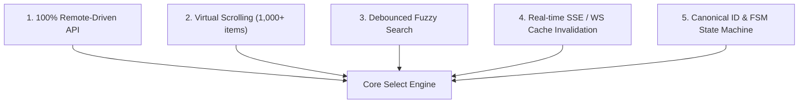
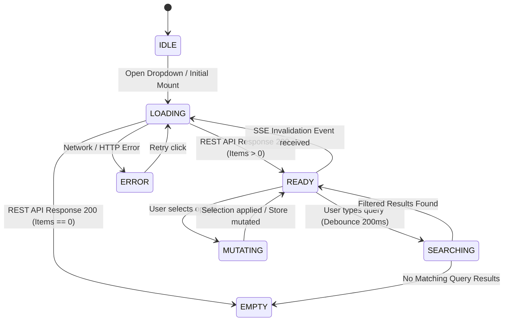
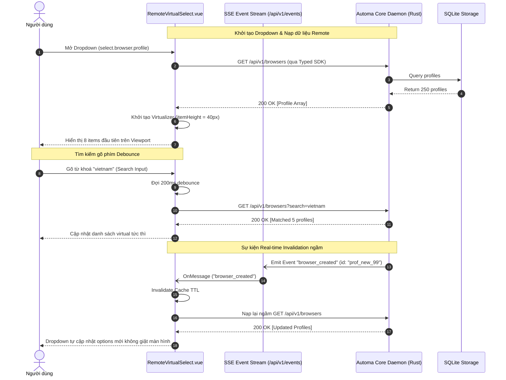
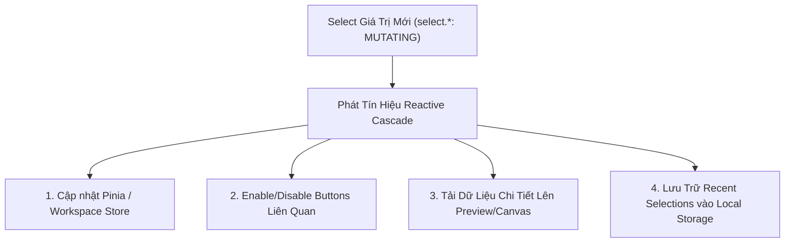

# 📜 SRS Select & Dropdown Business Logic: Event-Driven, Remote, Virtualized & Search Schema

---

## 🎯 1. TỔNG QUAN VÀ NGUYÊN TẮC THIẾT KẾ CỐT LÕI

Tài liệu này là **Đặc tả Kỹ thuật Master (SRS)** cho toàn bộ các thành phần Select / Dropdown / Combobox trên khắp hệ sinh thái Automa (**`apps/desk`**, **`apps/vsce`**, **`apps/webe`**).

Mọi Select component trong hệ thống **BẮT BUỘC** tuân thủ 5 nguyên tắc bất biến:



---

### 🛡️ 5 NGUYÊN TẮC BẤT BIẾN (INVARIANTS)

1. **100% Remote-Driven (Zero Hardcoded Options)**:
   - Tất cả dữ liệu danh sách chọn (Browser Profiles, Workflows, Campaigns, Tables, Variables, Credentials) đều được nạp động từ **Automa Core REST API** (`/api/v1/...`) qua `@automa/types/api`.
   - Tuyệt đối cấm hardcode mảng dữ liệu tĩnh trong Vue template.
2. **Virtual Scrolling Engine (Chống giật lag UI)**:
   - Các collection có thể mở rộng (như danh sách 500+ browser profiles, 1,000+ workflows) **bắt buộc sử dụng Virtual Scrolling** (tính toán `slice(start, end)` dựa trên `itemHeightPx`, chỉ render tối đa 8–10 DOM nodes trên màn hình).
3. **Debounced Fuzzy Search**:
   - Tích hợp ô tìm kiếm trực tiếp trong dropdown.
   - Hỗ trợ 2 chế độ:
     * **Client-side Fuzzy**: Cho các collection nhỏ (< 100 items).
     * **Remote Debounced (`200ms - 250ms`)**: Gửi query param `?search=...` lên Core Daemon cho các collection lớn.
4. **Real-time SSE / WS Cache Invalidation (Tự động cập nhật)**:
   - Khi có sự kiện SSE từ Daemon (ví dụ `browser_created`, `workflow_deleted`, `table_changed`), Select component tự động vô hiệu hóa bộ nhớ đệm (Cache Invalidation) và nạp lại danh sách mới ngầm dưới background mà không làm gián đoạn tương tác người dùng.
5. **Canonical ID & FSM State Machine**:
   - Mỗi dropdown được định danh duy nhất bằng **Select ID** (`select.domain.subdomain.target`).
   - Tuân thủ Finite State Machine: `IDLE` $\rightarrow$ `LOADING` $\rightarrow$ `READY` $\rightarrow$ `SEARCHING` $\rightarrow$ `EMPTY` $\rightarrow$ `ERROR` $\rightarrow$ `MUTATING`.

---

## 🔄 2. FINITE STATE MACHINE (FSM) VÒNG ĐỜI SELECT



### 🏷️ Định Nghĩa Các Trạng Thái FSM

| Trạng Thái | Mô Tả UI / Hành Vi |
|---|---|
| **`IDLE`** | Dropdown đang đóng hoặc chưa kích hoạt tải dữ liệu. |
| **`LOADING`** | Đang gọi REST API qua SDK. Hiển thị Skeleton Loader / Spinning Indicator. |
| **`READY`** | Dữ liệu đã sẵn sàng trong bộ nhớ đệm, Virtual Scroller kích hoạt, sẵn sàng nhận phím mũi tên. |
| **`SEARCHING`** | Người dùng đang gõ tìm kiếm, thanh debounce đang đếm lùi trước khi lọc. |
| **`EMPTY`** | Danh sách rỗng (không có profile/workflow nào hoặc kết quả tìm kiếm không khớp). Hiển thị Empty State kèm nút CTA "Tạo mới". |
| **`ERROR`** | Lỗi mạng / Daemon offline. Hiển thị Error Banner kèm nút "Thử lại". |
| **`MUTATING`** | Người dùng vừa chọn giá trị mới, đang đồng bộ vào Pinia Store hoặc gọi Patch API. |

---

## 📊 3. DANH MỤC 11 SELECT COMPONENTS CHUẨN HOÁ

| # | Select ID (`select.*`) | Context Scope | Remote Endpoint | Virtualize | Search Mode | Debounce | SSE Invalidation Events |
|---|---|---|---|:---:|:---:|:---:|---|
| **1** | `select.browser.profile` | `WorkflowCanvas`, `StudioHeader` | `/api/v1/browsers` | **Có** (40px) | Hybrid (Fuzzy) | 200ms | `browser_created`, `browser_deleted`, `browser_updated` |
| **2** | `select.storage.workflow` | `StudioHeader`, `CommandPalette` | `/api/v1/storage/workflows` | **Có** (44px) | Hybrid (Remote) | 250ms | `workflow_created`, `workflow_updated`, `workflow_deleted` |
| **3** | `select.campaign.suite` | `CampaignMatrix` | `/api/v1/storage/campaigns` | **Có** (40px) | Hybrid (Remote) | 200ms | `campaign_created`, `campaign_deleted` |
| **4** | `select.storage.table` | `StorageExplorer`, `ModalDialog` | `/api/v1/storage/tables` | **Có** (38px) | Client Fuzzy | 150ms | `storage_table_changed` |
| **5** | `select.storage.variable` | `StorageExplorer`, `WorkflowCanvas` | `/api/v1/storage/variables` | **Có** (38px) | Client Fuzzy | 150ms | `storage_variable_changed` |
| **6** | `select.storage.credential` | `StorageExplorer`, `WorkflowCanvas` | `/api/v1/storage/credentials` | **Có** (38px) | Client Fuzzy | 150ms | `storage_credential_changed` |
| **7** | `select.browser.type` | `SettingsPanel` | `/api/v1/system/settings` | Không (Khóa cứng: `chromium`) | Client Static | 0ms | `settings_updated` |
| **8** | `select.grid.matrix.columns` | `SettingsPanel`, `CampaignMatrix` | `/api/v1/system/settings` | Không (9 items) | Client Static | 0ms | `settings_updated` |
| **9** | `select.grid.matrix.rows` | `SettingsPanel`, `CampaignMatrix` | `/api/v1/system/settings` | Không (6 items) | Client Static | 0ms | `settings_updated` |
| **10** | `select.history.job_filter` | `HistoryLogs` | `/api/v1/history` | Không (4 items) | Client Static | 0ms | `job_finished`, `job_status` |
| **11** | `select.linter.rule_category` | `WorkflowCanvas` | `/api/v1/lint` | Không (4 items) | Client Static | 0ms | N/A |

---

## ⚡ 4. EVENT-DRIVEN REACTIVE FLOWS (SSE & WS)



---

## 💻 5. COMPONENT INTEGRATION RECIPES

### 📦 Ví Dụ 1: Vue 3.5 Virtualized Remote Select Component (`RemoteSelect.vue`)

```vue
<script setup lang="ts" generic="T = unknown">
import { ref, computed, onMounted, onUnmounted } from 'vue';
import { getSelectSchema, type SelectId, type SelectOption, type SelectFsmState } from '@automa/types';
import { getBrowsers, listWorkflows } from '@automa/types/api';

const props = defineProps<{
  selectId: SelectId;
  modelValue?: string | number;
}>();

const emit = defineEmits<{
  (e: 'update:modelValue', val: string | number): void;
  (e: 'select', option: SelectOption<T>): void;
}>();

const schema = computed(() => getSelectSchema(props.selectId)!);
const state = ref<SelectFsmState>('IDLE');
const options = ref<SelectOption<T>[]>([]);
const searchQuery = ref('');
const scrollTop = ref(0);

// Virtualization parameters
const itemHeight = computed(() => schema.value.virtualization.itemHeightPx);
const visibleCount = computed(() => schema.value.virtualization.maxVisibleItems);

const filteredOptions = computed(() => {
  if (!searchQuery.value.trim()) return options.value;
  const q = searchQuery.value.toLowerCase();
  return options.value.filter((o) => o.label.toLowerCase().includes(q));
});

const totalHeight = computed(() => filteredOptions.value.length * itemHeight.value);
const startIndex = computed(() => Math.max(0, Math.floor(scrollTop.value / itemHeight.value) - 2));
const endIndex = computed(() => Math.min(filteredOptions.value.length, startIndex.value + visibleCount.value + 4));
const visibleSlice = computed(() => filteredOptions.value.slice(startIndex.value, endIndex.value));
const offsetY = computed(() => startIndex.value * itemHeight.value);

async function loadData() {
  state.value = 'LOADING';
  try {
    const res = await fetch(schema.value.remote.endpoint);
    const data = await res.json();
    options.value = schema.value.remote.mapResponseToOptions(data) as SelectOption<T>[];
    state.value = options.value.length ? 'READY' : 'EMPTY';
  } catch (err) {
    state.value = 'ERROR';
  }
}

onMounted(() => {
  loadData();
});
</script>

<template>
  <div class="remote-select-container" :data-testid="schema.presentation.dataTestId">
    <!-- Search Input -->
    <div v-if="schema.search.searchable" class="select-search-bar">
      <input
        v-model="searchQuery"
        type="text"
        :placeholder="schema.search.placeholder"
        class="select-search-input"
      />
    </div>

    <!-- Virtual Scroll Viewport -->
    <div
      class="virtual-viewport"
      :style="{ height: `${itemHeight * visibleCount}px` }"
      @scroll="scrollTop = ($event.target as HTMLElement).scrollTop"
    >
      <div class="virtual-spacer" :style="{ height: `${totalHeight}px` }">
        <div class="virtual-content" :style="{ transform: `translateY(${offsetY}px)` }">
          <div
            v-for="item in visibleSlice"
            :key="item.value"
            class="select-item"
            :style="{ height: `${itemHeight}px` }"
            @click="emit('update:modelValue', item.value); emit('select', item)"
          >
            <span class="item-label">{{ item.label }}</span>
            <span v-if="item.badge" :class="`badge badge-${item.badge.variant || 'default'}`">{{ item.badge.text }}</span>
          </div>
        </div>
      </div>
    </div>
  </div>
</template>
```

---

## ♿ 6. ACCESSIBILITY & KEYBOARD NAVIGATION

Mọi Select component **BẮT BUỘC** hỗ trợ đầy đủ chuẩn phím tắt ARIA:
- **`Enter` / `Space`**: Mở dropdown hoặc chọn item đang focus.
- **`ArrowDown`**: Di chuyển xuống item tiếp theo trong virtual index.
- **`ArrowUp`**: Di chuyển lên item trước đó.
- **`Escape`**: Đóng dropdown và khôi phục focus về trigger element.
- **`Home` / `End`**: Nhảy trực tiếp về item đầu tiên / cuối cùng trong danh sách.
- **`Tab`**: Đóng dropdown và chuyển focus sang interactive element kế tiếp.

---

## ⚡ 7. MA TRẬN SIDE EFFECT KHI CHỌN TRỊ & PHẢN XẠ REACTIVE LIÊN THÀNH PHẦN (CROSS-COMPONENT REFLECTION GRAPH)

Khi người dùng hoặc hệ thống thay đổi giá trị lựa chọn trên bất kỳ Select Component nào (`select.*`), hành động này **BẮT BUỘC** kích hoạt các Reactive Side Effects để đồng bộ trạng thái xuyên suốt các view và store:



### 📋 Ma Trận Phản Xạ Chéo Cho Select Dropdowns

| Select Dropdown (`select.*`) | Sự Kiện / Mutation Trọng Tâm | Thành Phần & Nút Bấm Phụ Thuộc | Phản Xạ Reactive Bắt Buộc |
|---|---|---|---|
| `select.browser.profile` | Chọn Profile ID mới | `btn.workflow.run`, `btn.browser.launch`, `StudioHeader.vue`, Browser Status Card | Cập nhật `activeBrowserId` trong Pinia store, hiển thị icon & timezone profile trên header, enable nút Run. |
| `select.storage.workflow` | Chọn Workflow ID mới | VueFlow Canvas, `btn.workflow.run`, `btn.workflow.save`, Breadcrumbs | Tải đồ thị AST JSON của workflow lên canvas, reset dirty state, kích hoạt linter engine kiểm tra AST mới. |
| `select.campaign.suite` | Chọn Campaign ID mới | `MatrixGrid.vue`, `btn.campaign.matrix.run`, `btn.campaign.abort` | Tải cấu hình grid matrix slots, danh sách browsers tham gia, enable nút Execute Campaign. |
| `select.storage.table` | Chọn Table ID mới | `TableView.vue`, Table Column Inspector, dynamic pagination bar | Gọi GET `/api/v1/storage/tables/{id}/rows` nạp 10 dòng đầu tiên, hiển thị danh sách cột và số dòng. |
| `select.storage.variable` | Chọn Variable Key | Variable Expression Preview (`{{variables.KEY}}`), JSON Editor | Chèn key vào vị trí con trỏ chuột trong block editor, hiển thị giá trị hiện tại của biến. |
| `select.storage.credential` | Chọn Secret Key | Credential Expression Preview (`{{secrets.KEY}}`), Block Config | Chèn key mã hóa vào block, khóa hiển thị giá trị thật (Zero-Leak Cryptography). |
| `select.browser.type` | Khóa cứng Executable (Phase 1: `chromium`) | `useBrowserWaterfall.ts`, Settings Form, Waterfall Resolver Modal | Khóa cứng giá trị 'chromium', loại bỏ hoàn toàn việc quét máy Host (Zero-Host Invariant). |
| `select.grid.matrix.columns` | Đổi số cột matrix (1..12) | `MatrixGrid.vue`, Desktop Slot Tile Layout CSS Grid | Tính toán lại `slot_w` và `slot_h`, cập nhật CSS grid template columns realtime. |
| `select.grid.matrix.rows` | Đổi số dòng matrix (1..8) | `MatrixGrid.vue`, Desktop Slot Tile Layout CSS Grid | Tính toán lại `slot_h`, cập nhật CSS grid template rows realtime. |
| `select.history.job_filter` | Đổi Filter (`all`/`running`/`completed`/`failed`) | `HistoryView.vue`, `LogsTreeDataProvider.ts` | Lọc danh sách job hiển thị tức thì theo status, cập nhật phân trang history. |
| `select.linter.rule_category` | Đổi Scope (`all`/`workflow`/`campaign`/`browser`) | Linter Diagnostics Panel, Node Warning Badges | Lọc danh sách linter issues hiển thị trên problem panel và canvas badges. |

---

## 🔍 8. GIAO THỨC KIỂM TRA CHÉO DÀNH CHO AGENT (AGENT CROSS-CHECKING PROTOCOL)

Mọi Subagent khi tích hợp hoặc rà soát một Select Component **BẮT BUỘC** tuân thủ 3 bước kiểm tra chéo:
1. **Binding Verification**: Xác nhận `select.*` nạp dữ liệu từ đúng endpoint OpenAPI được định nghĩa trong catalog.
2. **Side-Effect Cascade Check**: Tra cứu **Bảng Ma Trận Phản Xạ Chéo (Mục 7)** để kiểm tra xem khi chọn một item mới, Pinia store và các nút bấm liên quan (`btn.*`) có được kích hoạt/vô hiệu hóa tương ứng không.
3. **Cache & SSE Invalidation Audit**: Thử nghiệm hoặc mô phỏng sự kiện SSE tương ứng (ví dụ `browser_created` cho `select.browser.profile`) và kiểm tra xem danh sách có tự động refetch mà không làm vỡ selection hiện tại hay không.
