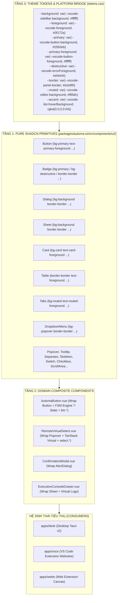
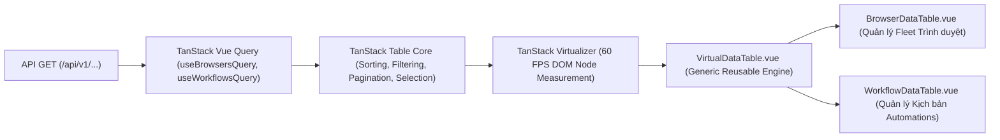

# 🎨 SRS HORIZONTAL UI COMPONENTS: KIẾN TRÚC DESIGN SYSTEM & ATOMIC SHADCN-VUE

---

## 🏛️ 1. TỔNG QUAN VÀ MỤC TIÊU KIẾN TRÚC

Hệ thống giao diện người dùng của Automa Ecosystem được chuẩn hóa theo mô hình **Design System 3 Tầng Phân Lớp Độc Lập** dựa trên nền tảng **Shadcn-Vue** và **Radix-Vue**, đóng gói tập trung tại package [`@automa/ui`](../../packages/automa-ui).



---

## 💎 2. NGUYÊN TẮC THIẾT KẾ CỐT LÕI (CORE ARCHITECTURAL INVARIANTS)

### Invariant 1: Theme Variable Inversion (Đảo Ngược Biến Theme)
* Các linh kiện Vue nguyên tử (`src/components/ui/`) **BẮT BUỘC giữ nguyên 100% class chuẩn hóa của Shadcn/Tailwind** (`bg-primary`, `text-primary-foreground`, `border-border`, `bg-card`, `bg-muted`...).
* **Nghiêm cấm tuyệt đối**: Hardcode mã màu hex hoặc viết class ad-hoc `bg-[var(--automa-...)]` trực tiếp trong template Vue của linh kiện.
* Mọi sự thích ứng đa nền tảng (VS Code 100+ themes, Desktop Dark/Light, Web Extension) được giải quyết triệt để tại tầng **CSS Variables** trong file [`packages/automa-ui/src/styles/tokens.css`](../../packages/automa-ui/src/styles/tokens.css).

### Invariant 2: Tự Động Hóa 100% (Zero Manual Component Copying)
* Không copy hoặc sửa tay các linh kiện nguyên tử từ upstream.
* Mọi thao tác tải mới hoặc đồng bộ linh kiện phải thông qua **Script Đồng Bộ Chính Thức** [`scripts/sync-shadcn-components.mjs`](../../scripts/sync-shadcn-components.mjs).

### Invariant 3: Không Lưu Trữ Duplicate Mirror Trong Source Control
* Thư mục bản nháp hoặc mirror thô (`upstream-shadcn/`) không được phép commit vào repository.
* Tính toàn vẹn của mã nguồn được bảo đảm thông qua lệnh **Đối Chiếu Ngược (Live Reverse Audit)** `pnpm run audit:ui`.

---

## 🛠️ 3. TẬP LỆNH QUẢN TRỊ DESIGN SYSTEM (CLI TOOLING)

Hệ thống cung cấp 3 lệnh chuẩn hóa tại root `package.json`:

### 1. Đồng Bộ Toàn Bộ Bộ Linh Kiện Cốt Lõi (`sync:ui`)
```bash
pnpm run sync:ui
```
* **Mô tả**: Tự động kết nối tới Registry chính thức của Shadcn-Vue, tải và cập nhật toàn bộ 19 linh kiện cốt lõi, chuẩn hóa đường dẫn import và tái sinh barrel export `src/components/ui/index.ts`.

### 2. Tải Thêm Linh Kiện Mới Từ Registry (`add:ui`)
```bash
pnpm run add:ui <component_name_1> <component_name_2>
# Ví dụ: pnpm run add:ui slider pin-input command
```
* **Mô tả**: Tự động bổ sung linh kiện mới vào `src/components/ui/<component_name>/` và re-export ra SDK package.

### 3. Đối Chiếu Ngược Toàn Diện (Live Reverse Audit) (`audit:ui`)
```bash
pnpm run audit:ui
```
* **Mô tả**: Thực hiện quét ngược trực tiếp từng file local với bản gốc trên Registry HTTP của Shadcn-Vue, kiểm tra tỷ lệ khớp cấu trúc (Structural Parity) và phát hiện bất kỳ sai lệch nào.

---

## 📦 4. DANH MỤC 19 LINH KIỆN NGUYÊN TỬ ĐÃ CHUẨN HÓA

| STT | Tên Linh Kiện | Thư Mục Local | Vai Trò & Tích Hợp Hệ Thống |
|---|---|---|---|
| 1 | **button** | `src/components/ui/button/` | Nút bấm nguyên tử, nền tảng cho `AutomaButton` và cỗ máy FSM (`btn.*`). |
| 2 | **badge** | `src/components/ui/badge/` | Nhãn trạng thái (Success, Warning, Destructive, Info, Outline). |
| 3 | **dialog** | `src/components/ui/dialog/` | Cửa sổ modal chuẩn (Command Palette, Settings dialogs). |
| 4 | **alert-dialog** | `src/components/ui/alert-dialog/` | Hộp thoại cảnh báo/xác nhận hành động nguy hiểm (`ConfirmationModal`). |
| 5 | **sheet** | `src/components/ui/sheet/` | Ngăn kéo slide-over 4 hướng (`ExecutionConsoleDrawer`, Block properties). |
| 6 | **popover** | `src/components/ui/popover/` | Khung popover nổi, nền tảng cho `RemoteVirtualSelect`. |
| 7 | **tooltip** | `src/components/ui/tooltip/` | Tooltip giải thích nhanh hành động và phím tắt. |
| 8 | **card** | `src/components/ui/card/` | Khung thẻ chứa thông tin profile, history trace, workflow summary. |
| 9 | **input** | `src/components/ui/input/` | Ô nhập liệu văn bản với 2-way `v-model` binding. |
| 10 | **separator** | `src/components/ui/separator/` | Đường kẻ phân cách ngang/dọc tuân thủ WAI-ARIA. |
| 11 | **skeleton** | `src/components/ui/skeleton/` | Khung hiển thị tải trước với hiệu ứng xung nhịp (pulse animation). |
| 12 | **table** | `src/components/ui/table/` | Bảng dữ liệu đa cột (SQLite Tables explorer, Matrix slots). |
| 13 | **tabs** | `src/components/ui/tabs/` | Chuyển đổi tab nội dung linh hoạt (Tables / Variables / Credentials). |
| 14 | **switch** | `src/components/ui/switch/` | Nút gạt bật/tắt boolean (Anti-detect features, Dark mode toggle). |
| 15 | **dropdown-menu** | `src/components/ui/dropdown-menu/` | Menu ngữ cảnh đa cấp (Context Menu, Header action dropdowns). |
| 16 | **checkbox** | `src/components/ui/checkbox/` | Hộp kiểm chọn nhiều bản ghi trong danh sách. |
| 17 | **scroll-area** | `src/components/ui/scroll-area/` | Vùng cuộn ảo hóa tùy biến thanh cuộn mượt mà. |
| 18 | **avatar** | `src/components/ui/avatar/` | Ảnh đại diện người dùng hoặc icon profile trình duyệt. |
| 19 | **accordion** | `src/components/ui/accordion/` | Khối gập mở thông tin nhiều tầng (Workflow parameters, Help docs). |

---

## 📊 5. HỆ THỐNG BẢNG ẢO HÓA & PHÂN TRANG (TANSTACK TABLE & VIRTUAL SCROLL)

Được đóng gói tại `@automa/ui`, kết hợp sức mạnh của `@tanstack/vue-table` + `@tanstack/vue-virtual` + Shadcn UI `Table` primitives để phục vụ các tập dữ liệu lớn từ API GET với hiệu năng 60 FPS:



### 1. `VirtualDataTable.vue` (Generic Engine)
* **Tính năng**: Hỗ trợ đồng thời tìm kiếm debounced, sắp xếp đa cột (`ArrowUp`, `ArrowDown`, `ArrowUpDown`), phân trang kép (Local client-side slicing hoặc Server-side `/api/v1/...` query params), chọn nhiều hàng (batch row selection), và cuộn ảo hóa (`translateY` node measurement).
* **Slots tùy biến**: `#toolbar`, `#empty`, `#cell-[columnId]`, `#header-[columnId]`.

### 2. `BrowserDataTable.vue` (Bảng Quản Lý Browsers)
* **Tích hợp**: `useBrowsersQuery`, `useStartBrowserMutation`, `useStopBrowserMutation`, `useDeleteBrowserMutation`, `useBrowserStore`.
* **Cột hiển thị**: Hộp chọn (batch actions), Trạng thái (Online pulsing badge / Offline), Tên & ID hồ sơ, Engine (Chromium / Chrome / Edge / Brave), Cấu hình Proxy (Server hoặc Direct), Cột thao tác nhanh (Launch `btn.browser.launch`, Stop, Delete `btn.browser.delete`).
* **Bộ lọc**: Tabs chuyển nhanh (Tất cả, Đang online, Ngoại tuyến), Ô tìm kiếm theo tên hoặc ID.

### 3. `WorkflowDataTable.vue` (Bảng Quản Lý Workflows)
* **Tích hợp**: `useWorkflowsQuery`, `useDeleteWorkflowMutation`.
* **Cột hiển thị**: Hộp chọn, Tên kịch bản & ID/Mô tả, Phiên bản (`v1.30.0`), Số lượng blocks đồ hình, Thời gian cập nhật gần nhất, Thao tác (Chạy ngay `btn.workflow.run`, Mở chỉnh sửa, Xuất file JSON, Xóa kịch bản).
* **Bộ lọc**: Ô tìm kiếm theo tên kịch bản hoặc ID, Nút Nhập JSON (`Import`), Nút tạo kịch bản mới (`+ New Workflow`).

---

## 🔗 6. LIÊN KẾT MA TRẬN VỚI CÁC ĐẶC TẢ SRS KHÁC

* [**SRS Button Business Logic & Event-Driven (`SRS_HORIZONTAL_BUTTONS.md`)**](./SRS_HORIZONTAL_BUTTONS.md): Kế thừa `Button` primitive để triển khai 37 `btn.*` FSM buttons.
* [**SRS Select & Dropdown Business Logic (`SRS_HORIZONTAL_SELECTS.md`)**](./SRS_HORIZONTAL_SELECTS.md): Kế thừa `Popover` & `Input` để triển khai 11 `select.*` virtualized selects.
* [**SRS Feature Stores & Reactive Hub (`SRS_HORIZONTAL_FEATURE_STORES.md`)**](./SRS_HORIZONTAL_FEATURE_STORES.md): Cung cấp state reactive và SSE hooks cho các bảng dữ liệu `BrowserDataTable` và `WorkflowDataTable`.
* [**OpenAPI Integration Guide (`../OPENAPI_INTEGRATION_GUIDE.md`)**](../OPENAPI_INTEGRATION_GUIDE.md): Kết nối dữ liệu từ Backend Axum Daemon vào các component trình diễn `Table`, `Card`, `Badge`.
