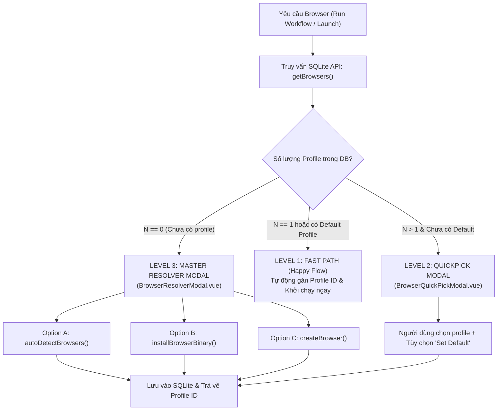

# 🌐 ĐẶC TẢ NGHIỆP VỤ SRS: MENU BROWSERS (ANTI-DETECT BROWSER FLEET)

---

## 🎯 1. MỤC TIÊU & PHẠM VI (SCOPE & OBJECTIVES)

Menu **Browsers** quản lý toàn bộ hạm đội trình duyệt ảo (Anti-detect Browser Profiles) và các phiên Chromium của Automa Ecosystem:
- **`automa-desk`**: Cung cấp giao diện quản trị profile độc lập (`BrowsersView.vue`), cấu hình proxy, user-agent, fingerprint, đảm bảo profile mặc định (`autoDetectBrowsers`), và điều khiển phiên chạy Chromium độc lập.
- **`automa-vsce`**: Cung cấp sidebar panel `BROWSERS` (`automa.browsers`) và webview quản lý `BrowserManagerView.vue` với khả năng launch/stop nhanh.
- **`automa-webe:studio`**: Cung cấp modal chọn profile nhanh (`BrowsersQuickModal.vue`) và cơ chế tự phục hồi (Self-Healing Waterfall).
- **Quy chuẩn Phase 1 (Zero-Host Invariant)**: Toàn bộ hệ sinh thái chỉ dùng duy nhất **1 Executable là Chromium tải về độc lập** (mô hình Playwright). Nghiêm cấm quét file cài đặt máy Host để tránh xung đột phiên bản và lộ danh tính.

---

## 🌳 2. BỐ CỤC GIAO DIỆN & COMPONENT TREE (UI/UX LAYOUT)

```text
BrowsersView.vue (hoặc BrowserManagerView.vue trong VS Code)
├── Header Bar
│   ├── Search Input (Debounced 150ms)
│   ├── Filter Dropdown (select.browser.status: All / Online / Offline)
│   ├── btn.browser.autodetect (Đảm bảo profile Chromium mặc định)
│   ├── btn.browser.download (Tải Chromium portable)
│   ├── btn.browser.create (Tạo profile ảo mới)
│   └── btn.browser.killall (Dừng khẩn cấp toàn bộ hạm đội)
├── Browser Profiles Grid / List
│   └── Browser Card (Từng profile)
│       ├── Status Indicator Badge (Green: Online / Gray: Offline)
│       ├── Profile Name & Browser Type (Khóa cứng: Chromium)
│       ├── Proxy Tag & Fingerprint Summary
│       ├── Default Star Toggle (btn.browser.setdefault)
│       ├── btn.browser.launch / btn.browser.stop (Khởi động / Tắt phiên)
│       ├── btn.browser.edit (Chỉnh sửa cấu hình proxy/headers)
│       └── btn.browser.delete (Xóa profile)
└── Modals:
    ├── CreateEditBrowserModal.vue (Form cấu hình chi tiết)
    └── BrowserResolverModal.vue (Thác giải quyết tự phục hồi 3 cấp)
```

---

## ⚡ 3. DANH MỤC NÚT BẤM (BUTTON CATALOG) TRONG MENU BROWSERS

| Button ID | Tên Nút / Nhãn UI | Icon | Trạng Thái FSM Hỗ Trợ | Target Action & Endpoint | `data-testid` |
|---|---|---|---|---|---|
| `btn.browser.launch` | Launch Browser | `ExternalLink` | `IDLE`, `DISPATCHING` | Gọi `startBrowser()` mở Chromium | `btn-launch-browser` |
| `btn.browser.stop` | Stop Browser | `Square` | `ONLINE` | Gọi `stopBrowserSession()` đóng cửa sổ | `btn-stop-browser` |
| `btn.browser.killall` | Kill All Sessions | `Flame` | `IDLE`, `ONLINE` | Gọi `killAllBrowsers()` đóng toàn bộ | `btn-kill-all-browsers` |
| `btn.browser.create` | New Profile | `Plus` | `IDLE` | Mở modal tạo profile mới `createBrowser()` | `btn-create-browser` |
| `btn.browser.edit` | Edit Profile | `Edit` | `IDLE` | Mở form sửa `updateBrowser()` | `btn-edit-browser` |
| `btn.browser.delete` | Delete Profile | `Trash2` | `IDLE` | Xóa profile `deleteBrowser()` khỏi SQLite | `btn-delete-browser` |
| `btn.browser.autodetect` | Ensure Default | `Search` | `IDLE`, `VALIDATING` | Gọi `autoDetectBrowsers()` đảm bảo Default Chromium | `btn-autodetect-browsers` |
| `btn.browser.download` | Download Binary | `Download` | `IDLE`, `DISPATCHING` | Gọi `installBrowserBinary()` tải Chromium | `btn-download-browser-binary` |
| `btn.browser.setdefault`| Set Default | `Star` | `IDLE` | Gán profile mặc định cho toàn hệ thống | `btn-set-default-browser` |

---

## 📜 4. DANH MỤC SELECT / DROPDOWN TRONG MENU BROWSERS

| Select ID | Tên Dropdown | Nguồn Dữ Liệu Remote | Virtualization & Debounce | Side-effect Phản Xạ Khi Chọn | `data-testid` |
|---|---|---|---|---|---|
| `select.browser.profile` | Filter Profiles | `GET /api/v1/browsers` | Virtualized 1000+, Debounce 150ms | Lọc danh sách hiển thị trên giao diện | `select-browser-profile` |
| `select.browser.status` | Filter Status | Static Union (`all`, `online`, `offline`) | Không cần ảo hóa | Cập nhật bộ lọc hiển thị | `select-browser-status` |
| `select.browser.proxy` | Select Proxy Config | `GET /api/v1/storage/variables` | Virtualized 500+, Debounce 150ms | Gán chuỗi proxy vào form cấu hình profile | `select-browser-proxy` |

---

## 🍍 5. QUẢN LÝ TRẠNG THÁI PINIA STORE LIÊN QUAN (`useBrowserStore`)

Store [`useBrowserStore`](../../packages/automa-ui/src/stores/useBrowserStore.ts) quản lý toàn bộ dữ liệu nghiệp vụ của menu Browsers:
- `browsers`: Mảng danh sách profile lấy từ SQLite (`BrowserResponse[]`).
- `selectedBrowserId`: ID profile được chọn làm đích thực thi.
- `onlineBrowserIds`: Danh sách ID các phiên đang chạy thực tế trong RAM.
- `waterfallResolution`: Trạng thái giải quyết đường dẫn binary (`executablePath`, `isDetected`).
- `onlineCount`: Computed getter đếm số lượng phiên đang hoạt động.
- `setBrowserOnline(id, isOnline)`: Action cập nhật tức thì khi nhận SSE `browser_online`/`browser_offline`.

---

## 🌐 6. DANH MỤC API ENDPOINTS & SSE EVENTS

| Giao Thức | Endpoint / Sự Kiện | Phương Thức | SDK Function Gọi Chuẩn | Mô Tả Nghiệp Vụ |
|---|---|:---:|---|---|
| **REST** | `/api/v1/browsers` | `GET` | `getBrowsers({ query: { limit, offset, search } })` | Lấy danh sách profile phân trang từ SQLite |
| **REST** | `/api/v1/browsers` | `POST` | `createBrowser()` | Tạo mới profile trình duyệt |
| **REST** | `/api/v1/browsers/{id}` | `PUT` / `DELETE` | `updateBrowser()` / `deleteBrowser()` | Cập nhật hoặc xóa profile |
| **REST** | `/api/v1/browsers/{id}/session` | `POST` | `startBrowser()` | Khởi chạy phiên Chromium instance |
| **REST** | `/api/v1/browsers/{id}/session` | `DELETE` | `stopBrowserSession()` | Dừng phiên Chromium |
| **REST** | `/api/v1/browsers/sessions` | `DELETE` | `killAllBrowsers()` | Dừng khẩn cấp toàn bộ các phiên |
| **REST** | `/api/v1/browsers/auto-detect` | `POST` | `autoDetectBrowsers()` | Tự động quét binary Chrome/Brave/Edge |
| **SSE** | `/api/v1/events` | Stream | `globalSseClient` | Nhận sự kiện `browser_created`, `browser_deleted`, `browser_online`, `browser_offline` |

---

## 🔄 7. SƠ ĐỒ THÁC GIẢI QUYẾT BROWSER 3 CẤP (RESOLUTION WATERFALL)



---

## 🛡️ 8. TIÊU CHUẨN KIỂM ĐỊNH CHẤT LƯỢNG (AGENT CROSS-CHECK)

Khi Subagent rà soát Menu Browsers, bắt buộc phải đối soát checklist:
1. [ ] 100% các nút thao tác đều gắn `data-testid` đúng chuẩn (`btn-launch-browser`, `btn-create-browser`, `btn-kill-all-browsers`).
2. [ ] Khi bấm `Launch`, card đổi sang trạng thái `ONLINE` với viền xanh lục và nút đổi thành `btn.browser.stop`.
3. [ ] Khi Core Daemon phát SSE `browser_online` hoặc `browser_offline`, badge trạng thái trên UI phải tự động cập nhật mà không cần reload trang.
4. [ ] Endpoint `auto-detect` quét đúng các đường dẫn binary tiêu chuẩn của hệ điều hành.
