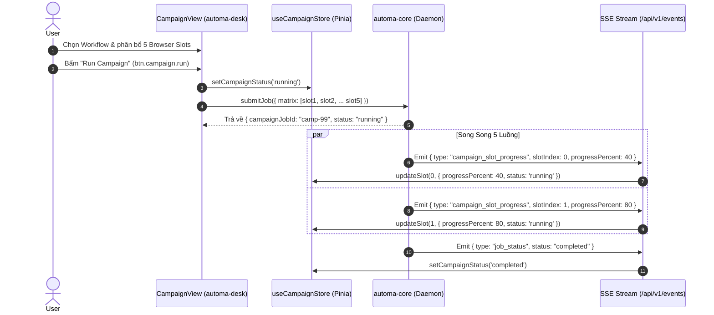

# 🚀 ĐẶC TẢ NGHIỆP VỤ SRS: MENU CAMPAIGN (CAMPAIGN MATRIX FLEET)

---

## 🎯 1. MỤC TIÊU & PHẠM VI (SCOPE & OBJECTIVES)

Menu **Campaign** quản lý và điều phối các chiến dịch tự động hóa quy mô lớn (Matrix Automation Fleet) chạy song song trên nhiều profile trình duyệt độc lập:
- **`automa-desk`**: Cung cấp giao diện bảng ma trận phân bổ tài nguyên (`CampaignView.vue`), cấu hình số lượng luồng song song (Concurrency Slots), theo dõi tiến độ từng luồng thời gian thực.
- **`automa-vsce`**: Cung cấp custom preview `CampaignMatrixView.vue` mở file `*.campaign.json` trên VS Code.
- **`automa-vault`**: Nơi lưu trữ các kịch bản ma trận chiến dịch trên đĩa.

---

## 🌳 2. BỐ CỤC GIAO DIỆN & COMPONENT TREE (UI/UX LAYOUT)

```text
CampaignView.vue (hoặc CampaignMatrixView.vue trong VS Code)
├── Campaign Header Toolbar
│   ├── Campaign Name & Status Badge (IDLE / RUNNING / ABORTED / COMPLETED)
│   ├── Target Workflow Selector (select.campaign.workflow)
│   ├── Concurrency Control (Slot Count Input: 1..32)
│   ├── btn.campaign.run (Chạy toàn bộ ma trận)
│   ├── btn.campaign.abort (Hủy khẩn cấp toàn bộ chiến dịch)
│   └── btn.campaign.save (Lưu cấu hình chiến dịch)
├── Fleet Slots Allocation Grid
│   └── Campaign Slot Card (Từng luồng song song)
│       ├── Slot Index (#1, #2, ... #N)
│       ├── Assigned Browser Selector (select.campaign.browser)
│       ├── Real-time Progress Bar (% tiến độ & số bước hoàn thành)
│       ├── Live Status Indicator (Idle / Running / Success / Error)
│       └── btn.campaign.slot.stop (Dừng riêng luồng này)
└── Real-time Telemetry Progress Summary
    ├── Total Slots, Completed Count, Failed Count
    └── Overall Campaign Progress Gauge (%)
```

---

## ⚡ 3. DANH MỤC NÚT BẤM (BUTTON CATALOG) TRONG MENU CAMPAIGN

| Button ID | Tên Nút / Nhãn UI | Icon | Trạng Thái FSM Hỗ Trợ | Target Action & Endpoint | `data-testid` |
|---|---|---|---|---|---|
| `btn.campaign.run` | Run Campaign | `Play` | `IDLE`, `ABORTED` | Gửi ma trận chiến dịch lên Daemon thực thi | `btn-run-campaign` |
| `btn.campaign.abort` | Abort Campaign | `Square` | `RUNNING` | Gửi lệnh hủy khẩn cấp toàn bộ chiến dịch | `btn-abort-campaign` |
| `btn.campaign.save` | Save Matrix | `Save` | `IDLE` | Lưu cấu hình `*.campaign.json` lên SQLite | `btn-save-campaign` |
| `btn.campaign.slot.add` | Add Slot | `Plus` | `IDLE` | Thêm 1 luồng browser vào ma trận | `btn-add-campaign-slot` |
| `btn.campaign.slot.remove`| Remove Slot | `Trash2` | `IDLE` | Xóa luồng khỏi ma trận | `btn-remove-campaign-slot` |
| `btn.campaign.slot.stop` | Stop Slot | `XCircle` | `RUNNING` | Dừng riêng 1 slot đang chạy | `btn-stop-campaign-slot` |

---

## 📜 4. DANH MỤC SELECT / DROPDOWN TRONG MENU CAMPAIGN

| Select ID | Tên Dropdown | Nguồn Dữ Liệu Remote | Virtualization & Debounce | Side-effect Phản Xạ Khi Chọn | `data-testid` |
|---|---|---|---|---|---|
| `select.campaign.workflow`| Select Target Workflow | `GET /api/v1/storage/workflows` | Virtualized 1000+, Debounce 150ms | Gán kịch bản gốc để ma trận phân phối chạy | `select-campaign-workflow` |
| `select.campaign.browser` | Assign Browser to Slot | `GET /api/v1/browsers` | Virtualized 1000+, Debounce 150ms | Gán profile browser riêng cho từng slot | `select-campaign-browser` |

---

## 🍍 5. QUẢN LÝ TRẠNG THÁI PINIA STORE LIÊN QUAN (`useCampaignStore`)

Store [`useCampaignStore`](../../packages/ui/src/stores/useCampaignStore.ts) quản lý ma trận chiến dịch:
- `campaignId`, `campaignName`: Định danh chiến dịch.
- `activeSlots`: Mảng các slot (`slotIndex`, `browserId`, `workflowId`, `status`, `progressPercent`).
- `status`: Trạng thái tổng thể (`'idle' | 'running' | 'aborted' | 'completed'`).
- `updateSlot(index, patch)`: Cập nhật tiến độ tức thì khi nhận SSE `campaign_slot_progress`.

---

## 🌐 6. DANH MỤC API ENDPOINTS & SSE EVENTS

| Giao Thức | Endpoint / Sự Kiện | Phương Thức | SDK Function Gọi Chuẩn | Mô Tả Nghiệp Vụ |
|---|---|:---:|---|---|
| **REST** | `/api/v1/storage/campaigns` | `GET` | `getCampaigns({ query: { limit, offset, search } })` | Lấy danh sách chiến dịch phân trang |
| **REST** | `/api/v1/storage/campaigns` | `POST` | `saveCampaign()` | Lưu cấu hình ma trận chiến dịch |
| **REST** | `/api/v1/jobs` | `POST` | `submitJob()` | Kích hoạt phân phối ma trận đa luồng |
| **SSE** | `/api/v1/events` | Stream | `globalSseClient` | Nhận sự kiện `campaign_slot_progress`, `campaign_aborted` |

---

## 🔄 7. SƠ ĐỒ ĐIỀU PHỐI MA TRẬN ĐA LUỒNG (CAMPAIGN DISPATCH FLOW)



---

## 🛡️ 8. TIÊU CHUẨN KIỂM ĐỊNH CHẤT LƯỢNG (AGENT CROSS-CHECK)

1. [ ] Bảng ma trận hỗ trợ phân bổ tối thiểu 32 slots đồng thời mà không giật lag giao diện nhờ Virtualization.
2. [ ] Các thanh tiến độ `%` của từng slot cập nhật mượt mà khi nhận SSE `campaign_slot_progress`.
3. [ ] Khi bấm `Abort Campaign`, 100% các slot đang chạy phải đổi trạng thái sang `aborted` và các session browser tương ứng phải được đóng.
