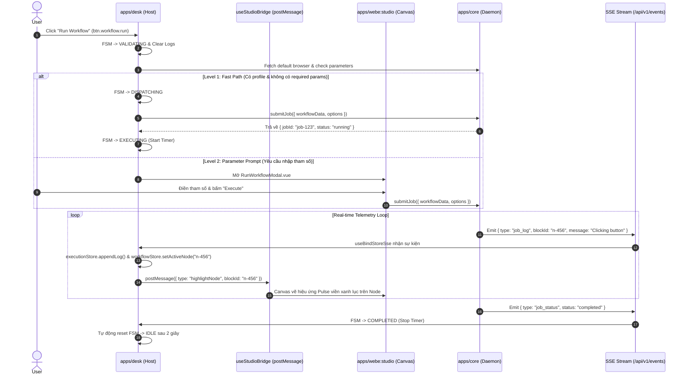

# 🎨 ĐẶC TẢ NGHIỆP VỤ SRS: MENU STUDIO (CANVAS & WORKFLOW EDITOR)

---

## 🎯 1. MỤC TIÊU & PHẠM VI (SCOPE & OBJECTIVES)

Menu **Studio** là trung tâm sáng tạo và điều khiển đồ thị kịch bản tự động hóa (Visual Workflow Editor) của Automa Ecosystem:
- **`apps/webe:studio`**: Cung cấp Visual Canvas Engine thuần Web dựa trên VueFlow, xử lý kéo thả khối (Blocks), kết nối cạnh (Edges), cấu hình thông số và linting thời gian thực.
- **`apps/desk`**: Nhúng Studio Canvas qua Iframe (`StudioCanvasEmbed.vue`), tích hợp thanh Action Header chuẩn (`StudioActionHeader.vue`), điều phối FSM thực thi kịch bản (`useStudioExecution.ts`), và hiển thị thanh Console Logs thời gian thực (`ExecutionConsole.vue`).
- **`apps/vsce`**: Nhúng Studio Canvas qua Custom Text Editor Webview (`WorkflowEditorView.vue`) gắn với file `*.workflow.json`.

---

## 🌳 2. BỐ CỤC GIAO DIỆN & COMPONENT TREE (UI/UX LAYOUT)

```text
StudioView.vue
├── StudioActionHeader.vue (Top Toolbar)
│   ├── Workflow Name & Version Badge
│   ├── btn.workflow.save (Lưu kịch bản)
│   ├── btn.workflow.lint (Kiểm tra lỗi AST)
│   ├── select.workflow.browser (Chọn nhanh Browser Profile)
│   └── btn.workflow.run / btn.workflow.stop (Chạy / Dừng FSM)
├── StudioCanvasEmbed.vue (Center Graph Area - Iframe to apps/webe:studio)
│   ├── VueFlow Visual Canvas (WorkflowEditor.vue)
│   │   ├── Custom Blocks (BlockBasic, BlockGroup, BlockLoop, etc.)
│   │   └── Smart Connect & Output Handles
│   ├── Blocks Palette Drawer (Danh mục khối tự động hóa)
│   ├── Block Edit Drawer (WorkflowEditBlock.vue)
│   └── Modals:
│       ├── RunWorkflowModal.vue (Cấu hình tham số & Browser trước khi chạy)
│       ├── BrowsersQuickModal.vue (Quản lý nhanh danh sách profile)
│       └── StorageTablesModal.vue (Nạp bảng dữ liệu SQLite)
└── ExecutionConsole.vue (Bottom Collapsible Drawer)
    ├── FSM Status Badge (IDLE / VALIDATING / DISPATCHING / EXECUTING / COMPLETED / FAILED)
    ├── Execution Timer (mm:ss.S)
    ├── Telemetry Log Stream Filter (All / Info / Warn / Error)
    └── Clear Logs & Close Buttons
```

---

## ⚡ 3. DANH MỤC NÚT BẤM (BUTTON CATALOG) TRONG MENU STUDIO

| Button ID | Tên Nút / Nhãn UI | Icon / Shortcut | Trạng Thái FSM Hỗ Trợ | Target Action & Endpoint | `data-testid` |
|---|---|---|---|---|---|
| `btn.workflow.run` | Run Workflow | `Play` / `F5` | `IDLE`, `VALIDATING`, `DISPATCHING` | Kích hoạt thác Waterfall $\rightarrow$ `submitJob()` | `btn-run-workflow` |
| `btn.workflow.stop` | Stop Job | `Square` / `Shift+F5` | `EXECUTING`, `TERMINATING` | Gửi lệnh hủy `killJob()` hoặc WS `KILL_JOB` | `btn-stop-workflow` |
| `btn.workflow.pause` | Pause Job | `Pause` | `EXECUTING` | Gửi lệnh tạm dừng qua WebSocket `PAUSE_JOB` | `btn-pause-workflow` |
| `btn.workflow.resume` | Resume Job | `Play` | `PAUSED` | Gửi lệnh tiếp tục qua WebSocket `RESUME_JOB` | `btn-resume-workflow` |
| `btn.workflow.save` | Save Workflow | `Save` / `Ctrl+S` | `IDLE`, `VALIDATING` | Cập nhật storage `saveWorkflow()` / SQLite | `btn-save-workflow` |
| `btn.workflow.export` | Export JSON | `Download` | `IDLE` | Xuất file `.workflow.json` ra đĩa | `btn-export-workflow` |
| `btn.workflow.import` | Import File | `Upload` | `IDLE` | Đọc file `.workflow.json` nạp lên Canvas | `btn-import-workflow` |
| `btn.workflow.lint` | Lint AST | `CheckCircle` | `IDLE`, `VALIDATING` | Gọi `lintWorkflow()` phân tích chu trình/lỗi | `btn-lint-workflow` |
| `btn.workflow.format` | Auto Layout | `LayoutGrid` | `IDLE` | Sắp xếp đồ thị tự động bằng Dagre Layout | `btn-format-workflow` |
| `btn.workflow.undo` | Undo | `Undo2` / `Ctrl+Z` | `IDLE` | Hoàn tác thay đổi gần nhất trên Canvas | `btn-undo-workflow` |
| `btn.workflow.redo` | Redo | `Redo2` / `Ctrl+Y` | `IDLE` | Làm lại thao tác vừa hoàn tác | `btn-redo-workflow` |
| `btn.workflow.debug.step` | Step Over | `StepForward` / `F10`| `PAUSED` | Bước qua 1 block tiếp theo trong debugger | `btn-debug-step` |

---

## 📜 4. DANH MỤC SELECT / DROPDOWN TRONG MENU STUDIO

| Select ID | Tên Dropdown | Nguồn Dữ Liệu Remote | Virtualization & Debounce | Side-effect Phản Xạ Khi Chọn | `data-testid` |
|---|---|---|---|---|---|
| `select.workflow.browser` | Select Target Browser | `GET /api/v1/browsers` | Virtualized 1000+, Debounce 200ms | Gán `browserStore.selectedBrowserId` $\rightarrow$ Cập nhật mục tiêu cho `btn.workflow.run` | `select-workflow-browser` |
| `select.workflow.table` | Select Storage Table | `GET /api/v1/storage/tables` | Virtualized 500+, Debounce 150ms | Nạp metadata cột bảng vào gợi ý `{{table.COL}}` | `select-workflow-table` |
| `select.workflow.variable` | Select Global Variable | `GET /api/v1/storage/variables` | Virtualized 1000+, Debounce 150ms | Tự động điền `{{variables.KEY}}` vào input block | `select-workflow-variable` |

---

## 🍍 5. QUẢN LÝ TRẠNG THÁI PINIA STORE LIÊN QUAN

Menu Studio tương tác trực tiếp với 2 Domain Stores chính:
1. **`useWorkflowStore`**:
   - `workflow`: Cấu trúc AST kịch bản (`nodes`, `edges`, `settings`, `globalData`).
   - `isDirty`: Cờ đánh dấu có thay đổi chưa lưu.
   - `activeNodeId`: ID node đang chạy nhận từ SSE `job_log` để kích hoạt hiệu ứng viền sáng (Pulse Highlighter).
   - `breakpoints`: Danh sách node IDs dừng luồng chạy.
   - `lintIssues`: Danh sách cảnh báo/lỗi từ Static Linter.
2. **`useExecutionStore`**:
   - `fsmState`: Máy trạng thái thực thi (`IDLE` $\rightarrow$ `VALIDATING` $\rightarrow$ `DISPATCHING` $\rightarrow$ `EXECUTING` $\rightarrow$ `COMPLETED`).
   - `activeJobId`: ID phiên chạy do Daemon cấp phát.
   - `logs`: Buffer chứa telemetry logs thời gian thực từ SSE.
   - `isConsoleOpen`: Đóng/mở console log drawer.

---

## 🌐 6. DANH MỤC API ENDPOINTS, SSE & WEBSOCKET

| Giao Thức | Đường Dẫn Endpoint / Channel | Phương Thức | SDK Function Gọi Chuẩn | Mô Tả Nghiệp Vụ |
|---|---|:---:|---|---|
| **REST** | `/api/v1/jobs` | `POST` | `submitJob()` | Khởi tạo phiên chạy workflow trên Daemon |
| **REST** | `/api/v1/jobs/{id}` | `DELETE` | `killJob()` | Dừng và hủy phiên chạy ngay lập tức |
| **REST** | `/api/v1/lint` | `POST` | `lintWorkflow()` | Kiểm tra chu trình và lỗi schema AST |
| **REST** | `/api/v1/storage/workflows` | `GET` / `POST` | `getWorkflow()` / `saveWorkflow()` | Nạp hoặc lưu file kịch bản lên SQLite |
| **SSE** | `/api/v1/events` | Stream | `globalSseClient` | Lắng nghe `job_log` (tiến độ block) & `job_status` (lifecycle) |
| **WS** | `/api/v1/ws` | 2-Way | `wsClient` | Gửi tín hiệu điều khiển `PAUSE_JOB`, `RESUME_JOB`, `KILL_JOB` |

---

## 🔄 7. SƠ ĐỒ MÁY TRẠNG THÁI & KỊCH BẢN THỰC THI (FSM WORKFLOW)



---

## 🛡️ 8. TIÊU CHUẨN KIỂM ĐỊNH CHẤT LƯỢNG (AGENT CROSS-CHECK)

Khi Subagent rà soát Menu Studio, bắt buộc phải đối soát checklist 5 điểm:
1. [ ] 100% các nút bấm trên Toolbar và Canvas đều có `data-testid` tương ứng với mã `btn.workflow.*`.
2. [ ] Thác giải quyết Browser (Waterfall) xử lý chuẩn cả 3 kịch bản (Fast path, QuickPick modal, Resolver modal).
3. [ ] Khi job đang chạy (`EXECUTING`), nút "Run" tự động chuyển thành nút "Stop" (`btn.workflow.stop`) và disable nút "Save".
4. [ ] Sự kiện SSE `job_log` có chứa `blockId` phải làm sáng viền đúng node trên Canvas và ghi log vào `ExecutionConsole`.
5. [ ] Tuyệt đối không dùng `fetch()` thô; 100% gọi qua typed SDK `@automa/types/api`.
