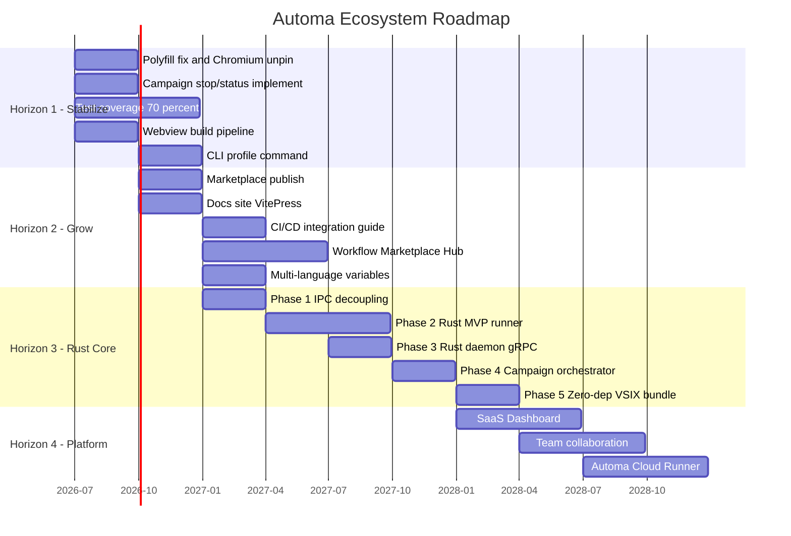
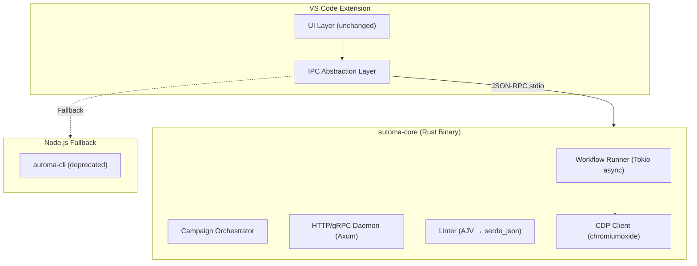

# Automa Ecosystem — Nhận xét Tổng quan & Chiến lược Phát triển Dài hạn

---

## Phần I: Nhận xét Tổng quan từ 2 bộ tài liệu

### 1. Bản đồ tính năng hiện tại

```mermaid
graph LR
    subgraph CLI ["automa-cli (10 lệnh)"]
        run["run"]
        studio["studio (Live Sync)"]
        Campaign["Campaign (start/stop/status)"]
        lint["lint"]
        serve["serve (HTTP Daemon)"]
        install_b["install-browser"]
        install_e["install-extension"]
        history["history"]
        log["log"]
        clean["clean"]
    end

    subgraph VSCode ["automa-vscode"]
        editors["5 Custom Editors"]
        sidebar["5 Sidebar Views"]
        commands["10+ Context Commands"]
        daemon["DaemonManager"]
        status["Status Bar Indicator"]
    end

    subgraph Source ["automa-ext (Vanilla Extension)"]
        engine["Workflow Engine"]
        sync["Cloud Sync (LWW)"]
        auth["Silent Auth"]
        team["Teamwork UI"]
    end

    VSCode -->|"child_process / HTTP"| CLI
    CLI -->|"Puppeteer CDP"| Source
    VSCode -.->|"settings sync"| CLI
```



### 2. Điểm mạnh (Strengths)

| Khía cạnh | Nhận xét |
| :--- | :--- |
| **Kiến trúc phân tầng rõ ràng** | VSCode → CLI → Browser Extension. Mỗi tầng có trách nhiệm đơn nhất (SRP). VSCode là GUI, CLI là Orchestrator, Extension là Runtime Engine. |
| **Offline-First** | Toàn bộ dữ liệu nằm trên local filesystem (`~/.automa-cli/` hoặc `.automa-cli-dev` khi chạy dev local, hỗ trợ tuỳ biến qua `AUTOMA_HOME`), vault, SQLite. Không phụ thuộc cloud để chạy. |
| **Anti-detection architecture** | CLI spawn browser qua `execFile` + CDP polling thay vì `puppeteer.launch()` — giảm bot-detection fingerprint. |
| **Auto-sanitization** | Workflow từ cộng đồng (ID dạng `n1`, thiếu `version`) được tự động sửa chữa khi mở — giảm friction adoption. |
| **Live 2-Way Sync (Studio)** | Tính năng killer: chỉnh visual trên Studio → ghi ngược file JSON → Git trackable. |
| **Campaign orchestration** | Đa trình duyệt, đa profile, 4 loại schedule, 3 concurrency modes — enterprise-grade. |
| **6-level config resolution** | CLI flags → VS Code settings → vault settings → env → defaults. Linh hoạt cho mọi deployment scenario. |

### 3. Điểm yếu & Technical Debt

| Vấn đề | Mức độ | Chi tiết |
| :--- | :--- | :--- |
| **Chromium version lock** | 🔴 Critical | Pinned build `1313161` (v126) vì `webextension-polyfill` crash trên Chrome 129+. Càng để lâu, security gap càng lớn. |
| **Node.js dependency** | 🟡 Medium | End-user phải cài Node.js 18+ — rào cản lớn cho non-developer. |
| **Campaign `stop`/`status` chưa implement** | 🟡 Medium | Code hiện chỉ output notice, chưa có logic thực tế. |
| **Daemon auto-shutdown 30 phút** | 🟡 Medium | Aggressive cho use case long-running Campaign. Không có cơ chế heartbeat từ Campaign task giữ daemon sống. |
| **Thiếu test coverage** | 🟡 Medium | Chỉ có `verify_cli.js` — không có unit test cho Linter, Sanitizer, Campaign scheduler. |
| **Webview inline JS/CSS** | 🟠 Low-Med | 5 webview HTML đều self-contained (Vue CDN + inline) — khó maintain, không có build pipeline riêng. |
| **SQLite + IndexedDB dual storage** | 🟠 Low-Med | Log lưu đồng thời 2 nơi (SQLite CLI + IndexedDB browser). Chưa có reconciliation strategy. |
| **`automa-ext` là fork read-only** | 🟠 Low-Med | Mọi thay đổi Extension phải qua upstream `AutomaApp/automa` hoặc maintain fork. Rủi ro divergence. |

### 4. Gaps giữa 2 sản phẩm

| VSCode Extension | CLI | Gap |
| :--- | :--- | :--- |
| Có UI quản lý Runners (kill, log) | Có `history` + `log` command | ✅ Đồng bộ tốt |
| Campaign Preview (live telemetry) | Campaign command (`start` only) | ⚠️ CLI thiếu `stop`/`status` → VSCode phải workaround bằng task terminate |
| Profile Editor (CodeMirror form) | Profile management via `--user-data-dir` | ⚠️ CLI không có `profile` command độc lập — chỉ implicitly qua Campaign |
| Lint Check (Problems panel) | `automa lint` (console + `--strict`) | ✅ Đồng bộ tốt, UX khác biệt hợp lý (Warning vs Error) |
| Package Preview (auto-detect) | Lint hỗ trợ package schema | ⚠️ CLI không có `run` cho package độc lập |
| — | `install-extension` command | ⚠️ VSCode không có UI tương đương — user phải dùng terminal |
| — | `scan-only` flag | ⚠️ VSCode không expose tính năng dependency scanning |

---

## Phần II: Chiến lược Phát triển Sản phẩm Dài hạn

### Tầm nhìn (Vision)

> **"Từ công cụ tự động hóa trình duyệt cá nhân → Nền tảng orchestration đa trình duyệt cho doanh nghiệp, chạy trên mọi nền tảng mà không cần cài đặt runtime."**

### Chiến lược 4 Horizon



---

### Horizon 1: Stabilize & Harden (Q3–Q4 2026)

**Mục tiêu**: Biến sản phẩm hiện tại thành phiên bản production-ready, sẵn sàng phát hành lên VS Code Marketplace.

#### 1.1 Giải quyết Chromium Version Lock 🔴

| Hạng mục | Hành động |
| :--- | :--- |
| **Root cause** | `webextension-polyfill` phiên bản cũ crash trên Chrome 129+ StorageArea API |
| **Giải pháp ngắn hạn** | Fork `webextension-polyfill` → patch StorageArea binding → maintain internal |
| **Giải pháp dài hạn** | Migrate sang Chrome's native `chrome.*` API (MV3 đã hỗ trợ đầy đủ) → loại bỏ polyfill hoàn toàn |
| **Kết quả** | Unpin Chromium version → luôn dùng Chromium stable mới nhất |

#### 1.2 Campaign Command Completion

```
automa Campaign stop [--all | --task-id <id>]   → Kill tiến trình + cleanup
automa Campaign status [path]                    → JSON output trạng thái Campaign
automa Campaign logs [path]                      → Aggregated logs từ tất cả task
```

#### 1.3 Test Infrastructure

| Layer | Tool | Target Coverage |
| :--- | :--- | :--- |
| Unit (Linter, Sanitizer, ConfigManager) | Vitest | 80%+ |
| Integration (CLI commands) | Vitest + mock Puppeteer | 60%+ |
| E2E (VSCode Extension) | `@vscode/test-electron` | Critical paths |

#### 1.4 Webview Build Pipeline

- Tách 5 webview HTML thành mini Vue 3 projects với Vite build.
- Output: bundled JS/CSS inject vào webview.
- Lợi ích: HMR dev, tree-shaking, proper dependency management, TypeScript.

#### 1.5 CLI `profile` Command

```
automa profile list                → Liệt kê profiles
automa profile create <name>       → Tạo profile mới
automa profile delete <name>       → Xóa profile
automa profile export <name>       → Export profile JSON
```

---

### Horizon 2: Grow & Distribute (Q4 2026 – Q1 2027)

**Mục tiêu**: Đưa sản phẩm đến tay cộng đồng, xây dựng hệ sinh thái mở.

#### 2.1 VS Code Marketplace Publish

- [ ] Hoàn thiện README.md (GIF demo, badges, feature highlights)
- [ ] Thiết lập CI/CD: GitHub Actions → `vsce publish`
- [ ] Semantic versioning + CHANGELOG.md
- [ ] Extension icon + banner design

#### 2.2 Documentation Site

| Công nghệ | Lý do |
| :--- | :--- |
| **VitePress** | Markdown-native, Vue ecosystem, tốc độ build nhanh |
| **Hosting** | GitHub Pages hoặc Cloudflare Pages (miễn phí) |

Cấu trúc đề xuất:
```
docs/
├── guide/               # Getting Started, Installation
├── cli/                  # CLI Reference (migrate từ user-guide.md)
├── vscode/               # VS Code Extension Guide (migrate từ user-guide.md)
├── workflows/            # Workflow authoring best practices
├── Campaign/                # Campaign management deep dive
└── api/                  # Daemon REST API reference
```

#### 2.3 CI/CD Integration Guide

Viết hướng dẫn tích hợp Automa CLI vào:
- **GitHub Actions**: `npx tuquet-automa-cli@latest run ... --headless`
- **GitLab CI**: Docker image với Chromium pre-installed
- **Jenkins**: Jenkinsfile template

#### 2.4 Workflow Hub (Community Marketplace)

- Platform chia sẻ workflow JSON (tương tự npm registry cho workflow)
- CLI command: `automa install <workflow-name>` → tải workflow vào vault
- Tích hợp trong VSCode Sidebar: "Browse Community Workflows"

---

### Horizon 3: Rust Core Migration (Q1 2027 – Q1 2028)

**Mục tiêu**: Thay thế Node.js runtime bằng native binary, đạt zero-dependency distribution.

> [!IMPORTANT]
> Chiến lược này đã được phác thảo trong [core_runner_roadmap.md](file:///c:/Users/pn.tund2/Documents/Repository/automa-ecosystem/backlog/core_runner_roadmap.md). Dưới đây là bản chi tiết hóa thực tế hơn.

#### 3.1 Kiến trúc mục tiêu



#### 3.2 Migration Strategy: Strangler Fig Pattern

| Phase | Rust handles | Node.js handles | Milestone |
| :--- | :--- | :--- | :--- |
| Phase 1 | — | Everything | IPC protocol defined (JSON-RPC spec) |
| Phase 2 | `lint`, `clean`, `history`, `log` | `run`, `studio`, `Campaign`, `serve` | Rust binary ships alongside Node.js |
| Phase 3 | + `serve` (Axum daemon) | `run`, `studio`, `Campaign` | Daemon is Rust-native |
| Phase 4 | + `run`, `Campaign` | `studio` only | Campaign orchestration is Rust-native |
| Phase 5 | Everything | **Deprecated** | Zero-dep VSIX bundle |

#### 3.3 Lợi ích kỳ vọng

| Metric | Node.js (hiện tại) | Rust (mục tiêu) |
| :--- | :--- | :--- |
| Cold start | ~2s | <100ms |
| RAM per workflow | ~150MB (Node + Puppeteer) | ~30MB (Rust + CDP direct) |
| Binary size | ~100MB (node_modules) | ~15MB (static binary) |
| Zombie process cleanup | Partial (tree-kill) | Complete (OS signal control) |
| Distribution | Requires Node.js 18+ | Zero dependency |

---

### Horizon 4: Platform & SaaS (2028+)

**Mục tiêu**: Chuyển từ tool cá nhân sang nền tảng doanh nghiệp.

#### 4.1 SaaS Dashboard

- **Web Dashboard**: Quản lý workflow, Campaign, execution history qua browser (không cần VS Code).
- **Tech stack**: Next.js + Supabase (đã có auth + sync infrastructure trong `automa-ext`).
- **Tái sử dụng**: Cloud Sync (LWW) engine từ `automa-ext` đã hoàn thiện 100%.

#### 4.2 Team Collaboration

- **Shared Vault**: Team members cùng truy cập vault qua Supabase Realtime.
- **Role-based access**: Owner / Editor / Viewer cho workflow và Campaign.
- **Audit log**: Ai chạy workflow gì, lúc nào, kết quả ra sao.
- **Tái sử dụng**: Teamwork UI + `teamWorkflowStore` từ `automa-ext` đã sẵn sàng.

#### 4.3 Cloud Runner (Managed Execution)

- Khách hàng không cần máy tính chạy 24/7.
- Automa Cloud Runner chạy Campaign trên infrastructure của mình.
- Pricing model: Per-execution hoặc monthly subscription.
- Rust binary chạy trên container → density cao, chi phí thấp.

---

## Phần III: Ma trận Ưu tiên (Priority Matrix)

| Hạng mục | Impact | Effort | Priority |
| :--- | :--- | :--- | :--- |
| Chromium unpin (polyfill fix) | 🔴 Critical | Medium | **P0** |
| Campaign stop/status | 🟡 High | Low | **P1** |
| Test coverage | 🟡 High | Medium | **P1** |
| Webview build pipeline | 🟠 Medium | Medium | **P2** |
| VS Code Marketplace publish | 🔴 Critical | Low | **P0** |
| Documentation site | 🟡 High | Medium | **P1** |
| CLI profile command | 🟠 Medium | Low | **P2** |
| Rust Phase 1 (IPC decoupling) | 🟡 High | Medium | **P1** |
| Workflow Hub | 🟠 Medium | High | **P3** |
| SaaS Dashboard | 🟠 Medium | Very High | **P4** |

---

## Phần IV: Rủi ro & Chiến lược giảm thiểu

| Rủi ro | Xác suất | Tác động | Giảm thiểu |
| :--- | :--- | :--- | :--- |
| Chrome API breaking changes (MV3 evolution) | Cao | Cao | Maintain fork `automa-ext` + automated upstream sync |
| `webextension-polyfill` abandoned | Cao | Cao | Migration plan sang native `chrome.*` API (Horizon 1) |
| Puppeteer major version break | Trung bình | Trung bình | Pin + gradual upgrade. Rust CDP client là giải pháp tận gốc |
| One-person bus factor | Cao | Rất cao | Documentation (đã bắt đầu), modular architecture, community contribution |
| Rust learning curve | Trung bình | Trung bình | Strangler Fig: Rust chỉ thay thế dần, Node.js luôn là fallback |
