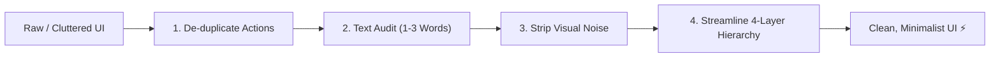

# Automa Minimalist UI/UX Audit & Review Standard (`automa-minimalist-ux-audit`)

A strict, pragmatic Product Design and UX Writing framework dedicated to **Radical Minimalism**, **Action De-duplication**, **Microcopy Density**, and **Visual Noise Reduction** across all Automa UI surfaces (`automa-webe`, `automa-desk`, `automa-vsce`).

---

## 1. 🎯 Core Design Philosophy: Pragmatic Minimalism

Modern developer & automation tools must prioritize **cognitive bandwidth**, **high data density**, and **zero friction**. Every pixel, border, icon, and word must justify its existence.



### The 4 Golden Rules:
1. **Single Source of Action**: No button or icon should perform the same function in more than one place within the same viewport.
2. **Terse Microcopy (Rule of 1–3 Words)**: Never explain what is already intuitive. Strip marketing fluff, redundant pronouns, and obvious helper text.
3. **Subdued Visual Weight**: Data takes center stage. Borders must be subtle, badges compact, and row action buttons secondary or hover-revealed.
4. **Deterministic 4-Tier Hierarchy**: Every modal/view strictly follows `Header` $\rightarrow$ `Toolbar/Filter` $\rightarrow$ `Content/Table` $\rightarrow$ `Footer`.

---

## 2. 🔍 The 4-Tier Audit Framework

When reviewing any UI screenshot, wireframe, or component implementation, evaluate against these 4 dimensions:

---

### Tier 1: Trùng Lặp Hành Động (Redundant Actions / CTAs)

* **Duplicate Action Detection**:
  - Scan for repeated functions (e.g. `+ Create` in banner AND `+ New` in toolbar, or duplicate `Refresh` icons in header and table).
  - Rule: **Exactly ONE primary CTA per view**.
* **Primary CTA Dilution**:
  - Ensure the main user objective stands out clearly.
  - Secondary/destructive actions (e.g. `Kill All Sessions`, `Clear History`) must not compete visually with the primary creation flow.
* **Placement Invariant**:
  - Context actions belong in the **Toolbar**, destructive bulk actions belong in the **Header right** or **Toolbar right** with `outline` or `ghost` variants.

---

### Tier 2: Rà Soát Microcopy & Text Rác (Text Audit)

* **Eliminate Marketing / Explanatory Fluff**:
  - Strip full-sentence explanations (e.g., *"Manage isolated Chromium instances with unique proxies and fingerprints"*). Power users already know what the tool does.
* **Multi-tier Title Elimination**:
  - Avoid duplicate titles (e.g., Dialog Title: `BROWSER FLEET MANAGEMENT` + Sub-banner Title: `Anti-Detect Browsers`).
  - Collapse into a single concise header (e.g., `Browser Profiles` or `Anti-Detect Fleet`).
* **Microcopy Compression (1–3 Words Max)**:
  - Table headers: `Browser Name / Profile` $\rightarrow$ `Profile` or `Profile Name`.
  - Search placeholders: `Filter browsers by name or ID...` $\rightarrow$ `Search profiles...`.
  - Button labels: `Launch Browser` $\rightarrow$ `Launch` (or icon `▶` with tooltip).
  - Empty state text: `No browser profiles found` $\rightarrow$ `No profiles`.

---

### Tier 3: Giảm Tải Thị Giác Trong Hiển Thị Dữ Liệu (Visual Noise)

* **Cell Redundancy & Clutter**:
  - Avoid displaying identical/redundant values (e.g. bold name `Default Chromium` with identical mono text `default_chromium` underneath).
  - Technical IDs should be subtle, truncated, or relegated to hover copy/tooltips.
* **Inline Action Overload**:
  - Bulky colored buttons on every row (e.g., 20 green `Launch Browser` buttons) create extreme visual fatigue.
  - Refactor row actions to:
    - Compact outline/ghost buttons with icons (`Play` icon + text `Launch`).
    - Or icon-only buttons with hover tooltips (`Play`, `Trash2`).
* **Badge & Status Over-styling**:
  - Keep status badges minimal: dot indicator + text (`ONLINE` / `OFFLINE`), font size `text-[10px]` or `text-[11px]`.
* **Subdued Borders**:
  - Replace heavy borders with semantic subtle borders (`border-border/50` or `border-border/60`).

---

### Tier 4: Bố Cục Đề Xuất Đã Tối Giản (Streamlined Layout Proposal)

Every dialog or screen must conform to the clean 4-layer layout:

```text
┌────────────────────────────────────────────────────────────────────────┐
│ 1. HEADER: [Icon] [Concise Title]         [Destructive/Aux Action] [X] │
├────────────────────────────────────────────────────────────────────────┤
│ 2. TOOLBAR: [Search Input] | [Filter Tabs] | [Refresh] | [+ Primary]   │
├────────────────────────────────────────────────────────────────────────┤
│ 3. TABLE / CONTENT: High density, clean cells, minimal row actions    │
│    - Row 1: [Status] | [Name] | [Detail] | [Action Icons]             │
│    - Row 2: [Status] | [Name] | [Detail] | [Action Icons]             │
├────────────────────────────────────────────────────────────────────────┤
│ 4. FOOTER: [Page Size Selector]          [Page X of Y] [Compact Nav]  │
└────────────────────────────────────────────────────────────────────────┘
```

* **Footer Simplification**:
  - Strip redundant count text like `Total 1 items` when filter tabs already show `All (1)`.
  - Disable or hide 4-button pagination (`<< < > >>`) when total pages $\le 1$.

---

## 3. 📋 Standard Audit Report Output Template

When delivering a Minimalist UX Audit, output in this exact structured format:

```markdown
Giao diện này đang bị phân mảnh nhiều tầng (multi-tier header) và tồn tại nhiều điểm trùng lặp chức năng lẫn text thừa.

### 1. Trùng Lặp Hành Động (Duplicate Actions / CTAs)
* **[Vấn đề 1]**: [Mô tả chi tiết vị trí lặp và giải pháp gộp/xóa]
* **[Vấn đề 2]**: [Mô tả chi tiết]

### 2. Rà Soát Microcopy & Text Rác (Text Audit)
* **Mô tả thừa**: [Chỉ ra câu thừa và đề xuất xóa bỏ]
* **Tầng tiêu đề kép**: [Chỉ ra tiêu đề lặp và đề xuất rút gọn 1-3 từ]
* **Placeholder & Labels**: [Đề xuất rút gọn ngắn nhất có thể]

### 3. Giảm Tải Thị Giác Trong Dữ Liệu (Visual Noise)
* **Nút bấm hành động từng dòng**: [Đề xuất tinh gọn sang icon/hover state]
* **Trùng lặp text trong cell**: [Chỉ ra text lặp giữa title và technical ID]
* **Badges & Cột rườm rà**: [Đề xuất tối giản]

### 4. Thanh Chân Trang (Footer) & Phân Trang
* **Thừa thông tin số đếm**: [Chỉ ra điểm lặp với Tabs]
* **Cụm phân trang dư thừa**: [Đề xuất ẩn/làm mờ khi số trang <= 1]

---

### 📐 Bố Cục Đề Xuất Sau Khi Tinh Giản (Streamlined Layout)
* **Header dialog**: [Cấu trúc thành phần tinh gọn]
* **Toolbar**: [Thứ tự các control từ trái sang phải]
* **Table**:
  * **Cột**: `[Cột 1]` | `[Cột 2]` | `[Cột 3]` | `[Cột Actions]`
  * **Hàng mẫu**: `[Giá trị 1]` | `[Giá trị 2]` | `[Giá trị 3]` | `[Action Icons]`
* **Footer**: [Cấu trúc phân trang tối giản]
```
