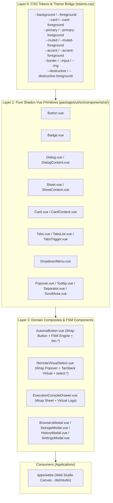

# Automa Shadcn-Vue Design System & Minimalist UX Standard (`automa-shadcn`)

Architecture, composition standards, theme inversion, dark mode synchronization, and radical minimalism UX review framework for the Automa Ecosystem UI (`@automa/ui`).

---

## 1. 🏛️ 3-Layer Design System Architecture

All user interface primitives and composite components are centralized in [`packages/ui`](../../packages/ui).



---

## 2. 🛡️ Architectural Invariants

### Invariant 1: Zero Code Duplication
- NEVER copy raw shadcn component files into application folders (`apps/webe`).
- All applications consume `@automa/ui` as a workspace dependency (`@automa/ui: workspace:*`).
- To add a new component, run `pnpm run add:ui <name>` at root, and import from `@automa/ui`.

### Invariant 2: Theme Variable Inversion (Zero Hardcoded Colors)
- NEVER hardcode hex colors (`#1e293b`), raw Tailwind palettes (`bg-zinc-900`, `text-zinc-500`), or ad-hoc variables (`var(--automa-bg)`).
- ALWAYS use Shadcn semantic theme tokens:
  | Token Class | Usage |
  |---|---|
  | `bg-background` / `text-foreground` | App viewport, canvas base, page background |
  | `bg-card` / `text-card-foreground` | Modals, cards, floating headers, panels |
  | `bg-muted` / `text-muted-foreground` | Secondary labels, disabled states, tab track |
  | `hover:bg-accent` / `hover:text-accent-foreground` | Interactive row/button hover states |
  | `bg-primary` / `text-primary-foreground` | Primary action buttons, active navigation, indicators |
  | `border-border` | Component borders, dividers, card outlines |
  | `bg-destructive` / `text-destructive-foreground` | Danger actions (Kill All, Delete, Stop) |

### Invariant 3: Testability & Canonical Identifiers
- Every interactive element MUST include an explicit `data-testid`.
- Buttons MUST map 1-to-1 with canonical Button IDs (`btn.*`) via `AutomaButton`.
- Remote dropdowns MUST map 1-to-1 with Select IDs (`select.*`) via `RemoteVirtualSelect`.

---

## 3. 🎯 Radical Minimalism UI/UX Standards

When reviewing or constructing user interfaces across Web Studio:

### The 4 Golden Rules:
1. **Single Source of Action**: Exactly ONE primary CTA per view. Context actions belong in the toolbar; bulk/destructive actions belong in header/toolbar right with `outline` or `ghost` variants.
2. **Terse Microcopy (Rule of 1–3 Words)**: Strip marketing fluff and obvious explanations. Power users need density and speed.
   - Button labels: `Launch Browser` $\rightarrow$ `Launch` (or icon `▶`).
   - Search placeholders: `Filter browsers by name...` $\rightarrow$ `Search profiles...`.
   - Table headers: `Browser Name / Profile` $\rightarrow$ `Profile`.
3. **Subdued Visual Weight**: Replace bulky colored buttons on every table row with compact outline/ghost icon buttons. Status indicators: dot indicator + `text-[10px]`.
4. **Deterministic 4-Tier Hierarchy**: Every modal/dialog strictly follows:
   ```text
   ┌────────────────────────────────────────────────────────────────────────┐
   │ 1. HEADER: [Icon] [Concise Title]         [Destructive/Aux Action] [X] │
   ├────────────────────────────────────────────────────────────────────────┤
   │ 2. TOOLBAR: [Search Input] | [Filter Tabs] | [Refresh] | [+ Primary]   │
   ├────────────────────────────────────────────────────────────────────────┤
   │ 3. TABLE / CONTENT: High density, clean cells, minimal row actions    │
   ├────────────────────────────────────────────────────────────────────────┤
   │ 4. FOOTER: [Page Size Selector]          [Page X of Y] [Compact Nav]  │
   └────────────────────────────────────────────────────────────────────────┘
   ```

---

## 4. 🌗 Dark Mode Synchronization Protocol (Host <-> Studio Iframe)

When `automa-webe:studio` is built as a standalone static bundle (`dist/studio`) and embedded as an `iframe` inside host containers:

### 1. Initial URL Query Parameter:
```text
http://127.0.0.1:8765/studio/?headless=true&theme=dark
```

### 2. Live Two-Way PostMessage IPC:
```javascript
window.addEventListener('message', (e) => {
  if (!e || !e.data || typeof e.data !== 'object') return;
  if (e.data.type === 'automa:set-theme' || e.data.type === 'automa:theme-changed') {
    const isDark = e.data.theme === 'dark' || Boolean(e.data.isDark);
    document.documentElement.classList.toggle('dark', isDark);
  }
});
```

---

## 5. 🛠️ CLI Registry Tooling (`packages/ui`)

```bash
# Add New Component from Shadcn-Vue Registry
pnpm run add:ui <component_name>

# Full Registry Parity Sync
pnpm run sync:ui

# Structural Parity Audit
pnpm run audit:ui
```
