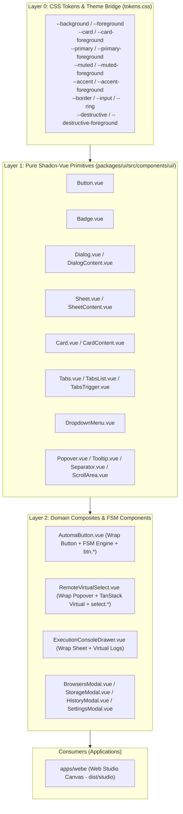

# Automa Shadcn-Vue Design System (`automa-shadcn`)

Architecture, composition standards, theme inversion, dark mode synchronization, and CLI registry tooling for the Automa Ecosystem UI (`@automa/ui`).

---

## 1. 🏛️ 3-Layer Design System Architecture

All user interface primitives and composite components are centralized in [`packages/ui`](../../packages/ui).



---

## 2. 🛡️ Architectural Invariants

### Invariant 1: Zero Code Duplication
- **Strict Monorepo Rule**: NEVER copy raw shadcn component files into application folders (`apps/webe`).
- All applications consume `@automa/ui` as a workspace dependency (`@automa/ui: workspace:*`).
- To add a new component, run `pnpm run add:ui <name>` at root, and import from `@automa/ui`.

### Invariant 2: Theme Variable Inversion (Zero Hardcoded Colors)
- NEVER hardcode hex colors (`#1e293b`, `#2563eb`), raw Tailwind palettes (`bg-zinc-900`, `text-zinc-500`, `!bg-blue-600`), or ad-hoc variables (`var(--automa-bg)`).
- ALWAYS use Shadcn semantic theme tokens:
  | Token Class | Usage |
  |---|---|
  | `bg-background` / `text-foreground` | App viewport, canvas base, page background |
  | `bg-card` / `text-card-foreground` | Modals, cards, floating headers, panels |
  | `bg-muted` / `text-muted-foreground` | Secondary labels, disabled states, tab track |
  | `hover:bg-accent` / `hover:text-accent-foreground` | Interactive row/button hover states |
  | `bg-primary` / `text-primary-foreground` | Primary action buttons, active navigation, indicators |
  | `border-border` | Component borders, dividers, card outlines |
  | `bg-destructive` / `text-destructive-foreground` | Danger actions (Kill All, Delete, Stop) |

### Invariant 3: Testability & Canonical Identifiers
- Every interactive element MUST include an explicit `data-testid`.
- Buttons MUST map 1-to-1 with canonical Button IDs (`btn.*`) via `AutomaButton`.
- Remote dropdowns MUST map 1-to-1 with Select IDs (`select.*`) via `RemoteVirtualSelect`.

---

## 3. 🌗 Dark Mode Synchronization Protocol (Host <-> Studio Iframe)

When `automa-webe:studio` is built as a standalone static bundle (`dist/studio`) and embedded as an `iframe` inside `automa-desk` or `automa-vsce`, the iframe runs as an isolated DOM tree. Theme state MUST be synchronized in real time.

### Protocol 1: Initial URL Query Parameter
Upon iframe mount, host app passes the initial theme:
```text
http://127.0.0.1:8765/studio/?headless=true&theme=dark
```
`StudioApp.vue` inspects `urlParams.get('theme')`:
```javascript
const themeParam = urlParams.get('theme');
if (
  themeParam === 'dark' ||
  (!themeParam && window.matchMedia && window.matchMedia('(prefers-color-scheme: dark)').matches)
) {
  document.documentElement.classList.add('dark');
} else if (themeParam === 'light') {
  document.documentElement.classList.remove('dark');
}
```

### Protocol 2: Live Two-Way PostMessage IPC
When the user toggles dark mode in Host (via Titlebar, Settings Modal, or `Ctrl+K` Command Palette):
- **Host Dispatcher (`useStudioBridge.ts`)**:
  ```typescript
  function syncThemeToStudio() {
    sendToStudio({
      type: 'automa:set-theme',
      theme: isDark.value ? 'dark' : 'light',
      isDark: isDark.value,
    });
  }

  watch(isDark, () => {
    syncThemeToStudio();
  });
  ```
- **Studio Receiver (`StudioApp.vue`)**:
  ```javascript
  function onWindowMessage(e) {
    if (!e || !e.data || typeof e.data !== 'object') return;
    if (e.data.type === 'automa:set-theme' || e.data.type === 'automa:theme-changed') {
      const isDark = e.data.theme === 'dark' || Boolean(e.data.isDark);
      if (isDark) {
        document.documentElement.classList.add('dark');
      } else {
        document.documentElement.classList.remove('dark');
      }
    }
  }
  ```

---

## 4. 🛠️ CLI Registry Tooling (`packages/ui`)

Manage the Shadcn-Vue component catalog via Root CLI scripts:

### 1. Add New Component from Shadcn-Vue Registry
```bash
pnpm run add:ui <component_name>
# Example:
pnpm run add:ui slider
pnpm run add:ui accordion avatar
```
- Fetches the component template from the official `shadcn-vue` registry.
- Places files in `packages/ui/src/components/ui/<component_name>/`.
- Automatically rebuilds `packages/ui/src/components/ui/index.ts` barrel export.

### 2. Full Registry Parity Sync
```bash
pnpm run sync:ui
```
- Re-syncs all 19 core components against latest Radix-Vue / Shadcn-Vue upstream.

### 3. Parity Audit
```bash
pnpm run audit:ui
```
- Validates structural parity and flags any accidental modifications or missing exports.

---

## 5. 💻 Production Usage Templates

### Example 1: Modal Dialog in Studio or Desktop
```vue
<script setup lang="ts">
import {
  Dialog,
  DialogContent,
  DialogHeader,
  DialogTitle,
  DialogDescription,
  DialogFooter,
  Button
} from '@automa/ui'
import { ref } from 'vue'

const isOpen = ref(false)
</script>

<template>
  <Dialog v-model:open="isOpen">
    <DialogContent class="max-w-md bg-card border-border text-foreground">
      <DialogHeader>
        <DialogTitle class="text-sm font-bold">Dialog Title</DialogTitle>
        <DialogDescription class="text-xs text-muted-foreground">
          Dialog description explaining action.
        </DialogDescription>
      </DialogHeader>

      <div class="py-4 text-xs">
        Modal body content goes here.
      </div>

      <DialogFooter class="gap-2">
        <Button variant="ghost" size="sm" @click="isOpen = false">Cancel</Button>
        <Button variant="primary" size="sm" @click="confirmAction">Save</Button>
      </DialogFooter>
    </DialogContent>
  </Dialog>
</template>
```

### Example 2: Tabs with Badges in All-in-One Studio
```vue
<script setup lang="ts">
import { Tabs, TabsList, TabsTrigger, TabsContent, Badge } from '@automa/ui'
import { ref } from 'vue'

const currentTab = ref('nodes')
</script>

<template>
  <Tabs v-model="currentTab" class="w-full">
    <TabsList class="grid grid-cols-2 bg-muted text-muted-foreground">
      <TabsTrigger value="nodes" class="text-xs">
        Nodes <Badge variant="outline" class="ml-1 text-[10px]">12</Badge>
      </TabsTrigger>
      <TabsTrigger value="settings" class="text-xs">
        Settings
      </TabsTrigger>
    </TabsList>
    <TabsContent value="nodes" class="p-3 bg-card border border-border rounded-xl mt-2">
      <!-- Nodes Content -->
    </TabsContent>
  </Tabs>
</template>
```
