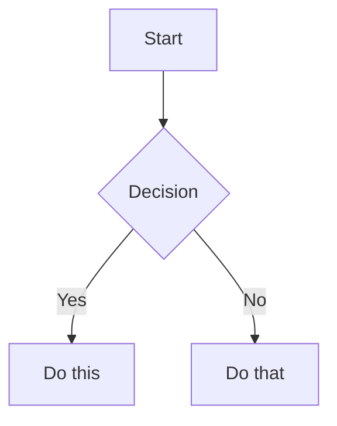

# Kỹ năng Obsidian Flavored Markdown

BẮT BUỘC TẠO và CHỈNH SỬA định dạng Obsidian Flavored Markdown hợp lệ. BẮT BUỘC ÁP DỤNG các cú pháp chuyên biệt của Obsidian DƯỚI ĐÂY. Việc nắm rõ Markdown tiêu chuẩn (headings, in đậm, in nghiêng, danh sách, trích dẫn, khối code, bảng) được xem là kiến thức hiển nhiên.

## Quy trình làm việc: Tạo một Note Obsidian

1. **Thêm frontmatter** chứa các thuộc tính (title, tags, aliases) ở đầu file. BẮT BUỘC THAM KHẢO [PROPERTIES.md](references/PROPERTIES.md) để biết tất cả các loại thuộc tính.
2. **Viết nội dung** dùng Markdown tiêu chuẩn cho cấu trúc, cộng thêm cú pháp chuyên biệt của Obsidian dưới đây.
3. **Liên kết các notes liên quan** bằng cách sử dụng wikilinks (`[[Note]]`) để tạo kết nối nội bộ trong vault, hoặc link Markdown tiêu chuẩn cho các URL bên ngoài.
4. **Nhúng nội dung** từ các notes khác, hình ảnh, hoặc PDF bằng cú pháp `![[embed]]`. BẮT BUỘC THAM KHẢO [EMBEDS.md](references/EMBEDS.md) để biết tất cả các loại nhúng.
5. **Thêm callouts** cho các thông tin cần làm nổi bật bằng cú pháp `> [!type]`. BẮT BUỘC THAM KHẢO [CALLOUTS.md](references/CALLOUTS.md) để biết tất cả các loại callout.
6. **Xác minh** note hiển thị chính xác trong chế độ reading view của Obsidian.

> BẮT BUỘC SỬ DỤNG `[[wikilinks]]` đối với các notes bên trong vault. TUYỆT ĐỐI CHỈ SỬ DỤNG `[text](url)` cho các URL bên ngoài.

## Liên kết nội bộ (Wikilinks)

```markdown
[[Note Name]]                          Link to note
[[Note Name|Display Text]]             Custom display text
[[Note Name#Heading]]                  Link to heading
[[Note Name#^block-id]]                Link to block
[[#Heading in same note]]              Same-note heading link
```

ĐỊNH NGHĨA một block ID bằng cách nối thêm `^block-id` vào bất kỳ đoạn văn nào:

```markdown
This paragraph can be linked to. ^my-block-id
```

Đối với danh sách và trích dẫn, BẮT BUỘC ĐẶT block ID ở một dòng riêng biệt ngay sau block:

```markdown
> A quote block

^quote-id
```

## Nhúng (Embeds)

BẮT BUỘC THÊM TIỀN TỐ `!` vào bất kỳ wikilink nào để nhúng nội dung của nó trực tiếp:

```markdown
![[Note Name]]                         Embed full note
![[Note Name#Heading]]                 Embed section
![[image.png]]                         Embed image
![[image.png|300]]                     Embed image with width
![[document.pdf#page=3]]               Embed PDF page
```

BẮT BUỘC THAM KHẢO [EMBEDS.md](references/EMBEDS.md) cho âm thanh, video, kết quả tìm kiếm và hình ảnh bên ngoài.

## Callouts

```markdown
> [!note]
> Basic callout.

> [!warning] Custom Title
> Callout with a custom title.

> [!faq]- Collapsed by default
> Foldable callout (- collapsed, + expanded).
```

BẮT BUỘC SỬ DỤNG các loại phổ biến: `note`, `tip`, `warning`, `info`, `example`, `quote`, `bug`, `danger`, `success`, `failure`, `question`, `abstract`, `todo`.

BẮT BUỘC THAM KHẢO [CALLOUTS.md](references/CALLOUTS.md) để biết danh sách đầy đủ bao gồm bí danh (aliases), callout lồng nhau và CSS callout tùy biến.

## Thuộc tính (Frontmatter)

```yaml
---
title: My Note
date: 2024-01-15
tags:
  - project
  - active
aliases:
  - Alternative Name
cssclasses:
  - custom-class
---
```

Các thuộc tính mặc định: `tags` (nhãn có thể tìm kiếm), `aliases` (tên gọi thay thế của note để gợi ý liên kết), `cssclasses` (CSS class dùng để tạo kiểu).

BẮT BUỘC THAM KHẢO [PROPERTIES.md](references/PROPERTIES.md) cho toàn bộ kiểu thuộc tính, quy tắc cú pháp của tag, và cách sử dụng nâng cao.

## Tags

```markdown
#tag                    Inline tag
#nested/tag             Nested tag with hierarchy
```

Tags TUYỆT ĐỐI KHÔNG bắt đầu bằng chữ số. BẮT BUỘC SỬ DỤNG chữ cái, số, dấu gạch dưới, dấu gạch ngang, và dấu gạch chéo xuôi. Tags cũng có thể được định nghĩa trong frontmatter dưới thuộc tính `tags`.

## Chú thích (Comments)

```markdown
This is visible %%but this is hidden%% text.

%%
This entire block is hidden in reading view.
%%
```

## Định dạng chuyên biệt của Obsidian

```markdown
==Highlighted text==                   Highlight syntax
```

## Toán học (LaTeX)

```markdown
Inline: $e^{i\pi} + 1 = 0$

Block:
$$
\frac{a}{b} = c
$$
```

## Sơ đồ (Mermaid)

````markdown

````

Để liên kết các node Mermaid tới các note trong Obsidian, BẮT BUỘC THÊM `class NodeName internal-link;`.

## Chú thích cuối trang (Footnotes)

```markdown
Text with a footnote[^1].

[^1]: Footnote content.

Inline footnote.^[This is inline.]
```

## Ví dụ hoàn chỉnh

````markdown
---
title: Project Alpha
date: 2024-01-15
tags:
  - project
  - active
status: in-progress
---

# Project Alpha

This project aims to [[improve workflow]] using modern techniques.

> [!important] Key Deadline
> The first milestone is due on ==January 30th==.

## Tasks

- [x] Initial planning
- [ ] Development phase
  - [ ] Backend implementation
  - [ ] Frontend design

## Notes

The algorithm uses $O(n \log n)$ sorting. See [[Algorithm Notes#Sorting]] for details.

![[Architecture Diagram.png|600]]

Reviewed in [[Meeting Notes 2024-01-10#Decisions]].
````

## Tài liệu tham khảo

- [Obsidian Flavored Markdown](https://help.obsidian.md/obsidian-flavored-markdown)
- [Internal links](https://help.obsidian.md/links)
- [Embed files](https://help.obsidian.md/embeds)
- [Callouts](https://help.obsidian.md/callouts)
- [Properties](https://help.obsidian.md/properties)
